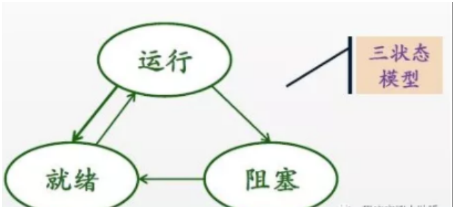

# 1.C++

## 1.虚函数表和多态(*)

### 1.1虚函数和多态

虚函数（Virtual Function）：在基类中声明为 virtual 并在一个或多个派生类中被重新定义的成员函数。
纯虚函数（Pure Virtual Function）：基类中没有实现体的虚函数称为纯虚函数（有纯虚函数的基类称为虚基类）。
C++  “虚函数”的存在是为了实现面向对象中的“多态”，即父类类别的指针（或者引用）指向其子类的实例，然后通过父类的指针（或者引用）调用实际子类的成员函数。通过动态赋值，实现调用不同的子类的成员函数（动态绑定）。正是因为这种机制，<font color='red'>把析构函数声明为“虚函数”可以防止在内存泄露。</font>

#### 1.1.1虚函数的访问权限

```c++
#include <iostream>

using namespace std;

class A
{
public:
	virtual void Print() { cout << "A::Print" << endl; }
};
class E :public A
{
//public:	/* 即使是private，编译依然可以通过，多态时也能正确调用E::Print() */
private:
	virtual void Print() { cout << "E::Print" << endl; }
};

void PrintInfo(A& r)
{
	r.Print();		// 多态，调用哪个Print，取决于r引用了哪个类的对象
}

int main()
{
	E e;
	PrintInfo(e);		// 输出 E::Print
	return 0;
}

```

一般情况下，基类与派生类的同名同参数表的[虚函数](https://so.csdn.net/so/search?q=虚函数&spm=1001.2101.3001.7020)的访问范围说明符应保持一致。

- 如果基类为`private`，则编译会报错。
- 如果基类为`public`，派生类为`private`，编译依然可以通过，多态时也能正确调用派生类的虚函数。<font color='green'>//只有这种情况是特殊的</font>


#### 1.1.2静态绑定和动态绑定

​     <font size=10> 1.</font> 基类的指针不能调用派生类自己定义的函数，只能调用虚函数！因为调用普通函数时是绑定静态的，调用虚函数时才动态绑定。
​       为了支持c++的多态性，才用了动态绑定和静态绑定。理解他们的区别有助于更好的理解多态性，以及在编程的过程中避免犯错误。需要理解四个名词：
对象的静态类型：<font color='red'>对象在声明时采用的类型，是在编译期确定的。</font>
对象的动态类型：<font color='red'>目前所指对象的类型，是在运行期决定的。</font>对象的动态类型可以更改，但是静态类型无法更改。<font color='green'>//基类指针或引用</font>,但还是取决于是否是虚函数
​          静态绑定：绑定的是对象的静态类型，某特性（比如函数）依赖于对象的静态类型，发生在编译期。
​          动态绑定：绑定的是对象的动态类型，某特性（比如函数）依赖于对象的动态类型，发生在运行期。

```c++
#include 
using namespace std;
class Base
{
public:
    void FuncInBase(){cout << "Func in Base..." << endl;}
};
class Derived:public Base
{
public:
    void FuncInDerived() {cout << "Func in Derived..." << endl;}
}; 
int main(void)
{
    Base *p = new Derived();
    p->FuncInBase();   //Func in  Base
    p->FuncInDerived();  //编译不通过
    return 0;
}
```

<font size=10>2.</font>虚函数的访问控制（编译器根据对象的静态类型来决定访问控制权限，并且进行形参的默认参数的赋值！）

​    虚函数是实现多态的机制，也就是说在利用基类的指针或者引用调用虚函数时，调用的是该指针或者引用的**动态类型**的相应的函数，这里有几点需要注意的。

（1） 编译器在决定调用函数时，如果该函数是虚函数才会在运行时确定调用什么函数（动态绑定），如果不是虚函数，那么在编译阶段就已经确定了调用的函数类型（静态绑定）。
        如下面的代码，基类与派生类都声明了函数f。但是在main函数的调用中编译器调用的是静态类型对应的函数，因为f函数并不是虚函数，虽然在基类与派生类中都声明了该函数。

```c++
class Base
{
public:
    void f(int i=0) {cout << "f() in Base..." << i << endl;}
};
class Derived:public Base
{
private:
    void f(int i=1){cout << "f() in derived..." << i << endl;}
};
int main(void)
{
    Base *b = new Derived();
    b->f();//f() in Base...
    return 0;
}
```

​    (2）如下基类定义虚函数为public，派生类覆盖了该虚函数，但是将其声明为private，这样当基类的指针绑定到派生类的对象时，使用该基类指针调用该虚函数时，调用是否成功。如果二者的访问权限反过来呢。

```C++
class Base
{
public:
    virtual void f(int i=0) {cout << "f() in Base..." << i << endl;}
};
class Derived:public Base
{
private:
    void f(int i=1){cout << "f() in derived..." << i << endl;}
};
 
int main(void)
{
    Base *b = new Derived();
    b->f();//f() in derived...0
    return 0;
}

```

分析】首先分析为什么输出结果是f() in derived。 编译器在看到b对f进行调用时，此时编译器根据b的**静态类型**（也就是Base）来决定f函数是否可访问，并且进行形参的默认参数的赋值！！
        由于f是虚函数，那么具体调用哪个函数是在运行时确定的，于是在运行时查找Derived的虚函数表，得到虚函数f（此时的f已经被Derived类覆盖，于是调用的就是派生类的版本。）
       至于，为什么i的值为0，上述分析也已经说明。
       如果将两者的访问权限交换，那么访问控制这一关都过不了，其实很简单，既然你需要派生类继承f函数，将其在Base类中声明为private本身就是不对的。

​      

#### 1.1.3函数调用机制

例：Base*base=new Derived();同有一个f()函数

1.根据静态类型(Base)决定f函数的访问权和默认值的赋值(base的f()的默认值)

2.判断Base的f()是否是虚函数，是则查找Derived的虚函数表

3.编译器还会根据参数类型决定查谁的虚函数表，如果Base和Derived的f的参数列表不一样,则会调用Base的虚函数表

4.调用Derived的f()

##### 1.1.3.1虚函数和静态函数冲突

```c++
#include <iostream>
using namespace std;

class A                                                     
{
public :
    void virtual print(){ cout<<"A::print()"<< endl; }
};

class B :public A
{
public :
    void virtual print(){ cout<<"B::print()"<< endl; }
} ;
class C :public B   
{
public :
    static void print(){ cout<<"C::print()"<< endl; }
} ;

void print (A a)                   
{   
     a.print();                         
}

void main()
{                                                                                                           
     A a, *aa, *ab, * ac;                       
     B b;                                                                         
     C c;
     aa=& a;                                                                                                       
     ab=& b;                           

     ac=& c;   
                                           
    //c.print();                                                         
     ac-> print();  //B::print() (有static)                                       //C::print() (没static)
}
```

static和virtual相互冲突,声明时就不可以同时存在，子类中用static声明的函数不会加入虚函数表

### 1.2虚函数表

虚函数表(Virtual Table，V-Table)：使用 V-Table 实现 C++ 的多态。在这个表中，主要是一个类的虚函数的地址表，这张表解决了继承、覆盖的问题，保证其真实反应实际的函数。这样，在有虚函数的类的实例中分配了指向这个表的指针的内存，所以，当用父类的指针来操作一个子类的时候，这张虚函数表就显得尤为重要了，它就像一个地图一样，指明了实际所应该调用的函数。
<font color='red'>编译器应该保证虚函数表的指针存在于对象实例中最前面的位置</font>（这是为了保证取到虚函数表的有最高的性能——如果有多层继承或是多重继承的情况下）。 这意味着可以通过对象实例的地址得到这张虚函数表，然后就可以遍历其中函数指针，并调用相应的函数。

#### 1.2.1无继承的虚函数表

```c++
#include <iostream>
using namespace std;

class base_class
{
public:
    virtual void v_func1()
    {
        cout << "This is base_class's v_func1()" << endl;
    }
    virtual void v_func2()
    {
        cout << "This is base_class's v_func2()" << endl;
    }
    virtual void v_func3()
    {
        cout << "This is base_class's v_func3()" << endl;
    }
};

int main()
{
    // 查看 base_class 的虚函数表
    base_class bc;
    cout << "base_class 的虚函数表首地址为：" << (int*)&bc << endl; // 虚函数表地址存在对象的前四个字节
    cout << "base_class 的 第一个函数首地址：" << (int*)*(int*)&bc+0 << endl; // 指针运算看不懂？没关系，一会解释给你听
    cout << "base_class 的 第二个函数首地址：" << (int*)*(int*)&bc+1 << endl;
    cout << "base_class 的 第三个函数首地址：" << (int*)*(int*)&bc+2 << endl;
    cout << "base_class 的 结束标志: " << *((int*)*(int*)&bc+3) << endl;
    
    // 通过函数指针调用函数，验证正确性
    typedef void(*func_pointer)(void);
    func_pointer fp = NULL;
    fp = (func_pointer)*((int*)*(int*)&bc+0); // v_func1()
    fp();
    fp = (func_pointer)*((int*)*(int*)&bc+1); // v_func2()
    fp();
    fp = (func_pointer)*((int*)*(int*)&bc+2); // v_func3()
    fp();
    return 0;
}

```

#### 1.2.1.1指针转换

&bc：获得 bc 对象的地址
(int*)&bc: 类型转换，获得虚函数表的首地址。这里使用 int* 的原因是函数指针的大小的 4byte，使用 int* 可以使得他们每次的偏移量保持一致（sizeof(int*) = 4，32-bit机器）。
(int*)&bc：解指针引用，<font color='red'>获得虚函数表</font>。
(int*)*(int*)&bc+0：和上面相同的类型转换，获得虚函数表的第一个虚函数地址。
(int*)*(int*)&bc+1：同上，获得第二个函数地址。
(int*)*(int*)&bc+2：同上，获得第三个函数地址。
*((int*)*(int*)&bc+3：获得虚函数表的结束标志，所以这里我解引用了。和我们使用链表的情况是一样的，虚函数表当然也需要一个结束标志。
typedef void(*func_pointer)(void)：定义一个函数指针，参数和返回值都是 void。
*((int*)*(int*)&bc+0)：找到第一个函数，注意这里需要解引用。

#### 1.2.1.2单一继承的虚函数表

子类没有父类的虚函数（陈皓文章中用了“覆盖”一词，我觉得太合理，但是我又找不到更合理的词语，所以就用一个句子代替了。）

```c++
#include <iostream>
using namespace std;

class base_class
{
public:
    virtual void v_func1()
    {
        cout << "This is base_class's v_func1()" << endl;
    }
    virtual void v_func2()
    {
        cout << "This is base_class's v_func2()" << endl;
    }
    virtual void v_func3()
    {
        cout << "This is base_class's v_func3()" << endl;
    }
};
class dev_class : public base_class
{
public:
    virtual void v_func4()
    {
        cout << "This is dev_class's v_func4()" << endl;
    }
    virtual void v_func5()
    {
        cout << "This is dev_class's v_func5()" << endl;
    }
};

int main()
{
    // 查看 dev_class 的虚函数表
    dev_class dc;
    cout << "dev_class 的虚函数表首地址为：" << (int*)&dc << endl;
    cout << "dev_class 的 第一个函数首地址：" << (int*)*(int*)&dc+0 << endl;
    cout << "dev_class 的 第二个函数首地址：" << (int*)*(int*)&dc+1 << endl;
    cout << "dev_class 的 第三个函数首地址：" << (int*)*(int*)&dc+2 << endl;
    cout << "dev_class 的 第四个函数首地址：" << (int*)*(int*)&dc+3 << endl;
    cout << "dev_class 的 第五个函数首地址：" << (int*)*(int*)&dc+4 << endl;
    cout << "dev_class 的虚函数表结束标志: " << *((int*)*(int*)&dc+5) << endl;
    // 通过函数指针调用函数，验证正确性
    typedef void(*func_pointer)(void);
    func_pointer fp = NULL;
    for (int i=0; i<5; i++) {
        fp = (func_pointer)*((int*)*(int*)&dc+i);
        fp();
    }
    return 0;
}

输出结果: 
dev_class 的虚函数表首地址为：0x22ff0c
dev_class 的 第一个函数首地址：0x472d10
dev_class 的 第二个函数首地址：0x472d14
dev_class 的 第三个函数首地址：0x472d18
dev_class 的 第四个函数首地址：0x472d1c
dev_class 的 第五个函数首地址：0x472d20
dev_class 的虚函数表结束标志: 0
This is base_class's v_func1()
This is base_class's v_func2()
This is base_class's v_func3()
This is dev_class's v_func4()
This is dev_class's v_func5()
可以看出，v-table中虚函数是顺序存放的，先基类后派生类。
    
    
    
    
```

#### 1.2.1.3子类有重写父类的虚函数

输出结果: 
dev_class 的虚函数表首地址为：0x22ff0c
dev_class 的 第一个函数首地址：0x472d10
dev_class 的 第二个函数首地址：0x472d14
dev_class 的 第三个函数首地址：0x472d18
dev_class 的 第四个函数首地址：0x472d1c
dev_class 的 第五个函数首地址：0x472d20
dev_class 的虚函数表结束标志: 0
This is base_class's v_func1()
This is base_class's v_func2()
This is base_class's v_func3()
This is dev_class's v_func4()
This is dev_class's v_func5()

可以看出当派生类中 dev_class 中重写了父类 base_class 的前两个虚函数（v_func1，v_func2）之后，使用派生类的虚函数指针**代替**了父类的虚函数。未重写的父类虚函数位置没有发生变化。//代码块里面的任何操作都不会影响

虚函数表的指针指向(比如: 在重写的函数里面调用基类函数)

#### 1.2.1.4多重继承下的虚函数表

```c++
#include <iostream>
using namespace std;

class base_class1
{
public:
    virtual void bc1_func1()
    {
        cout << "This is bc1_func1's v_func1()" << endl;
    }
};

class base_class2
{
public:
    virtual void bc2_func1()
    {
        cout << "This is bc2_func1's v_func1()" << endl;
    }
};

class dev_class : public base_class1, public base_class2
{
public:
    virtual void dc_func1()
    {
        cout << "This is dc_func1's dc_func1()" << endl;
    }
};

int main()
{
    dev_class dc;
    cout << "dc 的虚函数表 bc1_vt 地址：" << (int*)&dc << endl;
    cout << "dc 的虚函数表 bc1_vt 第一个虚函数地址：" << (int*)*(int*)&dc+0 << endl;
    cout << "dc 的虚函数表 bc1_vt 第二个虚函数地址：" << (int*)*(int*)&dc+1 << endl;
    cout << "dc 的虚函数表 bc1_vt 结束标志：" << *((int*)*(int*)&dc+2) << endl;
    cout << "dc 的虚函数表 bc2_vt 地址：" << (int*)&dc+1 << endl;
    cout << "dc 的虚函数表 bc2_vt 第一个虚函数首地址：：" << (int*)*((int*)&dc+1)+0 << endl;
    cout << "dc 的虚函数表 bc2_vt 结束标志：" << *((int*)*((int*)&dc+1)+1) << endl;
    // 通过函数指针调用函数，验证正确性
    typedef void(*func_pointer)(void);
    func_pointer fp = NULL;
    // bc1_vt
    fp = (func_pointer)*((int*)*(int*)&dc+0);
    fp();
    fp = (func_pointer)*((int*)*(int*)&dc+1);
    fp();
    // bc2_vt
    fp = (func_pointer)*(((int*)*((int*)&dc+1)+0));
    fp();
    return 0;
}

输出结果：


dc 的虚函数表 bc1_vt 地址：0x22ff08
dc 的虚函数表 bc1_vt 第一个虚函数地址：0x472d38
dc 的虚函数表 bc1_vt 第二个虚函数地址：0x472d3c
dc 的虚函数表 bc1_vt 结束标志：-4
dc 的虚函数表 bc2_vt 地址：0x22ff0c
dc 的虚函数表 bc2_vt 第一个虚函数首地址：：0x472d48
dc 的虚函数表 bc2_vt 结束标志：0
This is bc1_func1's v_func1()
This is dc_func1's dc_func1()
This is bc2_func1's v_func1()

```


多重继承的情况，会为每一个基类建一个虚函数表。派生类的虚函数放到第一个虚函数表的后面。

这个结束标志（虚函数表）的值在不同的编译器下是不同的。在WinXP+VS2003下，这个值是NULL。而在Ubuntu 7.10 + Linux 2.6.22 + GCC 4.1.3下，这个值是如果1，表示还有下一个虚函数表，如果值是0，表示是最后一个虚函数表。”。那么，我在 Windows 7 + Code::blocks 10.05 下尝试，这个值是如果是 **-4**，表示还有**下一个**虚函数表，如果是**0**，表示是**最后一个**虚函数表。

#### 


### 1.3内存的存储方式

即使类没有提供public接口操作private数据成员，我们一样可以通过获取类对象地址来操作私有数据成员

示例:  

```C++
class CTest
{
public:
    explicit CTest(int prii=111,int proi=222,int pubi=333)
    {
        m_prii=prii;
        m_proi=proi;
        m_pubi=pubi;
    }
    void show() const 
    {
        cout<<"m_prii="<<m_prii <<" m_proi="<<m_proi<<" m_pubi="<<m_pubi<<endl;
    }
private:
    int m_prii;
protected:
    int m_proi;
public:
    int m_pubi;
};


int main()
{
    CTest tobj;
    tobj.show();
    int *pi= (int *)(&tobj);//*****注意强制转换,如有疑问参读《inside C++ object model》
    cout<<"&tobj="<<&tobj<<" \n";//tobj对象本身的地址
    cout<<pi<<"="<<*pi<<" ";//pi的地址和指向的值
    pi++;
    cout<<pi<<"="<<*pi<<" ";//pi+1后的地址和指向的值
    pi++;
    cout<<pi<<"="<<*pi<<" "<<endl;//pi+1后的地址和指向的值
    cin.get();
}

   
1.类对象数据成员在内存中是连续存放的，和我们在类中数据成员的声明次序一样（以上结果只是MS的VS2010编译器结果）

2.从tobj对象的起始内存地址后，依次连续存放3个相同类型数据成员，中间没有什么其他数据存在（比如说用于访问权限设置的数据…）；//必须要数据类型相同才行，而且还和虚函数表不一样，数据成员没有表，子类不能用一个基类来表示
    
结果:
程序没有通过任何接口也访问了私有成员
```


  其实所谓的访问权限(public ,protected ,private)从来都只是编译器强加给我们的规定，从而使我们编写出来的程序更符合OO特性，

   实际一般程序在内存中数据读取没有任何限制，只要你能拿到数据地址就能读写数据（这也是很多程序外挂的原理，通过抓到的地址直接修改内存数据）。

   成员函数的访问权限的作用就是由编译器决定根据你定义的访问权限，给不给你该成员函数在内存中的具体地址

在真实内存中是不存在访问权限这种设置的

   类的访问权限设置仅在程序编译期起作用，一旦程序进入执行期（虚函数动态绑定就发生在这个时候，所以即使派生类为private访问权限），就没有访问权限控制了（这时候编译器不起作用了）；

C++程序的内存格局通常分为五个区：**全局数据区（data area）,代码区（code area）、栈区（stack area）、堆区（heap area）（即自由存储区）,文字常量区。**全局数据区存放全局变量和静态变量，初始化的全局变量和静态变量在一块区域，未初始化的全局变量和未初始化的静态变量在相邻的另一块区域，程序结束后由系统释放。；所有类成员函数和非成员函数代码存放在代码区；为运行函数而分配的局部变量、函数参数、返回数据、返回地址等存放在栈区；文字常量区存储常量字符串，程序结束后由系统释放，余下的空间都被称为堆区。


## 2.递归和循环的区别

递归是通过函数不断的在内部调用自身实现的

循环是通过设置计算的初始值及终止条件，在一个范围内重复计算

<font size=5>递归的优点:</font>

递归的方式比循环的代码简洁

此外，在树的前序、中序、后序遍历算法的代码中，递归的实现方式也比循环简单的多，而且更加容易实现。

**Tips：在面试的时候，如果面试官没有特别要求，则建议尽量多采用递归的方法编程。**

<font size=5>递归的缺点</font>

递归由于是调用自身，而函数调用是有时间和空间的消耗的：每一次函数调用，都需要在内存中分配空间以保存参数、返回地址及临时变量，而且往栈里压入数据和弹出数据都需要时间，更何况，每个进程的栈的容量是有限的。因此，递归实现的效率不如循环，而且，递归还有可能引起严重的调用栈溢出等问题。

## 3.delete this

<font size=5>**−1−**</font>

在类对象的内存空间中，只有数据成员和虚表指针，并不包含代码内容。

<font size=5>**− 2 −**</font>

类的成员函数单独放在代码段中

<font size=5>**−3−**</font>

在成员函数内部执行delete this之后，只要之后执行内容和this指向的内存块无关，则毫不影响。

但涉及this指针，则会出现不可预期后果。

<font size=5>**−4−**</font>

在当前成员函数未结束前，delete this语句并未马上执行，this指向内存块不是马上回收到系统，这时访问数据成员是随机数，访问虚表发生指针无效，系统崩溃。

<font size=8>**−5−**</font>

若析构函数执行delete this 会怎样？

<font color='red'>会 堆 或 栈 溢 出</font> 

进入析构函数后，执行delete this，delete this本身调用this指向类的析构函数，所以会无限递归下去。

## 4.顶层const和底层const

<font size=7>顶层const</font>

type* const value；

<font size=7>底层const</font>

const type* value;


## 5.内存对齐(***)

内存对齐的目的是为了让CPU能一次获取到数据，从而提升性能
CPU**只能使用基本类型**，char, short, int, long, float, double 等，不能使用数组或结构体等复合类型（汇编中并没有一个指令能直接存取一个struct或数组）。所以：内存对齐的单位是基本类型，目标是让CPU能一次获取到基本类型的值。

### 5.1什么是内存对齐

为了提高程序的性能，[数据结构](https://so.csdn.net/so/search?q=数据结构&spm=1001.2101.3001.7020)应该尽可能地在自然边界上对齐。

### 5.2为什么需要内存对齐

1、`便于移植`：不是所有的硬件平台都能访问任意地址上的任意数据的；某些硬件平台只能在某些地址处取某些特定类型的数据，否则抛出硬件异常。

2、`提高处理器访问速度`：对于未对齐的内存，处理器可能需要访问两次内存才能将数据完全读出，而对于**对齐的内存，处理器只需要一次即可**。

对于原因2具体解释一下：

尽管内存是以字节为单位，但是大部分CPU并不是按字节块来存取内存的。它一般会以2的n次方个字节为单位来存取内存，将上述这些存取单位称为**内存存取粒度**。

假设我们的内存存取粒度为4，即CPU只能从地址为4的倍数的内存开始读取数据。 对于int类型的数据，其占4个字节。


如果没有内存对齐，该数据可能存放在从地址1开始的内存中，即【1-4】，那么处理器需要先读取从地址0开始的连续4个内存单元【0-3】，再读取从地址4开始的连续4个内存单元【4-7】，总共需要CPU访问两次内存才能完全获取该int类型的值。

如果有内存对齐，该数据**只能存放在地址为4**的倍数的内存单元中，比如其在【0-3】，那么只需要读取从地址0开始的连续4个内存单元【0-3】，即CPU访问一次内存就能完全获取该类型的值

### 5.3数据类型大小

数据类型大小
**在32位编译器中**

char:1个字节

short:2个字节

int:4个字节

指针:4个字节(在64位编译器中是8个字节)

float:4个字节

long:4个字节(在64位编译器中是8个字节)

double:8个字节

long long:8个字节


### 5.4内存对齐规则

可以通过预编译命令`#pragma pack(n)`来指定有效对齐值

```
注意：并不是说n就是有效对齐值，可以理解为建议以n为有效对齐值，实际有效对齐值还要根据结构体成员大小来决定，如果n的值比结构体数据成员的大小小才起作用。
```

`有效对齐值N`:表示地址对齐在N上，即数据的存放地址%N=0；

如果没有预编译命令`#pragma pack(n)`指定有效对齐值， 则每个特定平台上的编译器都有自己的默认值n，**通常Linux默认值为4，window默认值为8**

- `结构体数据成员对齐规则`：第一个成员放在offet(偏移量)为0的地方,以后每个数据成员的offset按照**该成员的大小和有效对齐值中较小的整数倍**，即

​                 有效对齐值=*m**i**n*(数据成员类型大小，*n*)

​                *o**f**f**s**e*t=有效对齐值∗整数倍

​       `结构体对齐规则`：在数据成员对齐后，结构体本身也要对齐，其总大小为有效对齐值的整数倍，即

​            *s**i**z**e**o*f(结构体)=有效对齐值∗整数倍

- `结构体作为数据成员`:对于数据成员是结构体的情况，则该结构体成员要从其内部最大数据成员大小和有效对齐值中较小的整数倍地址开始存储

#### 样例1最大类型int

例子1：最大类型int

**上面提到默认情况下，window的n为8，而最大类型为int，所以结构体按照min(n，4)=4字节对齐**


```c++
struct S1 {
	char c;//类型长度1<8按1字节对齐；offset为0，存放区间在[0,0]
	int i;//类型长度4<=8按4字节对齐；offset为4(比0大的4的倍数)，存放区间在[4,7]
	short s;//类型长度2<8按2字节对齐；offset为8(比7大的8的倍数)，存放区间在[8,9]
};//进行结构体对齐，将10(9-0+1)提升到4的倍数，最终该结构体大小为12

struct S2 {
	char c;//类型长度1<8按1字节对齐；offset为0，存放区间在[0,0]
	short s;//类型长度2<8按2字节对齐；offset为2(比0大的2的倍数)，存放区间在[2,3]
	int i;//类型长度4<=8按4字节对齐；offset为4(比3大的4的倍数)，存放区间在[4,7]
};//进行整体对齐，将8提升到4的倍数，最终该结构体大小为8


int main()
{
	S1 objectS1 = { 'a','1','2' };
	S2 objectS2 = { 'a','2','1' };
	cout << "sizeof S1：" << sizeof(objectS1) << endl;//输出12
	cout << "sizeof S2：" << sizeof(objectS2) << endl;//输出8
}

```

#### 样例2最大类型double

**默认情况下，最大类型为double，所以结构体按照min(n，8)=8字节对齐**


```c++
struct S1 {
	char c;//类型长度1<8按1字节对齐；offset为0，存放区间在[0,0]
	double d;//类型长度8<=8按8字节对齐；offset为8，存放区间在[8,15]
	short s;//类型长度2<8按2字节对齐；offset为16，存放区间在[16,17]
};//进行整体对齐，将17提升到8的倍数，最终该结构体大小为24

struct S2 {
	char c;//类型长度1<8按1字节对齐；offset为0，存放区间在[0,0]
	short s;//类型长度2<8按2字节对齐；offset为2，存放区间在[2,3]
	double d;//类型长度8<=8按4字节对齐；offset为8，存放区间在[8,15]
};//进行整体对齐，将16提升到8的倍数，最终该结构体大小为16


int main()
{
	S1 objectS1 = { 'a','1','2' };
	S2 objectS2 = { 'a','2','1' };
	cout << "sizeof S1：" << sizeof(objectS1) << endl;//输出24
	cout << "sizeof S2：" << sizeof(objectS2) << endl;//输出16
}

```

#### 样例3指定一字节对齐值


```c++
#pragma pack(1)
struct S1 {
	char c;//类型长度1<=1按1字节对齐；offset为0，存放区间在[0,0]
	int i;//类型长度4>1按1字节对齐；offset为1，存放区间在[1,4]
	short s;//类型长度2>1按1字节对齐；offset为5，存放区间在[5,6]
};//类型进行结构体对齐，将7提升到1的倍数，最终该结构体大小为7
int main()
{
	S1 objectS1 = { 'a','1','2' };
	cout << "sizeof S1：" << sizeof(objectS1) << endl;//输出7
}

```

#### 样例4指定二字节对齐值


```c++
#pragma pack(2)
struct S1 {
	char c;//类型长度1<2按1字节对齐；offset为0，存放区间在[0,0]
	int i;//类型长度4>2按2字节对齐；offset为2，存放区间在[2,5]
	short s;//类型长度2>=2按2字节对齐；offset为6，存放区间在[6,7]
};//进行结构体对齐，将8提升到2的倍数，最终该结构体大小为8

int main()
{
	S1 objectS1 = { 'a','1','2' };
	cout << "sizeof S1：" << sizeof(objectS1) << endl;//输出8
}

```

#### 样例5结构体类型数据成员


```c++
#pragma pack(4)
struct S1 {
	char c;//类型长度1<4按1字节对齐；offset为0，存放区间在[0,0]
	double d;//类型长度8>4按4字节对齐；offset为4，存放区间在[4,11]
	short s;//类型长度2<4按2字节对齐；offset为12，存放区间在[12,13]
};//进行整体对齐，将14提升到4的倍数，最终该结构体大小为16

struct S2 {
	char c;//类型长度1<4按1字节对齐；offset为0，存放区间在[0,0]
	double s;//类型长度8>4按4字节对齐；offset为4，存放区间在[4,11]
	S1 m_S1;//该结构体内最大数据成员类型是double,所以可以把S1看成double来计算，但8>4,所以按4字节对齐；offset为12，存放区间在[12,27]
	short arr[3];//类型长度2<4按2字节对齐；offset为28，存放区间在[28,33]
};//进行整体对齐，将34提升到4的倍数，最终该结构体大小为36


int main()
{
	S1 objectS1 = { 'a','1','2' };
	S2 objectS2 = { 'a','2',objectS1,{1,2,3} };
	cout << "sizeof S1：" << sizeof(objectS1) << endl;//输出16
	cout << "sizeof S2：" << sizeof(objectS2) << endl;//输出36
}

```

**注意**：结构体中的结构体类型的成员变量也要进行整体对齐

### 5.5什么情况下需要内存对齐

1. 该数据需要直接写入文件
2. 该数据需要通过网络传给其他程序

## 6.TCP

***\*TCP协议：三次握手，四次挥手原理\****

三次握手：两个人打电话
1:在吗
2：在哦
1：好的

四次挥手：挂电话
1：我要挂了
2：好的
2：我也挂了
1：好的（1挂电话，然后2也挂了电话）

## 7.序列化

### 一、[序列化](https://so.csdn.net/so/search?q=序列化&spm=1001.2101.3001.7020)

在编写应用程序的时候往往需要将程序的某些数据存储在内存中，然后将其写入某个文件或是将它传输到网络中的另一台计算机上以实现通讯。这个**将** **程序数据转化成能被存储并传输的格式**的过程被称为“序列化”（Serialization），而它的逆过程则可被称为“反序列化” （Deserialization）。
简单来说，序列化就是将对象实例的状态转换为可保持或传输的格式的过程。与序列化相对的是反序列化，它根据流重构对象。这两个过程结合起来，可以轻 松地**存储和传输数据**。例如，可以序列化一个对象，然后使用 HTTP 通过 Internet 在客户端和服务器之间传输该对象。
序列化：将对象变成字节流的形式传出去。
反序列化：从字节流恢复成原来的对象。
简单来说，对象序列化通常用于两个目的：
1）将对象存储于硬盘上 ，便于以后反序列化使用。
2）在网络上传送对象的字节序列。

### 二、C++对象序列化方法

#### 1、Boost.Serialization

Boost.Serialization可以创建或重建程序中的**等效结构**，并保存为二进制数据、文本数据、XML或者有用户自定义的其他文件。该库具有以下吸引人的特性：
1). 代码可移植（实现仅依赖于ANSI C++）
2). 深度指针保存与恢复
3). 可以序列化STL容器和其他常用模版库
4). 数据可移植
5). 非入侵性
boost::serialization 基于 boost::archive 来完成任意复杂数据结构的序列化，boost::archive提供两个实现类来完成序列化、反序列化操作：
boost::archive::text_oarchive     序列化数据，也称为：输出、保存（save）
boost::archive::text_iarchive      反序列化数据，也称为：输入、载入（load）
也可以使用二进制格式:binary_oarchive, binary_iarchive
&操作符 
序列化操作使用 << 或者 & 操作符将数据存入text_oarchive中：
ar << data;
ar & data;
反序列化操作使用 >> 或者 & 操作符从text_iarchive中读取数据：
ar >> data;
ar & data;
为什么要引入&操作符？很简单，&操作符可以同时用于序列化和反序列化操作，这样就只需要提供一个 serialize 模板函数就可以同时用于两种操作，具体执行哪种由ar的类型（模版参数类型）决定；如果ar是text_oarchive类型则是序列化，如果ar是text_iarchive类型则是反序列化。

#### 2、protobuf

Google Protocol Buffers (GPB)是Google内部是用的数据编码方式，旨在用来代替XML进行数据交换。可用于数据序列化与反序列化。主要特性有：
1). 高效
2). 语言中立（Cpp, Java, Python）
3). 可扩展

#### 3.MFC Serialization

 Windows平台下可使用MFC中的序列化方法。MFC 对 CObject 类中的序列化提供内置支持。因此，所有从 CObject 派生的类都可利用 CObject 的序列化协议。
   继承CObject的类，实现序列化方法Serialize(CArchive& ar)，添加序列化宏DECLARE_SERIAL。编写序列化与反序列化的对象。

几种方法对比：  
Google Protocol Buffers效率较高，但是数据对象必须预先定义，并使用protoc编译，适合要求效率，允许自定义类型的内部场合使用。Boost.Serialization 使用灵活简单，而且支持标准C++容器。相比而言，MFC的效率较低，但是结合VisualStdio平台使用最为方便。

参考资料
http://www.cnblogs.com/lanxuezaipiao/p/3703988.html
http://blog.csdn.net/liyongofdm/article/details/7650380

[(32条消息) C++之序列化_镇天雷帝的博客-CSDN博客_c++ 序列化](https://blog.csdn.net/qq_41980769/article/details/107250278)

## 8.多线程

### 1.什么是C++多线程？

线程：线程是**操作系统**能够进行运算调度的**最小单位**，它被包含在进程之中，进程包含一个或者多个线程。进程可以理解为完成一件事的完整解决方案，而线程可以理解为这个解决方案中的的一个步骤，可能这个解决方案就这只有一个步骤，也可能这个解决方案有多个步骤。
多线程：多线程是实现并发（并行）的手段，并发（并行）即**多个线程同时执行**，一般而言，多线程就是把执行一件事情的完整步骤拆分为多个子步骤，然后使得这**多个步骤同时执行**。
C++多线程：（简单情况下）C++多线程使用多个函数实现各自功能，然后将不同函数生成不同线程，并同时执行这些线程（不同线程可能存在一定程度的执行先后顺序，但总体上可以看做同时执行）。

### 2.C++多线程基础知识

#### 2.1创建线程

首先要引入头文件#include<thread>(C++11的标准库中提供了多线程库)，该头文件中定义了thread类，创建一个线程即实例化一个该类的对象，实例化对象时候调用的构造函数需要传递一个参数，**该参数就是函数名**，thread th1(proc1)；**如果传递进去的函数本身需要传递参数，实例化对象时将这些参数按序写到函数名后面，thread th1(proc1,a,b)**;//**只要创建了线程对象（传递“函数名/可调用对象”作为参数的情况下），线程就开始执行**（std::thread 有一个无参构造函数重载的版本，不会创建底层的线程）。
有两种**线程阻塞方法join()与detach()**，阻塞线程的目的是**调节各线程的先后执行顺序**，这里重点讲join()方法，不推荐使用detach()，detach()使用不当会发生引用对象失效的错误。当线程启动后，**一定要在和线程相关联的thread对象销毁前，对主线程运用join()或者detach()**。
join(), 当前线程暂停, **等待指定的线程执行结束后, 当前线程再继续**。th1.join()，即**该语句所在的线程**（该语句写在main（）函数里面，即主线程内部）暂停，等待指定线程（指定线程为th1）执行结束后，主线程再继续执行。**//等待调用者的线程执行结束**
整个过程就相当于你在做某件事情，中途你让老王帮你办一个任务（你办的时候他同时办）（创建线程1），又叫老李帮你办一件任务（创建线程2），现在你的这部分工作做完了，需要用到他们的结果，只需要等待老王和老李处理完（join()，阻塞主线程），等他们把任务做完（子线程运行结束），你又可以开始你手头的工作了（主线程不再阻塞）。

```c++
#include<iostream>
#include<thread>
using namespace std;
void proc(int a)
{
    cout << "我是子线程,传入参数为" << a << endl;
    cout << "子线程中显示子线程id为" << this_thread::get_id()<< endl;
}
int main()
{
    cout << "我是主线程" << endl;
    int a = 9;
    thread th2(proc,a);//第一个参数为函数名，第二个参数为该函数的第一个参数，如果该函数接收多个参数就依次写在后面。此时线程开始执行。
    cout << "主线程中显示子线程id为" << th2.get_id() << endl;
    th2.join()；//此时主线程被阻塞直至子线程执行结束。
    return 0;
}
```

#### 2.2 互斥量使用

什么是互斥量？

这样比喻，单位上有一台打印机（**共享数据**a），你要用打印机（线程1要操作数据a），同事老王也要用打印机(线程2也要操作数据a)，但是打印机同一时间只能给一个人用，此时，**规定不管是谁，在用打印机之前都要向领导申请许可证（lock）**，用完后再向领导归还许可证(unlock)，许可证总共只有一个,没有许可证的人就等着在用打印机的同事用完后才能申请许可证(阻塞，线程1lock互斥量后其他线程就无法lock,只能等线程1unlock后，其他线程才能lock)，那么，这个许可证就是互斥量。互斥量保证了使用打印机这一过程不被打断。

程序实例化mutex对象m,线程调用成员函数m.lock()会发生下面 3 种情况：
(1)如果该互斥量当前未上锁，则调用线程将该互斥量锁住，直到调用unlock()之前，该线程一直拥有该锁。
(2)如果该互斥量当前被锁住，则**调用线程被阻塞**,直至该互斥量被解锁。

<font color='green'>上锁不单是防止数据被同时占用，还能约束线程行为</font>

<font color='green'>同一个主线程的子线程之间没有先后执行之分，但是主线程必定是最先执行的，除非用了join和detach</font>

互斥量怎么使用？

首先需要\#include<mutex>

lock()与unlock():

```c++
#include<iostream>
#include<thread>
#include<mutex>
using namespace std;
mutex m;//实例化m对象，不要理解为定义变量
void proc1(int a)
{
    m.lock();
    cout << "proc1函数正在改写a" << endl;
    cout << "原始a为" << a << endl;
    cout << "现在a为" << a + 2 << endl;
    m.unlock();
}

void proc2(int a)
{
    m.lock();
    cout << "proc2函数正在改写a" << endl;
    cout << "原始a为" << a << endl;
    cout << "现在a为" << a + 1 << endl;
    m.unlock();
}
int main()
{
    int a = 0;
    thread proc1(proc1, a);
    thread proc2(proc2, a);
    proc1.join();
    proc2.join();
    return 0;
}
```

不推荐实直接去调用成员函数lock()，因为如果忘记unlock()，将导致锁无法释放，**使用lock_guard或者unique_lock能避免忘记解锁**这种问题。

lock_guard():
其原理是：声明一个**局部的lock_guard对象**，在其构造函数中进行加锁，在其析构函数中进行解锁。最终的结果就是：**创建即加锁，作用域结束自动解锁**。从而使用lock_guard()就可以替代lock()与unlock()。
通过设定作用域，使得lock_guard在合适的地方被析构（在互斥量锁定到互斥量解锁之间的代码叫做临界区（需要互斥访问共享资源的那段代码称为临界区），临界区范围应该尽可能的小，即lock互斥量后应该尽早unlock），通过使用{}来调整作用域范围，可使得互斥量m在合适的地方被解锁：

```c++
#include<iostream>
#include<thread>
#include<mutex>
using namespace std;
mutex m;//实例化m对象，不要理解为定义变量
void proc1(int a)
{
    lock_guard<mutex> g1(m);//用此语句替换了m.lock()；lock_guard传入一个参数时，该参数为互斥量，此时调用了lock_guard的构造函数，申请锁定m
    cout << "proc1函数正在改写a" << endl;
    cout << "原始a为" << a << endl;
    cout << "现在a为" << a + 2 << endl;
}//此时不需要写m.unlock(),g1出了作用域被释放，自动调用析构函数，于是m被解锁

void proc2(int a)
{
    {
        lock_guard<mutex> g2(m);
        cout << "proc2函数正在改写a" << endl;
        cout << "原始a为" << a << endl;
        cout << "现在a为" << a + 1 << endl;
    }//通过使用{}来调整作用域范围，可使得m在合适的地方被解锁
    cout << "作用域外的内容3" << endl;
    cout << "作用域外的内容4" << endl;
    cout << "作用域外的内容5" << endl;
}
int main()
{
    int a = 0;
    thread proc1(proc1, a);
    thread proc2(proc2, a);
    proc1.join();
    proc2.join();
    return 0;
}
```

<font size=5>上锁只能确保数据不被同时占用，子线程之间的执行前后是随机的(大概率符合定义顺序)</font>

lock_gurad也可以传入两个参数，第一个参数为adopt_lock标识时，表示 构造函数中不再进行互斥量锁定，因此此时需要提前手动锁定。

```C++
#include<iostream>
#include<thread>
#include<mutex>
using namespace std;
mutex m;//实例化m对象，不要理解为定义变量
void proc1(int a)
{
    m.lock();//手动锁定
    lock_guard<mutex> g1(m,adopt_lock);
    cout << "proc1函数正在改写a" << endl;
    cout << "原始a为" << a << endl;
    cout << "现在a为" << a + 2 << endl;
}//自动解锁

void proc2(int a)
{
    lock_guard<mutex> g2(m);//自动锁定
    cout << "proc2函数正在改写a" << endl;
    cout << "原始a为" << a << endl;
    cout << "现在a为" << a + 1 << endl;
}//自动解锁

int main()
{
    int a = 0;
    thread proc1(proc1, a);
    thread proc2(proc2, a);
    proc1.join();
    proc2.join();
    return 0;
}
```

unique_lock:
unique_lock类似于lock_guard,只是unique_lock用法更加丰富，同时支持lock_guard()的原有功能。
使用lock_guard后不能手动lock()与手动unlock();**使用unique_lock后可以手动lock()与手动unlock()**;
unique_lock的第二个参数，除了可以是adopt_lock,还可以是try_to_lock与defer_lock;
try_to_lock: **尝试去锁定，得保证锁处于unlock的状态**,然后尝试现在能不能获得锁；尝试用mutx的lock()去锁定这个mutex，但如果没有锁定成功，会立即返回，不会阻塞在那里  <font color='red'>//尝试获取共享值</font>
defer_lock: **始化了一个没有加锁的mutex;**<font color='red'>//使unique_lock变量拥有互斥量的权限(开关锁)，并且在作用域等同于第一个参数的mutex</font>

|                      | lock_guard     | unique_lock                           |
| -------------------- | -------------- | ------------------------------------- |
| 手动lock与手动unlock | 不支持         | 支持                                  |
| 参数                 | 支持adopt_lock | 支持adopt_lock/try_to_lock/defer_lock |

```c++
#include<iostream>
#include<thread>
#include<mutex>
using namespace std;
mutex m;
void proc1(int a)
{
    unique_lock<mutex> g1(m, defer_lock);//始化了一个没有加锁的mutex
    cout << "不拉不拉不拉" << endl;
    g1.lock();//手动加锁，注意，不是m.lock();注意，不是m.lock();注意，不是m.lock()
    cout << "proc1函数正在改写a" << endl;
    cout << "原始a为" << a << endl;
    cout << "现在a为" << a + 2 << endl;
    g1.unlock();//临时解锁
    cout << "不拉不拉不拉"  << endl;
    g1.lock();
    cout << "不拉不拉不拉" << endl;
}//自动解锁

void proc2(int a)
{
    unique_lock<mutex> g2(m,try_to_lock);//尝试加锁，但如果没有锁定成功，会立即返回，不会阻塞在那里；
    cout << "proc2函数正在改写a" << endl;
    cout << "原始a为" << a << endl;
    cout << "现在a为" << a + 1 << endl;
}//自动解锁
int main()
{
    int a = 0;
    thread proc1(proc1, a);
    thread proc2(proc2, a);
    proc1.join();
    proc2.join();
    return 0;
}
//unique_lock所有权的转移

mutex m;
{  
    unique_lock<mutex> g2(m,defer_lock);
    unique_lock<mutex> g3(move(g2));//所有权转移，此时由g3来管理互斥量m
    g3.lock();
    g3.unlock();
    g3.lock();
}
```

#### 2.3condition_variable

需要#include<condition_variable>;
**wait(locker):**在线程被阻塞时，该函数会自动调用 locker.unlock() 释放锁，使得其他被阻塞在锁竞争上的线程得以继续执行。另外，一旦当前线程获得通知(通常是另外某个线程调用 notify_* 唤醒了当前线程)，wait() 函数此时再自动调用 locker.lock()。
notify_all():唤醒所有等待的线程
notify_once():随机唤醒一个等待的线程

condition_variable类似于[信号量](https://so.csdn.net/so/search?q=信号量&spm=1001.2101.3001.7020)机制，实现了线程的等待和唤醒。

```c++
#include<iostream>  
#include<thread>  
#include<mutex>  
#include<condition_variable>  
#include<chrono>
using namespace std;
mutex m;
condition_variable cond;
int LOOP = 10;
int flag = 0;

void fun(int id) {
	for (int i = 0; i < LOOP; i++) {
		unique_lock<mutex> lk(m);	//加锁
		//写法1，while循环比较，多次唤醒时，只要不满足条件就阻塞，if只判断一次会出错
		/*while (id != flag)
			cond.wait(lk);*/

			//写法2，实现原理和上面一样 ，id != flag时会阻塞，唤醒时继续判断，id == flag才会唤醒成功
		cond.wait(lk, [=]() {
			return id == flag;
			});
		cout << (char)('A' + id) << " ";
		flag = (flag + 1) % 3;
		cond.notify_all();
	}
}
int main() {
	thread A(fun, 0);
	thread B(fun, 1);
	thread C(fun, 2);

	A.join();
	B.join();
	C.join();
	cout << endl;
	cout << "main end" << endl;
	return 0;
}

```

##### 2.3.1semaphore源码

```c++
#pragma once
#include<mutex>
#include<condition_variable>
class semaphore {
public:
	semaphore(long count = 0) :count(count) {}
	void wait() {
		std::unique_lock<std::mutex>lock(mx);
		cond.wait(lock, [&]() {return count > 0; });
		--count;
	}
	void signal() {
		std::unique_lock<std::mutex>lock(mx);
		++count;
		cond.notify_one();
	}

private:
	std::mutex mx;
	std::condition_variable cond;
	long count;
};

```


#### 2.3异步线程

##### 2.3.1什么是异步线程(目的)

异步操作的目的是为了提高响应的并发量和控制访问的安全性以及健壮性。说的再直白一些，就是**把访问过程，处理过程和响应过程分离**。

异步是相对于同步来说，同步相当于一问一答，必须实现，假如你去银行办理业务，你问柜台的小姐姐一句话，半天才回复你，估计你就怒了。但是如果你去带着一些木料去定作家具，就不愿意等在那儿，而愿意等弄好了，给你打个电话，你再去取。其实好多人学了很多年计算机编程，并没有明白一个道理，计算机编程其实就是现实世界的一种映射，或者准确一点儿说，是现实世界一部分的可以数字逻辑化的映射。<font color='green'>交出任务，等任务完成再获取结果</font>

为了简化异步编程，提供std::async这个模板类。相应的，为了进行异步多线程间的交互提供了**std::future,std::promise,std::packaged_task**这几个模板。

简单来说**std::promise提供初步的多线程间的数据操作，std::future可以得到这些操作的结果**，而在实际应用中不仅有简单的数值操作，**有时候还需要对函数的运行进行处理（特别是函数运行结果）**，这时候就得需要std::packaged_task了。其实这两者可以从另外一个抽象层次上统一起来，就是这个操作的对象既可以是基础值也可以是一个函数，动态映射即可，但是，这不仅会消耗性能，还会增加应用的复杂度，这会不会是c++标准制定者有所考虑呢？不得而知。
而std::async又可以看作对上述三个的进一步的抽象，让他们应用起来更简单清晰。它的参数主要说明如下：
**std::launch::deferred延迟调用，延迟到future对象调用get()或者wait()的时候才执行函数，否则不会执行。**
**std::launch::async：强制这个异步任务在新线程上执行，即系统要创建一个新线程来执行相关函数;**
std::launch::async |std::launch::deferred “ |”符号代表二选一，都有可能 。
不带参数；只有函数名；默认 std::launch::async |std::launch::deferred，看具体平台的默认设置。

而实际情况中，线程的同步和异步，都是要针对具体的应用场景来说的。不过随着应用场景的越来越复杂，高并发和大数据量通信带的结果就是，异步编程越来越复杂，应用也越来越广泛。为了解决这个问题不同的语言和框架都提出了的解决方式，除最初的线程模拟，到封装，再到后来Go语言等提出的协程等，都朝着一个目标前进，那就是不断的减少异步编程的复杂度。


##### 2.3.2异步线程的实现

需要#include

**async与future：**
async是一个函数模板，用来**启动一个异步任务**，它返回一个future类模板对象，future对象起到了**占位的作用**，刚实例化的future是没有储存值的，但在调用future对象的get()成员函数时，**主线程会被阻塞直到异步线程执行结束**，并把返回结果传递给future，即通过FutureObject.get()获取函数返回值。

相当于你去办政府办业务（主线程），把资料交给了前台，前台安排了人员去给你办理（async创建子线程），前台给了你一个单据（future对象），说你的业务正在给你办（子线程正在运行），等段时间你再过来凭这个单据取结果。过了段时间，你去前台取结果，但是结果还没出来（子线程还没return），你就在前台等着（阻塞），直到你拿到结果（get()）你才离开（不再阻塞）。<font color='brown'>就是比join多了一个返回值,顺便创建一个线程</font>

```c++
#include <iostream>
#include <thread>
#include <mutex>
#include<future>
#include<Windows.h>
using namespace std;
double t1(const double a, const double b)
{
	double c = a + b;
	Sleep(3000);//假设t1函数是个复杂的计算过程，需要消耗3秒
	return c;
}

int main() 
{
	double a = 2.3;
	double b = 6.7;
	future<double> fu = async(t1, a, b);//创建异步线程线程，并将线程的执行结果用fu占位；
	cout << "正在进行计算" << endl;
	cout << "计算结果马上就准备好，请您耐心等待" << endl;
	cout << "计算结果：" << fu.get() << endl;//阻塞主线程，直至异步线程return
        //cout << "计算结果：" << fu.get() << endl;//取消该语句注释后运行会报错，因为一个future对象的get()方法只能调用一次。
	return 0;
}
```

##### 2.3.2shared_future

future与shared_future的用途都是为了**占位**，但是两者有些许差别。
future的get()成员函数是转移数据所有权;shared_future的get()成员函数是复制数据。

```c++
  
get的源码
    
const _Ty& get() const {
        return this->_Get_value();
    }//shared_future的get函数
   
   _Ty get() {
        future _Local{_STD move(*this)};//直接用move转移了所有权
        return _STD move(_Local._Get_value());
    }//future的get函数
#define _STD ::std::


```

因此：
**future对象的get()只能调用一次**；无法实现多个线程等待同一个异步线程，一旦其中一个线程获取了异步线程的返回值，其他线程就无法再次获取。
**shared_future对象的get()可以调用多次**；可以实现多个线程等待同一个异步线程，每个线程都可以获取异步线程的返回值。

|              | **future** | **shared_future** |
| ------------ | ---------- | ----------------- |
| get语义      | 转移       | 赋值              |
| 可否多次调用 | 否         | 可以              |

##### 2.3.3应用

```C++
#include <iostream>
#include <thread>
#include <functional>
#include <iostream>
#include <vector>
#include <algorithm>
#include <numeric>
#include <future>
#include <string>
#include <mutex>
#include <chrono>
 
int func_async()
{
    std::cout << "run async" << std::endl;
                //延时为了模拟异步操作
    std::this_thread::sleep_for(std::chrono::milliseconds(100));
    return 100;
}
 
int TestAsync()
{
    //测试一下不同参数效果
    auto h = std::async(std::launch::async/*std::launch::deferred*/, func_async);
    std::this_thread::sleep_for(std::chrono::milliseconds(1000));
    std::cout << "strat async get :" << h.get()<< std::endl;
 
    return 0;
}
 
void func_promise(std::promise<int>& p) {
    std::this_thread::sleep_for(std::chrono::milliseconds(3000));
    p.set_value(100);                         
}
 
int TestPromise()
{
    std::promise<int> p;
    std::thread t(func_promise, std::ref(p));
 
    std::future<int> f = p.get_future();
    std::cout << "get promis future is:" << f.get() << std::endl;
    t.join();
 
    return 0;
}
int func_task(int a, int b) {
    std::this_thread::sleep_for(std::chrono::seconds(3));
 
    return a<b?a:b;
}
 
int TestPackaged()
{
    std::packaged_task<int(int, int)> task(func_task);
    std::future<int> f = task.get_future();
    std::thread t(std::move(task), 20, 10);
    std::cout <<"get task future is:"<< f.get() << std::endl;          
    t.join();
    return 0;
    
}
 
int main()
{
    TestAsync();
    TestPromise();
    TestPackaged();
    return 0;
}
```

##### 2.3.4官网例子

```c++
#include <iostream>
#include <vector>
#include <algorithm>
#include <numeric>
#include <future>
#include <string>
#include <mutex>
 
std::mutex m;
struct X {
    void foo(int i, const std::string& str) {
        std::lock_guard<std::mutex> lk(m);
        std::cout << str << ' ' << i << '\n';
    }
    void bar(const std::string& str) {
        std::lock_guard<std::mutex> lk(m);
        std::cout << str << '\n';
    }
    int operator()(int i) {
        std::lock_guard<std::mutex> lk(m);
        std::cout << i << '\n';
        return i + 10;
    }
};
 
template <typename RandomIt>
int parallel_sum(RandomIt beg, RandomIt end)
{
    auto len = end - beg;
    if (len < 1000)
        return std::accumulate(beg, end, 0);
 
    RandomIt mid = beg + len/2;
    auto handle = std::async(std::launch::async,
                             parallel_sum<RandomIt>, mid, end);
    int sum = parallel_sum(beg, mid);
    return sum + handle.get();
}
 
int main()
{
    std::vector<int> v(10000, 1);
    std::cout << "The sum is " << parallel_sum(v.begin(), v.end()) << '\n';
 
    X x;
    // Calls (&x)->foo(42, "Hello") with default policy:
    // may print "Hello 42" concurrently or defer execution
    auto a1 = std::async(&X::foo, &x, 42, "Hello");
    // Calls x.bar("world!") with deferred policy
    // prints "world!" when a2.get() or a2.wait() is called
    auto a2 = std::async(std::launch::deferred, &X::bar, x, "world!");
    // Calls X()(43); with async policy
    // prints "43" concurrently
    auto a3 = std::async(std::launch::async, X(), 43);
    a2.wait();                     // prints "world!"
    std::cout << a3.get() << '\n'; // prints "53"
} // if a1 is not done at this point, destructor of a1 prints "Hello 42" here

```

#### 2.4原子类型automic和原子操作

**原子操作指“不可分割的操作”**；也就是说这种操作状态要么是完成的，要么是没完成的。**互斥量的加锁一般是针对一个代码段，而原子操作针对的一般都是一个变量**。<font color='red'>必须一次性完成</font>
automic是一个模板类，使用该模板类实例化的对象，提供了一些保证原子性的成员函数来实现共享数据的常用操作。

可以这样理解：
在以前，定义了一个共享的变量(int i=0)，多个线程会操作这个变量，那么每次操作这个变量时，都是用lock加锁，操作完毕使用unlock解锁，以保证线程之间不会冲突；
现在，实例化了一个类对象(automic I=0)来代替以前的那个变量，每次操作这个对象时，就不用lock与unlock，这个对象自身就具有原子性，以保证线程之间不会冲突。

automic对象提供了常见的原子操作（通过调用成员函数实现对数据的原子操作）：
**store是原子写操作，load是原子读操作。exchange是于两个数值进行交换的原子操作**。
**即使使用了automic，也要注意执行的操作是否支持原子性**。一般atomic原子操作，针对++，–，+=，-=，&=，|=，^=是支持的。
如果从对象读取值的加载操作是 原子 的，而且对这个对象的**所有修改操作**也是 原子 的，
那么加载操作得到的值要么是对象的初始值，要么是某次修改操作存入的值。

另一方面，非原子操作可能会被另一个线程观察到只完成一半。
如果这个操作是一个存储操作，那么其他线程看到的值，可能既不是存储前的值，也不是存储的值，而是别的什么值。
如果这个非原子操作是一个加载操作，它可能先取到对象的一部分，然后值被另一个线程修改，然后它再取到剩余的部分，
所以它取到的既不是第一个值，也不是第二个值，而是两个值的某种组合。
正如第三章所讲的，这一下成了一个容易出问题的竞争冒险，
但在这个层面上它可能就构成了 **数据竞争** （见5.1节），就成了未定义行为。

在C++中，多数时候你需要一个原子类型来得到原子的操作，我们来看一下这些类型。

##### 2.4.1标准原子类型

标准 原子类型 定义在头文件<atomic>中。
这些类型上的所有操作都是原子的，**在语言定义中只有这些类型的操作是原子的**，不过你可以用互斥锁来 模拟 原子操作。
实际上，标准原子类型自己的实现就可能是这样模拟出来的：
它们(几乎)都有一个is_lock_free()成员函数，//不能被锁
这个函数让用户可以查询某原子类型的操作是直接用的原子指令(x.is_lock_free()返回true)，
还是编译器和库内部用了一个锁(x.is_lock_free()返回false)。

只有std::atomic_flag类型不提供is_lock_free()成员函数。这个类型是一个简单的布尔标志，并且在这种类型上的操作都需要是无锁的；当你有一个简单无锁的布尔标志时，你可以使用其实现一个简单的锁，并且实现其他基础的原子类型。当你觉得“真的很简单”时，就说明：在std::atomic_flag对象明确初始化后，做查询和设置(使用test_and_set()成员函数)，或清除(使用clear()成员函数)都很容易。这就是：无赋值，无拷贝，没有测试和清除，没有其他任何操作。

剩下的原子类型都可以通过**特化std::atomic<>类型模板而访问到**，并且拥有更多的功能，但可能**不都是无锁的**(如之前解释的那样)。在最流行的平台上，期望原子变量都是**无锁的内置类型**(例如std::atomic<int>和std::atomic<void*>)，但这没有必要。你在后面将会看到，每个特化接口所反映出的类型特点；位操作(如&=)就没有为普通指针所定义，所以它也就不能为原子指针所定义。

除了直接使用std::atomic<>类型模板外，你可以使用在表5.1中所示的原子类型集。由于历史原因，原子类型已经添加入C++标准中，这些备选类型名可能参考相应的std::atomic<>特化类型，或是特化的基类。**在同一程序中混合使用备选名与std::atomic<>特化类名，会使代码的移植大打折扣**。


| **原子类型**    | **相关特化类**                  |
| --------------- | ------------------------------- |
| atomic_bool     | std::atomic<bool>               |
| atomic_char     | std::atomic<char>               |
| atomic_schar    | std::atomic<signed char>        |
| atomic_uchar    | std::atomic<unsigned char>      |
| atomic_int      | std::atomic<int>                |
| atomic_uint     | std::atomic<unsigned>           |
| atomic_short    | std::atomic<short>              |
| atomic_ushort   | std::atomic<unsigned short>     |
| atomic_long     | std::atomic<long>               |
| atomic_ulong    | std::atomic<unsigned long>      |
| atomic_llong    | std::atomic<long long>          |
| atomic_ullong   | std::atomic<unsigned long long> |
| atomic_char16_t | std::atomic<char16_t>           |
| atomic_char32_t | std::atomic<char32_t>           |
| atomic_wchar_t  | std::atomic<wchar_t>            |

C++标准库不仅提供基本原子类型，还定义了与原子类型对应的非原子类型，就如同标准库中的`std::size_t`。如表5.2所示这些类型:

<font size=5>std::size_t</font>

- std::size_t可以**存放下理论上可能存在的对象的最大大小**，该对象可以是任何类型，包括数组。自C++14起，大小无法以std::size_t表示的类型是非良构的。
- **std::size_t 通常被用于数组索引和循环计数**
  - 使用其它类型来进行数组索引操作的程序可能会在某些情况下出错，例如在 64 位系统中使用 unsigned int 进行索引时，如果索引号超过 UINT_MAX 或者依赖于 32 位取模运算的话，程序就会出错。
  - 在对诸如 std::string、std::vector 等 C++ 容器进行索引操作时，正确的类型是该容器的成员 typedef size_type，而该类型通常被定义为与 std::size_t 相同

```c++
#include <cstddef>
#include <iostream>

int main()
{
    const std::size_t  N  = 10;
    int *a = new int [N];

    for(std::size_t n = 0; n < N; n++){
        a[n] = n;
    }

    for(std::size_t n = N; n-- > 0;){
        std::cout << a[n] << " ";
    }

    delete [] a;
}
源码:
 typedef unsigned __int64 size_t;
```

表5.2 标准原子类型定义(typedefs)和对应的内置类型定义(typedefs)

| **原子类型定义**      | **标准库中相关类型定义** |
| --------------------- | ------------------------ |
| atomic_int_least8_t   | int_least8_t             |
| atomic_uint_least8_t  | uint_least8_t            |
| atomic_int_least16_t  | int_least16_t            |
| atomic_uint_least16_t | uint_least16_t           |
| atomic_int_least32_t  | int_least32_t            |
| atomic_uint_least32_t | uint_least32_t           |
| atomic_int_least64_t  | int_least64_t            |
| atomic_uint_least64_t | uint_least64_t           |
| atomic_int_fast8_t    | int_fast8_t              |
| atomic_uint_fast8_t   | uint_fast8_t             |
| atomic_int_fast16_t   | int_fast16_t             |
| atomic_uint_fast16_t  | uint_fast16_t            |
| atomic_int_fast32_t   | int_fast32_t             |
| atomic_uint_fast32_t  | uint_fast32_t            |
| atomic_int_fast64_t   | int_fast64_t             |
| atomic_uint_fast64_t  | uint_fast64_t            |
| atomic_intptr_t       | intptr_t                 |
| atomic_uintptr_t      | uintptr_t                |
| atomic_size_t         | size_t                   |
| atomic_ptrdiff_t      | ptrdiff_t                |
| atomic_intmax_t       | intmax_t                 |
| atomic_uintmax_t      | uintmax_t                |

对于`std::atomic<T>`模板，使用对应的T类型去特化模板的方式，要好于使用别名的方式

通常，标准原子类型是不能拷贝和赋值，他们没有拷贝构造函数和拷贝赋值操作。

但是，因为可以隐式转化成对应的内置类型，所以这些类型依旧支持赋值，可以使用load()和store()成员函数，exchange()、compare_exchange_weak()和compare_exchange_strong()。它们都支持复合赋值符：+=, -=, *=, |= 等等。并且使用整型和指针的特化类型还支持 ++ 和 --。当然，这些操作也有功能相同的成员函数所对应：fetch_add(), fetch_or() 等等。**赋值操作和成员函数的返回值要么是被存储的值(赋值操作)，要么是操作前的值(命名函数)**。这就能避免赋值操作符返回引用。为了获取存储在引用的值，代码需要执行单独的读操作，从而允许另一个线程在赋值和读取进行的同时修改这个值，这也就为条件竞争打开了大门。
std::atomic<>类模板不仅仅一套特化的类型，其作为一个原发模板也可以使用用户定义类型创建对应的原子变量。因为，它是一个通用类模板，操作被限制为**load(),store()(赋值和转换为用户类型), exchange(), compare_exchange_weak()和compare_exchange_strong()。**

<font color='green'>//用户自定义类型创建的原子变量只可以执行这些操作</font>

**每种函数类型的操作都有一个可选内存排序参数**，这个参数可以用来指定所需存储的顺序。在5.3节中，会对存储顺序选项进行详述。现在，只需要知道操作分为三类：

Store操作，可选如下顺序：memory_order_relaxed, memory_order_release, memory_order_seq_cst。

Load操作，可选如下顺序：memory_order_relaxed, memory_order_consume, memory_order_acquire, memory_order_seq_cst。

Read-modify-write(读-改-写)操作，可选如下顺序：memory_order_relaxed, memory_order_consume, memory_order_acquire, memory_order_release, memory_order_acq_rel, memory_order_seq_cst。

所有操作的默认顺序都是**memory_order_seq_cst**。

现在，让我们来看一下每个标准原子类型进行的操作，就从`std::atomic_flag`开始吧。

##### 2.4.2std::atomic_flag的相关操作

std::atomic_flag是最简单的标准原子类型，它表示了一个布尔标志。这个类型的对象可以在两个状态间切换：**设置和清除**。它就是那么的简单，只作为一个构建块存在。我从未期待这个类型被使用，除非在十分特别的情况下。正因如此，它将作为讨论其他原子类型的起点，因为它会展示一些原子类型使用的通用策略。

`std::atomic_flag`类型的对象必须被ATOMIC_FLAG_INIT初始化。初始化标志位是“清除”状态。这里没得选择；这个标志**总是初始化为“清除”**：

```c++
std::atomic_flag f = ATOMIC_FLAG_INIT;
```

这适用于任何对象的声明，并且可在任意范围内。它是**唯一**需要以如此特殊的方式初始化的原子类型，但它也是**唯一保证无锁**的类型。如果std::atomic_flag是静态存储的，那么就要保证其是静态初始化的，也就意味着没有初始化顺序问题；**在首次使用时，其都需要初始化**。

当你的标志对象已初始化，那么你只能做三件事情：销毁，清除或设置(查询之前的值)。这些事情对应的函数分别是：clear()成员函数，和test_and_set()成员函数。clear()和test_and_set()成员函数可以指定好内存顺序。clear()是一个存储操作，所以不能有memory_order_acquire或（acquire:获得）memory_order_acq_rel语义，但是test_and_set()是一个“读-改-写”操作，所有可以应用于任何内存顺序标签。每一个原子操作，默认的内存顺序都是memory_order_seq_cst。例如：

```c++
f.clear(std::memory_order_release);  // 1
bool x=f.test_and_set();  // 2
```


#### 2.5线程池

##### 2.5.1不采用线程池时:

创建线程 -> 由该线程执行任务 -> 任务执行完毕后销毁线程。即使需要使用到大量线程，每个线程都要按照这个流程来创建、执行与销毁。

**虽然创建与销毁线程消耗的时间 远小于 线程执行的时间，但是对于需要频繁创建大量线程的任务，创建与销毁线程 所占用的时间与CPU资源也会有很大占比。**

**为了减少创建与销毁线程所带来的时间消耗与资源消耗，因此采用线程池的策略**

程序启动后，**预先创建**一定数量的**线程**放入空闲队列中，这些线程都是处于阻塞状态，基本不消耗CPU，只占用较小的内存空间。

接收到任务后，线程池选择一个空闲线程来执行此任务。

任务执行完毕后，不销毁线程，线程继续保持在池中**等待下一次的任务**。

##### 2.5.2**线程池所解决的问题**

(1) 需要频繁创建与销毁大量线程的情况下，减少了创建与销毁线程带来的时间开销和CPU资源占用。**（省时省力）**

(2) 实时性要求较高的情况下，由于大量线程预先就创建好了，接到任务就能马上从线程池中调用线程来处理任务，略过了创建线程这一步骤，提高了实时性。**（实时）**

#### 2.6实例

<font size=5>生产者消费者问题</font>

```c++
/*
生产者消费者问题
*/
#include <iostream>
#include <deque>
#include <thread>
#include <mutex>
#include <condition_variable>
#include <Windows.h>
using namespace std;

deque<int> q;
mutex mu;
condition_variable cond;
int c = 0;//缓冲区的产品个数

void producer() { 
	int data1;
	while (1) {//通过外层循环，能保证生成用不停止
		if(c < 3) {//限流
			{
				data1 = rand();
				unique_lock<mutex> locker(mu);//锁
				q.push_front(data1);
				cout << "存了" << data1 << endl;
				cond.notify_one();  // 通知取
				++c;
			}
			Sleep(500);
		}
	}
}

void consumer() {
	int data2;//data用来覆盖存放取的数据
	while (1) {
		{
			unique_lock<mutex> locker(mu);
			while(q.empty())
				cond.wait(locker); //wati()阻塞前先会解锁,解锁后生产者才能获得锁来放产品到缓冲区；生产者notify后，将不再阻塞，且自动又获得了锁。
			data2 = q.back();//取的第一步
			q.pop_back();//取的第二步
			cout << "取了" << data2<<endl;
			--c;
		}
		Sleep(1500);
	}
}
int main() {
	thread t1(producer);
	thread t2(consumer);
	t1.join();
	t2.join();
	return 0;
}
```

#### 2.7threadlocal

C++11中的thread_local是C++存储期的一种，属于**线程存储期**。存储期定义C++程序中变量/函数的范围(可见性)和生命周期。C++程序中可用的存储期包括auto、register、static、extern、mutable和thread_local。这些说明符**放置在它们所修饰的类型之前**。

线程局部存储(Thread Local Storage，TLS)是一种**存储期**(storage duration)，**对象的存储是在线程开始时分配**，线程结束时回收，每个线程有该对象自己的实例。这种对象的链接性(linkage)可以是静态的也可是外部的。TLS的一个例子是用全局变量errno表示错误号。这可能在多线程并发时产生同步错误。线程局部存储的errno是个解决办法。

对于Windows系统来说，全局变量或静态变量会被放到".data"或".bss"段中，但当使用declspec(thread)定义一个线程私有变量的时候，编译器会把这些变量放到PE文件的".tls"段中。当系统启动一个新的线程时，它会从进程的堆中分配一块足够大小的空间，然后把".tls"段中的内容复制到这块空间中，于是每个线程都有自己独立的一个".tls"副本。所以对于用declspec(thread)定义的同一个变量，它们在不同线程中的地址都是不一样的。对于一个TLS变量来说，它有可能是一个C++的全局对象，那么每个线程在启动时不仅仅是复制".tls"的内容那么简单，还需要把这些TLS对象初始化，必须逐个地调用它们的全局构造函数，而且当线程退出时，还要逐个地将它们析构，正如普通的全局对象在进程启动和退出时都要构造、析构一样。Windows PE文件的结构中有个叫数据目录的结构。它总共有16个元素，其中有一元素下标为IMAGE_DIRECT_ENTRY_TLS，这个元素中保存的地址和长度就是TLS表(IMAGE_TLS_DIRECTORY结构)的地址和长度。TLS表中保存了所有TLS变量的构造函数和析构函数的地址，Windows系统就是根据TLS表中的内容，在每次线程启动或退出时对TLS变量进行构造和析构。TLS表本身往往位于PE文件的".rdata"段中。

C++11引入了thread_local关键字用于下述情形：(1).命名空间(全局)变量；(2).文件静态变量；(3).函数静态变量；(4).静态成员变量。此外，不同编译器提供了各自的方法声明线程局部变量。thread_local作为类成员变量时必须是static的。

C++11中的thread_local关键字仅可允许使用在：命名空间范围内声明的对象；块范围内声明的对象；静态数据成员。它指示对象具有线程存储期(thread storage duration)。可以将其与static或extern组合以分别指定内部或外部链接(始终具有外部链接的静态数据成员除外)，但是附加的static不会影响存储期。具有不同范围的内部或外部链接的thread_local变量的名称可以引用相同或不同的实例，具体取决于代码是在同一线程中执行还是在不同线程中执行。

当你声明一个thread_local变量时，每个线程都有其自己的副本。当你通过名称引用它时，将使用与当前线程关联的副本。

如果类的成员函数内定义了thread_local变量，则对于同一个线程内的该类的多个对象都会共享一个变量实例，并且只会在第一次执行这个成员函数时初始化这个变量实例，这一点是跟类的静态成员变量类似的。


```c++
#include "funset.hpp"
#include <thread>
#include <mutex>
#include <iostream>
#include <string>
 
///
// reference: https://en.cppreference.com/w/cpp/language/storage_duration
namespace {
 
thread_local unsigned int rage = 1;
std::mutex cout_mutex;
 
void increase_rage(const std::string& thread_name)
{
	++rage; // modifying outside a lock is okay; this is a thread-local variable, 每个线程有一个副本
	std::lock_guard<std::mutex> lock(cout_mutex);
	fprintf(stdout, "Rage counter for: %s : %d\n", thread_name.c_str(), rage); // : 2, 子线程中rage的值为2
}
 
} // namespace
 
int test_thread_local_1()
{
	std::thread a(increase_rage, "a"), b(increase_rage, "b");
 
	{
		std::lock_guard<std::mutex> lock(cout_mutex);
		fprintf(stdout, "Rage counter for main: %d\n", rage); // 1, 主线程中rage的值始终为1
	}
 
	a.join();
	b.join();
	return 0;
}
```


## 9.decltype

### 9.1常规用法

decltype是C++11新增的关键字，主要用于提取变量和表达式的类型。
decltype的语法形式为：decltype(e)，这里e是一个表达式，而decltype(e)是一个类型指示符。decltype的结果不是值，而是一个类型。
decltype的语法规则主要有以下四条：
如果e是一个**没有用小括号括起来**的标识符表达式或类成员存取表达式(**表达式**)，那么decltype(e)的结果类型为**该表达式中标识符的声明类型**。
注：这里的小括号是指表达式e自身带的小括号，而不是decltype(e)中的小括号。
如果e是T类型的x值，那么decltype(e)的结果类型为**T&&**。
注：x值（xvalue）是C++11新引入的值的种类，介于传统的左值和右值之间。最常见的x值为**无名右值引用**。&&
如果e是T类型的左值，那么decltype(e)的结果类型为**T&**。
注：同时满足规则1和规则3的情况下，规则1优先。
如果e是T类型的纯右值，那么decltype(e)的结果类型为**T**。
注：纯右值（prvalue）即传统右值。**字面量以及临时对象都是纯右值。**

测试代码及出错信息

```c++
#include <iostream>
 
template<typename T>
T f();
 
struct S {int a;};
 
int main()
{
    int a = 0;
    S s;
    f<decltype(a)>();//int
    f<decltype(s.a)>();//int
    f<decltype(std::move(a))>();//&&
    f<decltype((a))>();//&
    f<decltype((s.a))>();//&
    f<decltype(0)>();//int
 
    decltype(a) b = a; // int b = a;
    decltype((a)) c = a; // int& c = a;
}

main.cpp:(.text.startup+0x5): undefined reference to `int f<int>()'
main.cpp:(.text.startup+0xa): undefined reference to `int f<int>()'
main.cpp:(.text.startup+0xf): undefined reference to `int&& f<int&&>()'
main.cpp:(.text.startup+0x14): undefined reference to `int& f<int&>()'
main.cpp:(.text.startup+0x19): undefined reference to `int& f<int&>()'
main.cpp:(.text.startup+0x1e): undefined reference to `int f<int>()'

```

decltype(a)和decltype(s.a)的结果类型为int。（适用规则1）
理由：a是未带外围小括号的标识符，s.a是未带外围小括号的类成员存取表达式。变量a的声明类型是int，S结构的成员变量a的声明类型也是int。
decltype(std::move(a))的结果类型为int&&。（适用规则2）
理由：std::move(a)是无名右值引用，是x值的一种。
decltype((a))和decltype((s.a))的结果类型为int&。（适用规则3）
理由：(a)和(s.a)都是带外围小括号的左值引用，是左值。
decltype(0)的结果类型为int。（适用规则4）
理由：0是纯右值（即传统右值）。

### 9.2decltype(auto)

decltype(auto)是C++14新增的类型指示符，可以用来声明变量以及指示函数返回类型。
当decltype(auto)被用于声明变量时，该变量必须立即初始化。假设该变量的初始化表达式为e，那么该变量的类型将被推导为decltype(e)。也就是说在推导变量类型时，先用初始化表达式替换decltype(auto)当中的auto，然后再根据decltype的语法规则来确定变量的类型。

```c++
decltype(auto) prop = value; ---> decltype(value)
```

decltype(auto)也可以被用于指示函数的返回值类型。假设函数返回表达式e，那么该函数的返回值类型将被推导为decltype(e)。也就是说在推导函数返回值类型时，先用返回值表达式替换decltype(auto)当中的auto，然后再根据decltype的语法规则来确定函数返回值的类型。

```c++
#include <iostream>
 
template<typename T>  
T f();
 
struct S {int a;};
 
int a = 0;
S s;
decltype(auto) g1() {return s.a;}
decltype(auto) g2() {return std::move(a);}
decltype(auto) g3() {return (a);}
decltype(auto) g4() {return (0);}
 
int main()
{
    decltype(auto) i1 = a;//int
    decltype(auto) i2 = std::move(a);//&&
    decltype(auto) i3 = (s.a);//int&
    decltype(auto) i4 = (0);//int
    f<decltype(i1)>();
    f<decltype(i2)>();
    f<decltype(i3)>();
    f<decltype(i4)>();
    f<decltype(g1())>();//int
    f<decltype(g2())>();//int&&
    f<decltype(g3())>();//int&
    f<decltype(g4())>();//int
}


main.cpp:(.text.startup+0x5): undefined reference to `int f<int>()'
main.cpp:(.text.startup+0xa): undefined reference to `int&& f<int&&>()'
main.cpp:(.text.startup+0xf): undefined reference to `int& f<int&>()'
main.cpp:(.text.startup+0x14): undefined reference to `int f<int>()'
main.cpp:(.text.startup+0x19): undefined reference to `int f<int>()'
main.cpp:(.text.startup+0x1e): undefined reference to `int&& f<int&&>()'
main.cpp:(.text.startup+0x23): undefined reference to `int& f<int&>()'
main.cpp:(.text.startup+0x28): undefined reference to `int f<int>()'
```

这段代码使用了同样的编程技巧来查看decltype(auto)的结果类型。
从出错信息中可以得知:

变量i1的类型等同于decltype(a)的结果类型，即int。（适用规则1）
函数g1的返回值类型等同于decltype(s.a)的结果类型，即int。（适用规则1）
变量i2的类型等同于decltype(std::move(a))的结果类型，即int&&。（适用规则2）
函数g2的返回值类型等同于decltype(std::move(a))的结果类型，即int&&。（适用规则2）
变量i3的类型等同于decltype((s.a))的结果类型，即int&。（适用规则3）
函数g3的返回值类型等同于decltype((a))的结果类型，即int&。（适用规则3）
变量i4的类型等同于decltype((0))的结果类型，即int。（适用规则4）
函数g4的返回值类型等同于decltype((0))的结果类型，即int。（适用规则4）

## 10.内存模型

### 1.1内存模型基础

这里从两方面来讲内存模型：一方面是基本结构，这与事物在内存中是怎样布局的有关；另一方面就是并发。对于并发基本结构很重要，特别是在低层[原子操作](https://so.csdn.net/so/search?q=原子操作&spm=1001.2101.3001.7020)。所以我将会从基本结构讲起。`C++`中它与所有的对象和内存位置有关。

### 1.2对象和内存位置

在一个C++程序中的所有数据都是由对象(objects)构成。这不是说你可以创建一个int的衍生类，或者是基本类型中存在有成员函数，或是像在Smalltalk和Ruby语言下讨论程序那样——“一切都是对象”。“对象”仅仅是对C++数据构建块的一个声明。**C++标准定义类对象为“存储区域”**，但对象还是可以将自己的特性赋予其他对象，比如，其类型和生命周期。

像int或float这样的对象就是简单基本类型；当然，也有用户定义类的实例。一些对象(比如，数组，衍生类的实例，特殊（具有非静态数据成员）类的实例)拥有子对象，但是其他对象就没有。

无论对象是怎么样的一个类型，一个对象都会存储在一个或多个内存位置上。每一个内存位置不是一个标量类型的对象，就是一个标量类型的子对象，比如，unsigned short、my_class*或序列中的相邻位域。当你使用位域，就需要注意**：虽然相邻位域中是不同的对象，但仍视其为相同的内存位置**。如图5.1所示，将一个struct分解为多个对象，并且展示了每个对象的内存位置。//一个对象内存储的对象不论怎么被存储的，都视为相同的内存位置


首先，完整的struct是一个有多个子对象(每一个成员变量)组成的对象。位域bf1和bf2共享同一个内存位置(int是4字节、32位类型)，并且std::string类型的对象s由内部多个内存位置组成，但是其他的每个成员都拥有自己的内存位置。注意，位域宽度为0的bf3是如何与bf4分离，并拥有各自的内存位置的。(译者注：**图中bf3是一个错误展示，在C++和C中规定，宽度为0的一个未命名位域强制下一位域对齐到其下一type边界**，其中type是该成员(bf3)的类型。这里使用命名变量为0的位域，可能只是想展示其与bf4是如何分离的。有关位域的更多可以参考wiki的页面)。
这里有四个需要牢记的原则：

   1.每一个变量都是一个对象，包括作为其成员变量的对象。

   2.每个对象至少占有一个内存位置。

   3.**基本类型都有确定的内存位置**(无论类型大小如何，即使他们是相邻的，或是数组的一部分)。

   4.相邻位域是相同内存中的一部分。

### 1.3对象、内存位置和并发

这部分对于C++的多线程应用来说是至关重要的：所有东西都在内存中。当两个线程访问不同的内存位置时，不会存在任何问题，一切都工作顺利。而另一种情况下，当两个线程访问同一个内存位置，你就要小心了。如果没有线程**更新内存位置上的数据**，那还好；只读数据不需要保护或同步。当有线程对内存位置上的数据进行修改，那就有可能会产生**条件竞争**，就如第3章所述的那样。

为了避免条件竞争，两个线程就需要一定的执行顺序。第一种方式，如第3章所述那样，使用互斥量来确定访问的顺序；当同一互斥量在两个线程同时访问前被锁住，那么在同一时间内就只有一个线程能够访问到对应的内存位置，所以后一个访问必须在前一个访问之后。另一种方式是**使用原子操作同步机制**(详见5.2节中对于原子操作的定义)，决定两个线程的访问顺序。使用原子操作来规定顺序在5.3节中会有介绍。当多于两个线程访问同一个内存地址时，**对每个访问这都需要定义一个顺序**。

如果不去规定两个不同线程对同一内存地址访问的顺序，那么访问就不是原子的；并且，当两个线程都是“作者”时，就会产生数据竞争和未定义行为。

以下的声明由为重要：未定义的行为是C++中最黑暗的角落。根据语言的标准，一旦应用中有任何未定义的行为，就很难预料会发生什么事情；因为，未定义行为是难以预料的。我就知道一个未定义行为的特定实例，让某人的显示器起火的案例。虽然，这种事情应该不会发生在你身上，但是数据竞争绝对是一个严重的错误，并且需要不惜一切代价避免它。

另一个重点是：当程序中的对同一内存地址中的数据访问存在竞争，你可以使用原子操作来避免未定义行为。当然，这不会影响竞争的产生——原子操作并没有指定访问顺序——但原子操作把程序拉回了定义行为的区域内。

在我们了解原子操作前，还有一个有关对象和内存地址的概念需要重点了解：修改顺序。

### 1.4修改顺序

每一个在C++程序中的对象，**都有(由程序中的所有线程对象)确定好的修改顺序**//自带的，在对象的初始化开始阶段确定。在大多数情况下，这个顺序不同于执行中的顺序，但是在给定的执行程序中，所有线程都需要遵守这顺序。**如果对象不是一个原子类型(将在5.2节详述)，你必要确保有足够的同步操作**，来确定每个线程都遵守了变量的修改顺序。当不同线程在不同序列中访问同一个值时，你可能就会遇到数据竞争或未定义行为(详见5.1.2节)。如果你使用原子操作，编译器就有责任去替你做必要的同步。

这一要求意味着：投机执行是不允许的，因为当线程按修改顺序访问一个特殊的输入，之后的读操作，必须由线程返回较新的值，并且之后的写操作必须发生在修改顺序之后。同样的，在同一线程上允许读取对象的操作，要不返回一个已写入的值，要不在对象的修改顺序后(也就是在读取后)再写入另一个值。虽然，所有线程都需要遵守程序中每个独立对象的修改顺序，但它们没有必要遵守在独立对象上的相对操作顺序。在5.3.3节中会有更多关于不同线程间操作顺序的内容。

## 11.类型转换

### 11.1static_cast

与dynamic_cast对应的是static_cast（静态强制）。static_cast关键字一般用来将[枚举类型](https://so.csdn.net/so/search?q=枚举类型&spm=1001.2101.3001.7020)转换成整型，或者短整形转换成长整形，又或者整型转换成浮点型。也可以用来将指向父类的指针转换成指向子类的指针。

#### 11.1.1static_cast使用注意事项

1）static_cast可以用于基本类型的转换，如short与int、int与float、enum与int之间；

2）static_cast也可以**用于类类型的转换**，但**目标类型必须含有相应的构造函数**；

3）static_cast还可以转换对象的指针类型，但它不进行运行时类型检查，所以是不安全的；

4）static_cast甚至可以把任何表达式都转换成void类型；

5）satic_cast**不能移除变量的const属性**，请参考const_cast操作符；

6）static_cast进行的是简单粗暴的转换（仅仅依靠尖括号中的类型），所以其正确性完全由程序员自己保证。

7）static_cast是在编译时进行的，这与dynamic_cast正好相反。

#### 11.1.2**static_cast的使用形式：**

static_cast< T >(exp)
dynamic_cast< T >(exp)
其中，T为目标数据类型，exp为原始数据类型变量或者表达式。

```c++
#include <iostream>
//#include <typeinfo>
using namespace std;
 
void test() {
    char ch = 'a';
    short sh = 10;
    int i1 = static_cast<char>(ch);//成功，将char型数据转换成int型数据
    int i2 = static_cast<short>(sh);
    
    cout<<i1<<endl;  //97
    cout<<i2<<endl;  //10
 
    double *d = new double;
    void *v = static_cast<void*>(d);//成功，将double指针转换成void指针
 
    cout<<v<<endl;  //0x7f7f9ec05960
 
 
    int i = 20;
    const int iConst = static_cast<const int>(i);//成功，将int型数据转换成const int型数据
 
    cout<<iConst<<endl;  //20
 
    const int jConst = 30;
    //int *p = static_cast<int*>(&jConst);//error: static_cast from 'const int *' to 'int *' is not allowed
}
 
int main()
{
    test();
 
    return 0;
}
/*
编译环境：mac os下用g++编译.
*/

```

```c++
const int jConst = 30;
    //int *p = static_cast<int*>(&jConst);
```

发生编译错误：error: static_cast from 'const int *' to 'int *' is not allowed。

根据提示也很明显，原因是static_cast不能将“const int *”转换成“int *”，即违反了static_cast使用注意事项的第5条：static_cast不能移除变量的const属性。
<font size=5>**用户定义类型使用static_cast转换:(继承)**</font>

```c++
#include <iostream>
#include <typeinfo>
using namespace std;
 
class Base {
public:
    int a;
    void fun1() {cout<<"Base::fun1"<<endl;}
    void fun2() {cout<<"Base::fun2"<<endl;}
};
 
class Derive : public Base{
public:
    int b;
    void fun2() {cout<<"Derive::fun2"<<endl;}
    void fun4() {cout<<"Derive::fun4"<<endl;}
};
 
void test() {
    Base b;
    Derive d;
 
    Base *pB = static_cast<Base*>(&d);    //派生类指针->父类指针
 
    Derive *pD = static_cast<Derive*>(&b); //父类指针->派生类指针
 
    pB->fun1(); // 调用父类的fun1
    pB->fun2(); // 调用父类的fun2
    //pB->fun4(); // 编译错误：error: no member named 'fun4' in 'Base'。 因为fun4是派生类的成员函数，只能通过派生类对象进行访问。
 
    pD->fun1(); //调用父类的fun1
    pD->fun2(); //调用派生类类的fun2
    pD->fun4(); //调用派生类类的fun4，fun4是派生类的成员函数，而不是父类的成员函数。
}
    
 
int main()
{
    test();
 
    return 0;
}
/*
编译环境：mac os下用g++编译：
*/
```

可见，使用static_cast能够进行派生类和父类的相互转换。

**再看一个例子：互不相关的类之间使用static_cast进行转换**

```c++
#include <iostream>
#include <typeinfo>
using namespace std;
 
class A {
public:
    int a;
    void fun1() {cout<<"A::fun1"<<endl;}
};
 
class B{
public:
    int b;
 
    B(A& a) {cout<<"B::constructor"<<endl;}
 
    void fun2() {cout<<"B::fun2"<<endl;}
};
 
void test() {
    A a;
 
    B b = static_cast<B>(a);    //A->B
 
    //b.fun1(); //编译错误，error: no member named 'fun1' in 'B'; did you mean 'fun2'?。 因为对于b，没有fun1成员函数。
    //实测并不会报错，一切正常，并且B相关的所有数据成员都设置为空
    b.fun2(); //B::fun2
}
    
 
int main()
{
    test();
 
    return 0;
}
/*
编译环境：mac os下用g++编译：
*/
```

但是，如果在B中，没有定义 B(A& a)的话，就会发生编译错误：

可见，如果A和B没有继承关系的两个互不相关的类，想要由A转换为B，则在B中必须定义“以A为参数的”构造函数。

[(32条消息) C++基础#22：C++中的静态强制static_cast_liranke的博客-CSDN博客_c++ static_cast](https://blog.csdn.net/liranke/article/details/5295133)


## 12.malloc和new（*）

(1）malloc和new都是在堆上开辟内存的**malloc**只负责开辟内存，**没有初始化功能**，需要用户自己初始化；new不但开辟内存，还可以进行**初始化**，如new int(10)；表示在堆上开辟了一个4字节的int整形内存，初始值是10，再如new int[10] ()；表示在堆上开辟了一个包含10个整形元素的数组，初始值都为0。

(2）malloc是函数，**开辟内存需要传入字节数**，如malloc(100)；表示在堆上开辟了100个字节的内存，返回void*，表示分配的堆内存的起始地址，因此malloc的返回值需要强转成指定类型的地址；new是**运算符**，开辟内存需要指定类型，返回指定类型的地址，因此不需要进行强转。

```c++
#include<iostream>
using namespace std;
int main()
{
	unsigned char* p = new unsigned char('a');  //new不但开辟内存，还可以进行初始化，表示在堆上开辟了一个1字节的unsigned char整形内存，初始值是'a';
	unsigned char* p_arr = new unsigned char[10](); // 表示在堆上开辟了一个包含10个unsigned char元素的数组，初始值都为0。（加上小括号）
	cout << *p << endl;
	cout << int(*p) << endl;
	for (int i = 0; i < 10; i++) {
		cout << *p_arr++ << endl;
	}

	int *p1 = (int*)malloc(sizeof(int)); // = > 根据传入字节数开辟内存，没有初始化
	int *p2 = (int*)malloc(sizeof(int) * 100); //= > 开辟400个字节的内存，相当于包含100个整形元素的数组，没有初始化
	for (int i = 0; i < 100; i++) {
		cout << *p++ << endl;  //1 取数组当前位置的值*p; 2 p指向下一位置的数据
		//输出来里面是乱码，因为不知道之前内存里的是什么东西
	}
	
	delete p;
	delete []p_arr;
	free(p1);
	free(p2);
	
	return 0;
}

```

(3）malloc开辟内存失败返回NULL，new开辟内存失败抛出bad_alloc类型的异常，需要捕获异常才能判断内存开辟成功或失败，n**ew运算符其实是operator new函数的调用，它底层调用的也是malloc来开辟内存的，new它比malloc多的就是初始化功能，对于类类型来说，所谓初始化，就是调用相应的构造函数。**

(4）malloc开辟的内存永远是通过free来释放的；而new单个元素内存，用的是delete，如果new[]数组，用的是**delete[]**来释放内存的。
(5）malloc开辟内存只有一种方式，而new有四种**分别是普通的new（内存开辟失败抛出bad_alloc异常）, nothrow版本的new，const new以及定位new。**

1. **new是操作符，而malloc是函数**。
2. new在调用的时候先分配内存，在调用构造函数，释放的时候调用析构函数；而**malloc没有构造函数和析构函数**。
3. malloc需要给定**申请内存的大小**，返回的指针需要**强转**；new会调用构造函数，不用指定内存的大小，返回指针不用强转。
4. new可以被**重载**；malloc不行
5. new分配内存更**直接**和**安全**。
6. new发生错误**抛出异常**，malloc返回null

**malloc底层实现：**当开辟的空间小于 128K 时，调用 brk（）函数；当开辟的空间大于 128K 时，调用mmap（）。malloc采用的是内存池的管理方式，以减少内存碎片。先申请大块内存作为堆区，然后将堆区分为多个内存块。当用户申请内存时，直接从堆区分配一块合适的空闲快。采用隐式链表将所有空闲块，每一个空闲块记录了一个未分配的、连续的内存地址。

**new底层实现：**关键字new在调用构造函数的时候实际上进行了如下的几个步骤：

1. 创建一个新的对象
2. 将构造函数的作用域赋值给这个新的对象（因此this指向了这个新的对象）
3. 执行构造函数中的代码（为这个新对象添加属性）
4. 返回新对象


## 13.存储方式


## 14.extern

### 14.1翻译单元

#### 14.1.1简述

在C语言术语中， 翻译单元指C编译器产生目标文件（object file）的最终输入。在非正式使用情况下，**翻译单元也叫编译单元**。一个编译单元大致由一个<font color=red>**经过C预处理器处理过的源文件组成**</font>，意味着*由#include指令列出的头文件会被正确的包含进来，由#ifdef指令包含的代码会被包含进来，定义的宏会被展开*。

#### 14.1.2上下文

由单元组成的C程序叫源文件（或者叫预处理文件），源文件除了源代码以外，还包括C预处理指令(#include)。一个源文件经过预处理器处理后的输出叫做翻译单元。

预处理主要包括将一个源文件中由#include指令声明的文件（通常是头文件，也可能是其它源文件）递归地替换，产生的结果是一个预处理翻译单元。接下来包括**对#define指令进行宏展开**，对#ifdef指令进行条件编译等等; 这一步便将预处理翻译单元转换成一个**翻译单元**。编译器从翻译单元产生一个目标文件，目标文件经过后续处理后链接（可能需要其它目标文件）成一个可执行程序。

需要注意的是预处理器是语言无关的，只是一个词法处理器，只在词法分析级别，它并不做语法分析，所以它**不能处理具体的C语法**。编译单元做为编译器的输入，它将不会看到任何预处理指令，因为在编译之前预处理指令已经被预处理器处理了。**一个翻译单元根本上是基于一个文件，实际输入编译器的源代码可能和程序员所看到的大不一样，特别是递归包含的头文件**。


#### 14.1.3范围

翻译单元定义了一个范围，大致是文件范围，功能上类似于模块范围；在C术语中称为内部连接，内部连接是C语言中两种连接方式之一。在函数块外声明的名字（函数和变量）仅对该翻译单元可见，称为[内部连接](http://en.wikipedia.org/wiki/Linkage_(software))，内部连接对链接器不可见。如果名字对其它翻译单元可见，称为[外部连接](http://en.wikipedia.org/wiki/Linkage_(software))，外部连接对链接器可见。

C语言没有模块的概念。但是单独的目标文件（翻译单元产生的目标文件）功能也像一个独立的模块，如果一个源文件没有包含其它源文件，内部连接（翻译单元范围）可能被认为是包括所有头文件的文件范围。

#### 14.1.4代码组织

大部分工程的代码都是保存在以.c为后缀（c++用.cpp, .c++, 或 .cc，通常用.cpp）的文件中。被包含的文件一般以.h为后缀（c++用.hpp或.hh， 在c++中通常用.h比较多），为了避免多个源文件包含头文件产生的名字冲突，头文件中一般不包含函数或变量的定义。头文件可以被其它头文件包含。在项目中，.c文件至少包含一个头文件是标准做法。

### 14.2extern的含义


#### 14.2.1修饰全局变量

```c++
//file1
int i = 0; //默认拥有外部链接
extern int j; //j定义于其他翻译单元
extern int i = 10; //与 int i = 0 相同，这里extern被忽略，属于重复定义
```

### 14.3链接指示: extern "C"

C++向下兼容C，所以C++需要提供一种方式能和C代码互动。说起来应该是很简单的一件事，因为他们的语法都是一样的嘛

<font size=5>C++代码</font>

链接指示可以有两种形式:  单个的或复合的。链接指示(extern ' ')不能出现在**类定义或函数定义**的内部。同样的链接指示必须在函数的每个声明中都出现

cstring头文件的部分函数声明

```c++
单语句
    extern "C" size_t strlen(const char *);
复合语句
    extern "C" {
    int strcmp(const char*, const char *);
    char *strcat(char*, const char* );
}
```

#### 14.3.1链接指示和头文件

也可直接应用于预编译的头文件

```C++
extern "C" {
    #include<string.h>
}
```

头文件中的所有普通函数**声明**都认为是由链接指示的语言编写的，并且链接指示**可以嵌套**，链接指示的头文件内的链接指示的函数不受影响

#### 14.3.2指向 extern "C"函数的指针

编写函数的语言类型是函数类型的一部分

指向其他语言编写的函数的指针必须与函数本身使用相同的链接指示

```c++
extern "C" void (*pf)(int); //使用pf调用函数的时候，编译器默认该函数也是一个C函数

```

因为C不支持重载，所以C函数只能有一个，其他的重载版本都是C++函数


## 15.volatile

[volatile](https://so.csdn.net/so/search?q=volatile&spm=1001.2101.3001.7020)的本意是“易变的”,volatile关键字是一种类型修饰符，**用它声明的类型变量表示可以被某些编译器未知的因素更改**，比如操作系统、硬件或者其它线程等。遇到这个关键字声明的变量，**编译器对访问该变量的代码就不再进行优化，从而可以提供对特殊地址的稳定访问**。

```C++
volatile int i=10;
 
int a = i;
 
。。。//其他代码，并未明确告诉编译器，对i进行过操作
 
int b = i;
```

volatile 指出 i是随时可能发生变化的，**每次使用它的时候必须从i的地址中读取**，因而[编译器](https://so.csdn.net/so/search?q=编译器&spm=1001.2101.3001.7020)生成的汇编代码会重新从i的地址读取数据放在b中。而优化做法是，*由于编译器发现两次从i读数据的代码之间的代码没有对i进行过操作*，它会自动把**上次读的数据**放在b中。而不是**重新从i里面读**。这样以来，如果i是一个寄存器变量或者表示一个端口数据就容易出错，所以说volatile可以保证对特殊地址的稳定访问。


volatile和const并不冲突，可同时用于修饰同一个变量，用法也相同，只有volatile修饰的对象可以调用被volatile修饰的成员函数，且有volatile xx,  xx volatile, volatile xx volatile

一个定义为volatile的变量是说这变量可能会**被意想不到地改变**，这样，编译器就**不会去假设这个变量的值**了。精确地说就是，**优化器在用到这个变量时必须每次都小心地重新读取这个变量在内存中的值**，**而不是使用保存在寄存器里的备份（虽然读写寄存器比读写内存快）。**
**当一个被volatile关键字修饰的变量被一个线程修改的时候，其他线程可以立刻得到修改之后的结果**。一个线程向被volatile关键字修饰的变量写入数据的时候，虚拟机会强制**它的值刷新到主内存中**。当一个线程用到被volatile关键字修饰的值的时候，虚拟机会强制**要求它从主内存中读取**。
volatile 禁止指令重排，保证了有序性
以下几种情况都会用到volatile：

- 1、**并行设备的硬件寄存器**（如：状态寄存器）
- 2、一个中断服务子程序中会访问到的非自动变量
- 3、**多线程应用中被几个任务共享的变量线程安全**


## 16.波兰式

### 16.1波兰式（前缀式）

波兰式是在通常的表达式中，二元运算符总是置于与之相关的两个运算对象之前，所以，这种表示法也称为前缀表达式。例如：3*（2-（5+1）），用波兰式来表示是： *3 - 2 + 5 1。

阅读这个表达式需要**从左至右读入表达式**，**如果一个操作符后面跟着两个操作数时，则计算**，然后将结果作为操作数替换这个操作符和两个操作数，重复此步骤，直至所有操作符处理完毕。从左往右依次读取，直到遇到+ 5 1，做计算后，将表达式替换为* 3 - 2 6，然后再次从左往右读取，直到遇到- 2 6，做计算后，将表达式替换为*3 （-4）（这里“-”为负号不是减号，-4为一个数负四），从而得到最终结果-12。

### 16.2逆波兰式（后缀式）

逆波兰式（Reverse Polish notation，RPN，或逆波兰记法），也叫后缀表达式（将运算符写在操作数之后）。例如：3*（2-（5+1）），用逆波兰式来表示是：3 2 5 1 + - *，也就是把操作运算符往操作数后面放。

阅读这个表达式需要**从左往右读入表达式**，当读到第一个操作符时，从左边取出两个操作数做计算，然后将这个结果作为操作数替换这个操作符和两个操作数，重复此步骤，直至所有操作符处理完毕。
3 2 5 1 + - *
→3 2 6 - *
→3 （-4） *
→ -12

## 17.条件编译（头文件用）

c++中条件编译相关的预编译指令，包括 #define、#undef、#ifdef、#ifndef、#if、#elif、#else、#endif、defined。

#define 定义一个预处理宏
#undef 取消宏的定义

#if 编译预处理中的条件命令，相当于C语法中的if语句
#ifdef 判断某个宏是否被定义，若已定义，执行随后的语句
#ifndef 与#ifdef相反，判断某个宏是否未被定义
#elif 若#if, #ifdef, #ifndef或前面的#elif条件不满足，则执行#elif之后的语句，相当于C语法中的else-if
#else 与#if, #ifdef, #ifndef对应, 若这些条件不满足，则执行#else之后的语句，相当于C语法中的else
#endif #if, #ifdef, #ifndef这些条件命令的结束标志.
defined 　与#if, #elif配合使用，判断某个宏是否被定义


C++中#ifdef、#else、#endif 都是预处理命令，称为条件编译命令。其中，#ifdef 后接一个标识符和程序段1，#else 后接程序段2和结束条件编译段的预处理命令 #endif。其中所有的预处理命令都必须换行写，且单独占一行。其意义为：如果标识符已经用宏定义命令进行过定义，编译程序段1，跳过程序段2；否则，跳过程序段1，编译程序段2。

## 18.::

全局作用域符号：当[全局变量](https://so.csdn.net/so/search?q=全局变量&spm=1001.2101.3001.7020)在局部函数中与其中某个变量重名，那么就可以用::来区分


## 19.类的大小

### 1 类的大小与什么有关系？

**与类大小有关的因素：普通成员变量，虚函数，继承（单一继承，多重继承，重复继承，虚拟继承）**

**与类大小无关的因素：静态成员变量，静态成员函数及普通成员函数**


### 2 空类

空类即什么都没有的类，按上面的说法，照理说大小应该是0，但是，**空类的大小为1**，因为空类可以实例化，**实例化必然在内存中占有一个位置**，因此，编译器为其优化为一个字节大小。

```c++
#include <iostream>
using namespace std;
 
class base
{
};
class derived:public base
{
 private:
    int a;
};
 
 
 
int main(int argc, char** argv) {
        cout << sizeof(base) << endl;
        cout << sizeof(derived) << endl;
        return 0;
}
```

此时，derived类的大小为4，derived类的大小是自身int成员变量的大小，至于为什么没有加上父类base的大小1是因为空白基优化的问题，**在空基类被继承后，子类会优化掉基类的1字节的大小**，节省了空间大小，提高了运行效率。

### 3 一般类的大小（注意内存对齐）

示例1

```C++
#include <iostream>
using namespace std;
 
 
class base1
{
private:
    char a;
    int b;
    double c;
};
class base2
{
private:
    char a;
    double b;
    int c;
};
 
 
int main(int argc, char** argv) {
        cout << sizeof(base1) << endl;//16
        cout << sizeof(base2) << endl;//24
        return 0;
}
```

### 4 含虚函数的单一继承

```c++
#include <iostream>
using namespace std;
 
class Base
{
private:
    char a;
public:
    virtual void f();
    virtual void g();
};
class Derived:public Base
{
private:
    int b;
public:
    void f();
};
class Derived1:public Base
{
private:
    double b;
public:
    void g();
    virtual void h();
};
 
 
int main(int argc, char** argv) {
        cout << sizeof(Base) << endl;//16
        cout << sizeof(Derived) << endl;//16
        cout << sizeof(Derived1) << endl;//24
        return 0;
}
```


## 20.dynamic_cast和static_cast

   派生类不仅有自己的方法和属性，同时它还包括从父类继承来的方法和属性。当我们从派生类向基类转换时，不管用传统的c语言还是c++转换方式都可以百分百转换成功。但是可怕是**向下转换类型**，也就是我们从**基类向派生类转换**，当我们采用传统的C语言和c++转换时，就会出现意想不到的情况，因为转换后派生类自己的方法和属性丢失了，一旦我们去调用派生类的方法和属性那就糟糕了，这就是对类继承关系和内存分配理解不清晰导致的。好在c++增加了static_cast和dynamic_cast运用于**继承关系类间的强制转化**

### **一、static_cast和dynamic_cast使用方式**

static_cast< new_type >(expression)

dynamic_cast< new_type >(expression)

备注：new_type为目标数据类型，expression为原始数据类型变量或者表达式。

### **二、static_cast详解：**

static_cast相当于传统的C语言里的**强制转换**，该运算符把expression转换为new_type类型，用来强迫隐式转换如non-const对象转为const对象，编译时检查，用于非多态的转换，可以转换指针及其他，但**没有运行时类型检查来保证转换的安全性**。它主要有如下几种用法：

①用于类层次结构中基类（父类）和派生类（子类）之间指针或引用的转换。
进行**上行**转换（把派生类的指针或引用转换成基类表示）是**安全**的；
进行**下行**转换（把基类指针或引用转换成派生类表示）时，由于没有动态类型检查，所以是**不安全**的。
②用于基本数据类型之间的转换，如把int转换成char，把int转换成enum。
③把空指针转换成目标类型的空指针。
④把任何类型的表达式转换成void类型。
注意：static_cast不能转换掉expression的const、volatile、或者__unaligned属性

```c++
//基础数据类型
char a = 'a';
int b = static_cast<char>(a);//正确，将char型数据转换成int型数据

double *c = new double;
void *d = static_cast<void*>(c);//正确，将double指针转换成void指针

int e = 10;
const int f = static_cast<const int>(e);//正确，将int型数据转换成const int型数据

const int g = 20;
int *h = static_cast<int*>(&g);//编译错误，static_cast不能转换掉g的const属性
```

```c++
//类上行和下行转换

class Base
{};

class Derived : public Base
{}

Base* pB = new Base();
if(Derived* pD = static_cast<Derived*>(pB))
{}//下行转换是不安全的(坚决抵制这种方法)

Derived* pD = new Derived();
if(Base* pB = static_cast<Base*>(pD))
{}//上行转换是安全的
```

### **三、dynamic_cast详解：**

转换方式：
dynamic_cast< type* >(e)      type必须是一个类类型且必须是一个有效的指针
dynamic_cast< type& >(e)      type必须是一个类类型且必须是一个左值
dynamic_cast< type&& >(e)   type必须是一个类类型且必须是一个右值

e的类型必须符合以下三个条件中的任何一个：**要有继承关系**
1、e的类型是目标类型type的公有派生类
2、e的类型是目标type的公有基类
3、e的类型就是目标type的类型。

如果一条dynamic_cast语句的转换目标是**指针**类型并且失败了，则**结果为0**。如果转换目标是**引用**类型并且失败了，则dynamic_cast运算符将抛出一个**std::bad_cast异常**(该异常定义在typeinfo标准库头文件中)。e也可以是一个空指针，结果是所需类型的空指针。

dynamic_cast主要用于类层次间的上行转换和下行转换，还可以用于类之间的交叉转换（cross cast）。

在类层次间进行上行转换时，dynamic_cast和static_cast的效果是一样的；在进行下行转换时，dynamic_cast具有**类型检查**的功能，比static_cast更安全。dynamic_cast是唯一无法由旧式语法执行的动作，也是唯一可能**耗费重大运行成本**的转型动作。

（1）指针类型
举例，Base为包含至少一个虚函数的基类，Derived是Base的共有派生类，如果有一个指向Base的指针bp，我们可以在运行时将它转换成指向Derived的指针，代码如下：

```C++
if(Derived *dp = dynamic_cast<Derived *>(bp)){
  //使用dp指向的Derived对象  
}
else{
  //使用bp指向的Base对象  
}
```

值得注意的是，在上述代码中，if语句中定义了dp，这样做的好处是可以在一个操作中同时完成类型转换和条件检查两项任务。

（2）引用类型

因为不存在所谓空引用，所以引用类型的dynamic_cast转换与指针类型不同，在引用转换失败时，会抛出std::bad_cast异常，该异常定义在头文件typeinfo中。

```c++
void f(const Base &b){
 try{
   const Derived &d = dynamic_cast<const Base &>(b);  
   //使用b引用的Derived对象
 }
 catch(std::bad_cast){
   //处理类型转换失败的情况
 }
}
```

尽量少使用转型操作，尤其是dynamic_cast，耗时较高，会导致性能的下降，尽量使用其他方法替代。


## 20.Git


基础linux操作


git add .     git commit       git push


```
git clone ##git文件网址
git init    git init的作用主要是用于初始化一个空的仓库.后续在这个仓库下面的一切的操作,都会纳入到Git的版本控制当中

git add .   把当前目录下的所有文件放入暂存区

git status  查看远程仓库 暂存区 本地仓库 的状态

git commit -m   把暂存区文件提交到本地仓库，-m是提交的消息（注释差不多）


git pull --allow-unrelated-histories

git push 


```


创建一个公钥

```
ssh-keygen -t rsa  //在用户名/.ssh目录下
```

每台电脑可以生成一个自己唯一的一个公钥


## 21.P4（废弃）

P4虽然是epic官方推荐，但是教程少且质量差，纯英文界面，操作复杂难上手，不如用Git (虽然Git功能差一点)


新建一个工作区（本地仓库）


用户名就是P4里面的用户名，修改一个文件，编辑器会询问是否迁出，迁出即代表你占用着这个文件，只有你把它提交给源码管理，才会释放控制权

右键文件，Get Revision 可以回到给定版本号的版本


## 22.短答

<font size =5>代码到可执行文件</font>

答:  一个C++程序从源码到执行文件，有四个过程，**预编译、编译、汇编、链接**。


<font size =5>说说数组和指针的区别</font>

数组:保存多个相同类型数据的集合

指针：一个存储其他变量在内存中的地址

赋值：同类型指针可以互相赋值，数组不行

存储方式：数组在内存中连续存放，指针没有确切存储位置

sizeof：数组: sizeof（数组名）/sizeof (数据类型)

指针：x32 = 4，x64 = 8


<font size =5>说说什么是函数指针，如何定义函数指针，有什么使用场景</font>

1. **概念：**函数指针就是**指向函数**的指针变量。每一个函数都有一个入口地址，该入口地址就是函数指针所指向的地址。

1. 函数指针的**应用场景**：**回调**（callback）。我们调用别人提供的 API函数(Application Programming Interface,应用程序编程接口)，称为Call；如果别人的库里面调用我们的函数，就叫Callback。


<font size =5>说说静态变量什么时候初始化？</font>

C++标准规定：全局或静态对象当且仅当对象首次用到时才进行构造。

**作用域**：C++里作用域可分为6种：全局，局部，类，语句，命名空间和文件作用域。


<font size =5> nullptr调用成员函数可以吗？为什么？</font>

能。

原因：因为在**编译时对象**就绑定了**函数地址**，和指针空不空没关系。


<font size =5>说说什么是野指针，怎么产生的，如何避免？</font>

1. **概念：**野指针就是指针指向的位置是不可知的（随机的、不正确的、没有明确限制的）

   2.**产生原因**：释放内存后指针不及时置空（野指针），依然指向了该内存，那么可能出现非法访问的错误。这些我们都要注意避免。

1. **避免办法：**

   （1）初始化成NULL

   （2）申请内存后判空

   （3）指针指向变量释放后指针设置成NULL

   （4）使用智能指针


<font size =5>说说静态局部变量，全局变量，局部变量的特点，以及使用场景</font>

1. **首先从作用域考虑**：C++里作用域可分为6种：全局，局部，类，语句，命名空间和文件作用域。

   全局变量：全局作用域，可以通过extern作用于其他非定义的源文件。

   静态全局变量 ：全局作用域+文件作用域，所以无法在其他文件中使用。

   局部变量：局部作用域，比如函数的参数，函数内的局部变量等等。

   静态局部变量 ：局部作用域，只被初始化一次，直到程序结束。

2. **从所在空间考虑**：除了局部变量在栈上外，其他都在静态存储区。因为静态变量都在静态存储区，所以下次调用函数的时候还是能取到原来的值。

3. **生命周期**： 局部变量在栈上，出了作用域就回收内存；而全局变量、静态全局变量、静态局部变量都在静态存储区，直到程序结束才会回收内存。

4. **使用场景**：从它们各自特点就可以看出各自的应用场景，不再赘述。


<font size =5>说说内联函数和宏函数的区别</font>

1. **宏定义不是函数**，但是使用起来像函数。预处理器用复制宏代码的方式代替函数的调用，省去了函数压栈退栈过程，提高了效率；**而内联函数本质上是一个函数**，内联函数一般用于函数体的代码比较简单的函数，不能包含复杂的控制语句，while、switch，并且内联函数本身不能直接调用自身。
2. **宏函数**是在预编译的时候把所有的宏名用宏体来替换，简单的说就是字符串替换 ；**而内联函数**则是在编译的时候进行代码插入，编译器会在每处调用内联函数的地方**直接把内联函数的内容展开**，这样可以省去函数的调用的开销，提高效率
3. **宏定义**是没有类型检查的，无论对还是错都是直接替换；**而内联函数**在编译的时候会进行类型的检查，内联函数满足函数的性质，比如有返回值、参数列表等

最好将inline函数定义在头文件


<font size =5>说说运算符i++和++i的区别</font>

1. **赋值顺序不同**：++ i 是先加后赋值；i ++ 是先赋值后加；++i和i++都是分两步完成的。
2. **效率不同**：后置++执行速度比前置的慢。
3. **i++ 不能作为左值，而++i 可以**

   4.两者都不是原子操作。


## 23.map和unordered_map的优缺点，适用于什么场景？(*)

<font size =7>map</font>
map的底层是基于**红黑树**实现的
**优点**：<font color='red' >有序性</font>，这是map最大的优点，其元素的有序性在很多应用中都会简化很多操作
map的查找，删除，增加等一系列操作的**时间复杂度稳定**，都为O(logn)

**缺点**：
查找 删除 增加等操作的**平均时间复杂度较慢**，与n相关

<font size = 7>unordered_map</font>
unordered_map的底层基于哈希表实现的

优点: 查找，删除 , 添加的速度快，时间复杂度为常数级 O（c)

缺点: 由于unordered_map的底层是基于哈希表实现的 以（key,value)的储存形式，因此空间占用率高

unordered_map的查找，删除，添加的时间复杂度不稳定 平均为常数级O（c) 取决于哈希函数，极端情况下为  O（n)


## 24.emplace_back和push_back区别

emplace_back()是c++11的新特性。

emplace_back(arg), arg-----构造函数的参数

区别在于：

push_back()方法**要调用构造函数和复制构造函数**，这也就代表着要先构造一个临时对象，然后把临时的copy构造函数拷贝或者移动到容器最后面。

而emplace_back()在实现时，则是**直接在容器的尾部创建这个元素，省去了拷贝或移动元素的过程。**

emplace_back() 函数在原理上⽐ push_back() 有了⼀定的改进，包括在内存优化⽅⾯和运⾏效率⽅⾯。内存优化主要体现在使⽤了就地构造（直接在容器内构造对象，不⽤拷⻉⼀个复制品再使⽤） + 强制类型转换 的⽅法来 实现，在运⾏效率⽅⾯，由于省去了拷⻉构造过程
结论：在C++11情况下，**果断用emplace_back代替push_back** 


## 25.数组和链表的区别

<font size=5>一、数组</font>

数组是最基本的数据结构，所开辟的**内存空间是连续的**，且内存大小一经确定之后便无法再更改；
<font color = 'blue'>优点</font>：**查找速度快**，因为开辟的内存空间是连续的，
为什么说是查找速度快？

1、因为**可以直接通过数组的索引得到对应的数据**，

2、因为存储数据的内存连续，就算不知道所需要的数据对应的索引，即便从头到尾顺序查找一遍也能快速得到想要的数据。

<font color='blue'>缺点</font>：
1、**浪费内存，缺乏弹性**（不能根据当前实际需求更改大小）。

2、**增添和删除的效率低**。因为数组的**大小在一开始就确定**，无法更改，在后续想要添加或者删除数据，不能直接往里面添加或者删除索引，取而代之的方法是：先复制原有的数组，根据添加或者删除的数据再增加或减小数组长度，再往新的数组中添加或删除数据。

<font size=5>二、链表</font>

链表，存储数据的内存**不需要连续**的，链表中的数据可以存储在内存的任何地方，这是因为**链表中的每个数据都存储了下一个链表的地址**，从而使**离散**的内存空间**联系在一起**，能**合理的利用内存**。每个链表包含多个节点，每个节点又包含数据域和引用域。

<font color='blue'>缺点</font>：
**查找元素麻烦**，如果要查找链表中的一个元素，需要从第一个元素开始，依次往下，直到找到需要的元素位置。

<font color = 'blue'>优点</font>：
添加和删除元素十分方便。只需要知道修改前一个元素指向的地址即可。

<font color = 'red'>插入</font>: 把插入位置的原元素的上一个元素的next指向插入元素，再把插入元素的next指向原元素

<font color = 'red'>删除</font>:  把删除元素的前一个元素的next指向删除元素的next


链表实现原理：

1.创建节点类，并在类中写两个部分，数据域和引用域。

2.创建链表类，需要包含头结点，尾节点和大小，并在其中加入所需要的方法


## 26.智能指针

<font size =5>一. 定义</font>

在C++中没有[垃圾回收](https://so.csdn.net/so/search?q=垃圾回收&spm=1001.2101.3001.7020)机制，必须自己释放分配的内存，否则就会造成内存泄露。解决这个问题最有效的方法是使用智能指针（smart pointer）。

```text
C++11中提供了三种智能指针，使用这些智能指针时需要引用头文件<memory>

std::shared_ptr：共享的智能指针
std::unique_ptr：独占的智能指针
std::weak_ptr：弱引用的智能指针，它不共享指针，不能操作资源，是用来监视shared_ptr的。

```

<font size=5>shared_ptr</font>

共享智能指针是指**多个智能指针可以同时管理同一块有效的内存，并通过一个User_Count的成员函数记录同时有几个共享指针指向同一个内存地址** 

**可以调用共享智能指针类提供的get()方法得到原始地址**

**共享指针的User_Count为0时，执行删除操作，这个删除操作对应的函数被称之为删除器**，**这个删除器函数本质是一个回调函数(不需要程序指定运行，编辑器自动运行)**


<font size=5>unique_ptr</font>

**std::unique_ptr是一个独占型的智能指针，它不允许<font  color = ' red'>其他的智能指针</font>共享其内部的指针，可以通过它的构造函数初始化一个独占智能指针对象，但是不允许通过赋值将一个unique_ptr赋值给另一个unique_ptr。**


unique_ptr指定删除器和shared_ptr指定删除器是有区别的，unique_ptr指定删除器的时候**需要确定删除器的类型**，所以不能像shared_ptr那样直接指定删除器


<font size=5>weak_ptr</font>

弱引用智能指针std::weak_ptr可以看做是**shared_ptr的助手**，它不管理shared_ptr内部的指针。std::weak_ptr没有重载操作符*和->，因为它**不共享指针，不能操作资源**，所以它的构造不会增加引用计数，析构也不会减少引用计数，它的主要作用就是**作为一个旁观者监视shared_ptr中管理的资源是否存在。**


```c++
#include <iostream>
#include <memory>
using namespace std;
 
int main() 
{
    shared_ptr<int> sp(new int);
 
    weak_ptr<int> wp1;//null
    weak_ptr<int> wp2(wp1);//null
    weak_ptr<int> wp3(sp);//sp
    weak_ptr<int> wp4;//null
    wp4 = sp;//sp
    weak_ptr<int> wp5;
    wp5 = wp3;
    
    return 0;
}
```

```tex
1.weak_ptr<int> wp1;构造了一个空weak_ptr对象
2.weak_ptr<int> wp2(wp1);通过一个空weak_ptr对象构造了另一个空weak_ptr对象
3.weak_ptr<int> wp3(sp);通过一个shared_ptr对象构造了一个可用的weak_ptr实例对象
4.wp4 = sp;通过一个shared_ptr对象构造了一个可用的weak_ptr实例对象（这是一个隐式类型转换）
5.wp5 = wp3;通过一个weak_ptr对象构造了一个可用的weak_ptr实例对象
 通过调用std::weak_ptr类提供的use_count()方法可以获得当前所观测资源的引用计数
```

**常用函数**

```tex
1. 通过调用std::weak_ptr类提供的expired()方法来判断观测的资源是否已经被释放

2. 通过调用std::weak_ptr类提供的lock()方法来获取管理所监测资源的shared_ptr对象

3. 通过调用std::weak_ptr类提供的reset()方法来清空对象，使其不监测任何资源

利用weak_ptr可以解决shared_ptr的一些问题
 1.返回管理this的shared_ptr
 2.解决循环引用问题
 
   在某些情况下，需要断开 shared_ptr 实例间的循环引用

   想要观察某个对象但不需要其保持活动状态，请使用该实例
```

<font size=5>shared_ptr的循环引用问题</font>

什么是循环引用，两个对象相互使用shared_ptr指向对方。造成的后果是：内存泄漏

```c++
class A;
class B;
class A {
public:
    std::shared_ptr<B> bptr;
    ~A() {
        cout << "A is deleted" << endl; // 析构函数后，才去释放成员变量
    }
};

class B {
public:
    std::shared_ptr<A> aptr;
    ~B() {
        cout << "B is deleted" << endl;  // 析构函数后，才去释放成员变量
    }
};

int main()
{
    std::shared_ptr<A> pa;
    {
        std::shared_ptr<A> ap(new A);
        std::shared_ptr<B> bp(new B);
        ap->bptr = bp;
        bp->aptr = ap;
    }
    return 0;
}


```


# 2.数据结构


## 2.1基础概念

- 对于实现某个算法，我们往往会用到一些数据结构。
- 因为我们通常不能一下子把数据处理完，更多的时候需要先把它们放在一个容器或者说缓存里面，等到一定的时刻再把它们拿出来。
- 这其实是一种 **「空间换时间」** 思想的体现， 恰当使用数据结构可以帮助我们高效地处理数据。
- 常用的一些数据结构如下：

| 数据结构 | **应用场景**                             |
| -------- | ---------------------------------------- |
| 数组     | 线性存储、元素为任意相同类型、随机访问   |
| 字符串   | 线性存储、元素为字符、结尾字符、随机访问 |
| 链表     | 链式存储、快速删除                       |
| 栈       | 先进后出                                 |
| 队列     | 先进先出                                 |
| 哈希表   | 随机存储、快速增删改查                   |
| 二叉树   | 对数时间增删改查，二叉查找树、线段树     |
| 多叉树   | B/B+树 硬盘树、字典树 字符串前缀匹配     |
| 森林     | 并查集 快速合并数据                      |
| 树状数组 | 单点更新，成段求和                       |

任何一种数据结构都不是 **完美的**。所以我们需要根据对应的场景，来采用对应的数据结构，具体用哪种数据结构，需要通过刷题不断刷新经验，才能总结出来。

### 2.1.1时间复杂度

常数时间的操作（操作与数据量无关），如数组，可以直接获得目标下标的值，反例如链表，必须要遍历对应数量元素才能得到目标的值,<font color='red'>时间复杂度是算法最差情况下的数值</font>

**常数操作的次数中以n为方程的最高阶项去掉系数**


例:选择排序  ---- O(n^2)  O---一个数据的上限(在数据量达到一定程度，系数及低阶项的大小可忽略，只能用最高阶项来表示一个数据的上限)

两个操作时间复杂度相同，只能用实际操作（运行代码）来比较 

<font size =5>额外空间复杂度</font>：

   **在执行代码过程中申请的额外存储空间**，比如变量，有限个变量则O(1)，分析额外空间复杂度和时间复杂度类似;如使用冒泡排序对一个数组排序，期间只需要一个临时变量temp，那么该算法的额外空间复杂度为O(1)。又如归并排序，在排序过程中需要创建一个与样本数组相同大小的辅助数组，尽管在排序过后该数组被销毁，但该算法的额外空间复杂度为O(n)。

  执行一个操作，是否需要额外开辟一个空间，不需要为 O (1), 需要则根据实际, 例如需要额外开辟一个数组则是O (n)

 

## 2.2链表

对于练题，要同时考虑笔试和面试的两种情况，优先得出结果和额外减少空间复杂度

```c++
//随机链表生成器
inline void Solution::SpawnList(ListNode*& Head, int length)
{
	if (length <= 0)
		return;
	Head = new ListNode;
	Head->val = rand() % 100;
	length--;
	SpawnList(Head->next, length);
}


//遍历链表
inline void Solution::ergodicList(ListNode* Node)
{
	if (Node == NULL)
		return;
	printf("%d ", Node->val);
	ergodicList(Node->next);
}

//反转单链表
inline Solution::ListNode* Solution::reversal_ListNode(ListNode*& Head)
{
	if (Head == NULL || Head->next == NULL)
		return Head;
	ListNode* NextNode = reversal_ListNode(Head->next); 
	Head->next->next = Head;
	Head->next = NULL;
	return NextNode;


	// 	srand(time(0)); //main函数部分
	// 	Solution::ListNode* Node = NULL;
	// 	solu.SpawnList(Node, 10);
	// 	solu.ergodicList(Node);
	// 	Node = solu.reversal_ListNode(Node);
	// 	printf("\n");
	// 	solu.ergodicList(Node);
	// 
	// 
}


```


## 2.3二叉树

### 2.1.1相关术语

①节点：包含一个数据元素及若干指向子树分支的信息 。

②节点的度：一个节点拥有子树的数目称为节点的度。

③叶子节点：也称为终端节点，没有子树的节点或者度为零的节点。

④分支节点：也称为非终端节点，度不为零的节点称为非终端节点。

⑤树的度：树中所有节点的度的最大值 。

⑥节点的层次：从根节点开始，假设根节点为第1层，根节点的子节点为第2层，依此类推，如果某一个节点位于第L层，则其子节点位于第L+1层。

⑦树的深度：也称为树的高度，树中所有节点的层次最大值称为树的深度  。

⑧有序树：如果树中各棵子树的次序是有先后次序，则称该树为有序树 。

⑨无序树：如果树中各棵子树的次序没有先后次序，则称该树为无序树 。

⑩森林：由m（m≥0）棵互不相交的树构成一片森林。如果把一棵非空的树的根节点删除，则该树就变成了一片森林，森林中的树由原来根节点的各棵子树构成  。


#### 2.1.1.1满二叉树

除底层节点度数为0，其他所有节点度数为2

深度（最大层数）为k，节点个数为（2^k）- 1

1、满二叉树：如果一棵二叉树只有度为0的节点和度为2的节点，并且度为0的节点在同一层上，则这棵二叉树为满二叉树。


#### 2.1.1.2完全二叉树

2、完全二叉树：深度为k，有n个节点的二叉树当且仅当其每一个节点都与深度为k的满二叉树中编号从1到n的节点一一对应时，称为完全二叉树 。


3、完全二叉树的特点是叶子节点只可能出现在层序最大的两层上，并且某个节点的左分支下子孙的最大层序与右分支下子孙的最大层序相等或大1 。

```text
完全二叉树：完全二叉树的节点数是任意的，从形式上讲它是个缺失的的三角形，但所缺失的部分一定是右下角某个连续的部分，最后那一行可能不是完整的，对于k层的完全二叉树，节点数的范围
2^(k - 1) - 1 < N < 2^k - 1;

设二叉树的深度为h，除第 h 层外，其它各层 (1～h-1) 的结点数都达到最大个数，第 h 层所有的结点都连续集中在最左边，这就是完全二叉树。
```


​     满二叉树（full binary tree）中，每个深度级别的每一个可能的位置都有一个节点。

​     满二叉树最下面一层，所有的节点都是叶节点（也就是说，所有的叶节点都处于相同的深度，并且每个非叶节点都具有两个子节点）。

​     完全二叉树是在最深层之外的每一个可能位置都有一个节点，

​     完全二叉树在最深的那一层，节点按照从左到右的位置进行排列。

#### 2.1.1.3平衡二叉树

​     平衡二叉树又称为AVL树，是一种特殊的二叉排序树。其左右子树都是平衡二叉树，且**左右子树高度之差的绝对值不超过1**。一句话表述为：**以树中所有结点为根的树的左右子树高度之差的绝对值不超过1**。将二叉树上结点的左子树深度减去右子树深度的值称为**平衡因子**BF，那么平衡二叉树上的所有结点的平衡因子只可能是-1、0和1。只要二叉树上有一个结点的平衡因子的绝对值大于1，则该二叉树就是不平衡的。


#### 2.1.1.4红黑树

红黑树是一种二叉查找树，但在每个节点增加一个存储位表示节点的颜色，可以是红或黑（非红即黑）。通过对任何一条从根到叶子的路径上各个节点着色的方式的限制，红黑树确保没有一条路径会比其它路径长出两倍，因此，红黑树是一种弱平衡二叉树，相对于要求严格的AVL树来说，它的旋转次数少，所以对于搜索，插入，删除操作较多的情况下，通常使用红黑树。

性质：

\1. 每个节点非红即黑

\2. 根节点是黑的;

\3. 每个叶节点（叶节点即树尾端NULL指针或NULL节点）都是黑的;

\4. 如果一个节点是红色的，则它的子节点必须是黑色的。

\5. 对于任意节点而言，其到叶子点树NULL指针的每条路径都包含相同数目的黑节点;


区别：

AVL 树是高度平衡的，频繁的插入和删除，会引起频繁的rebalance，导致效率下降；红黑树不是高度平衡的，算是一种折中，插入最多两次旋转，删除最多三次旋转。


### 2.1.2二叉树的遍历

#### 2.1.2.1前序遍历 -递归

文中的[二叉树](https://so.csdn.net/so/search?q=二叉树&spm=1001.2101.3001.7020)结构如下：

```c++
struct TreeNode {
	int val;
	TreeNode* left;
	TreeNode* right;
	TreeNode() : val(0), left(nullptr), right(nullptr) {}
	TreeNode(int x) : val(x), left(nullptr), right(nullptr) {}
	TreeNode(int x, TreeNode* left, TreeNode* right) : val(x), left(left), right(right) {}
	
};
```

二叉树的前序遍历顺序为先访问根节点，然后对左子树进行前序遍历，再对右子树前序遍历，这是一个很明显的递归思想。访问当前节点的值，函数调用自身去访问左节点，然后访问右节点，那么递归函数的主体内容已经确定了

```c++
void helper(TreeNode* root) 
{
		//访问当前节点的值
		int res = root->val;
		
		//前序遍历左子树
		helper(root->left);
		
		//前序遍历右子树
		helper(root->right);
}

```

函数的主体已经确定，后面就是对细节问题的一些优化了，可以看到我们并没有考虑节点为空的情况，这一点也很简单，节点为空的时候直接返回就行，然后我们要把读取到的节点值存储起来，需要一个数组来存放数值，这样一来前序遍历的递归函数就完成了，下面是完整代码


```c++
vector<int> preorderTraversal(TreeNode* root)
{
	//二叉树前序遍历
	vector<int> res; //定义数组
	helper(root, res);
	return res;
}

void helper(TreeNode* root, vector<int>& res)
{
	//如果节点为空，则直接返回
	if (root == nullptr)
		return;
	//将节点的值存到数组中
	res.push_back(root->val);
	
	//前序遍历左子树
	helper(root->left, res);
	
	//前序遍历右子树
	helper(root->right, res);
}


```


### 2.1.3二叉树的增删改查

<font size =5>增-二叉树的建立</font>

建立一个 左子树 < 本节点 < 右子树的二叉树


建立二叉树就是插入二叉树的过程，**本次插入的位置都是叶子节点**，将比较小的放到[叶子节点](https://so.csdn.net/so/search?q=叶子节点&spm=1001.2101.3001.7020)的左边，比较大的放到叶子节点的右边。

例如我们要将 **6** 添加到上面的二叉树的中，

- 比较 6 > 4 因此，接右子树
- 比较 6 < 8 ，接左子树
- 比较 6 < 7 接 ，左子树
- 比较 6 > 5 ，且 5的右子树为空，将6 作为 5 的右子树（结束）


## 2.4哈希表

一张表只有一个哈希函数

任何使用哈希表的算法时间复杂度都是一个常数值 

哈希表：也叫做**散列表**。是根据**关键字和值**（Key-Value）直接进行访问的数据结构。也就是说，它**通过关键字 key 和一个映射函数 Hash(key) 计算出对应的哈希表上的地址，再得到这个地址上的值 value**，然后把**键值对映射到表中一个位置来访问记录**，以加快查找的速度。这个**映射函数叫做哈希函数**（散列函数），用于存放记录的数组叫做 哈希表（散列表）。 哈希表的关键思想是使用哈希函数，将键 key 和值 value 映射到对应表的某个区块中。可以将算法思想分为两个部分：

向哈希表中**插入一个关键字**：**哈希函数**决定该关键字的对应值应该存放到表中的哪个区块，并将对应值存放到该区块中
在哈希表中**搜索一个关键字**：使用**相同的哈希函数**从哈希表中查找对应的区块，并在特定的区块搜索该关键字对应的值


unordered_set unordered_map底层都是哈希表

并且对于基础数据类型，哈希表里面都是按值存储

对于自定义数据类型和非常大的基础类型数据，哈希表内部都是按地址存储，

所以大小都是8字节

 


### 2.3.1哈希函数

哈希函数：**将哈希表中元素的关键字映射为元素存储位置的函数**。一般来说，哈希函数会满足以下几个条件：

​      哈希函数应该易于计算，并且尽量使计算出来的索引值均匀分布，这能减少哈希冲突
​      哈希函数计算得到的哈希值是**一个固定长度的输出值**
​      如果 Hash(key1) 不等于 Hash(key2)，那么 key1、key2 一定不相等
​      如果 Hash(key1) 等于 Hash(key2)，**那么 key1、key2 可能相等，也可能不相等（会发生哈希冲突），没有不发生哈希冲突的哈希函数，只能根据需求选择特定的哈希函数**

在哈希表的实际应用中，关键字的类型除了数字类型，还有可能是字符串类型、浮点数类型、大整数类型，甚至还有可能是几种类型的组合。**一般会将各种类型的关键字先转换为整数类型，再通过哈希函数，将其映射到哈希表中。** 而关于整数类型的关键字，通常用到的哈希函数方法有：直接定址法、除留余数法、平方取中法、基数转换法、数字分析法、折叠法、随机数法、乘积法、点积法等。


<font size =5>哈希冲突处理</font>

哈希冲突：不同的关键字通过同一个哈希函数可能得到同一哈希地址，即 key1 ≠ key2，而Hash(key1) = Hash(key2)，这种现象称为哈希冲突。

<font size=4>解决方法</font>

<font size=4>开放地址法</font>

开放地址法：**指的是将哈希表中的「空地址」向处理冲突开放(再找过一个地址给它)**。当哈希表未满时，处理冲突时需要**尝试另外的单元**，直到找到空的单元为止。**H(i) = (Hash(key) + F(i)) \% m，i = 1, 2, 3, ..., n (n ≤ m - 1)**

​     H(i) 是在处理冲突中得到的地址序列。即在第 1 次冲突（i = 1）时经过处理得到一个新地址 H(1)，如果在 H(1) 处仍然发生冲突（i = 2）时经过处理时得到另一个新地址 H(2) …… 如此下去，直到求得的 H(n) 不再发生冲突
​      Hash(key) 是**哈希函数**，m 是**哈希表表长**，取余目的是为了使得到的**下一个地址一定落在哈希表**中
​      F(i) 是**冲突解决方法**，取法可以有以下几种：
​           线性探测法：F(i) = 1, 2, 3, …, m - 1
​           二次探测法：F(i) = 1^2, -1^2, 2^2, -2^2, …, n^2(n ≤ m / 2)
​           伪随机数序列：F(i) = 伪随机数序列

<font size=4>链地址法</font>

链地址法：将**具有相同哈希地址的元素（或记录）存储在同一个线性链表中**。 链地址法是一种更加常用的哈希冲突解决方法。相比于开放地址法，链地址法更加简单。 假设哈希函数产生的哈希地址区间为 [0, m - 1]，哈希表的表长为 m。则可以将哈希表定义为一个有 m 个头节点组成的链表指针数组 T。

- 这样在插入关键字的时候，只需要通过哈希函数 Hash(key) 计算出对应的哈希地址 i，然后将其以链表节点的形式插入到以 T[i] 为头节点的**单链表**中。在链表中插入位置可以在表头或表尾，也可以在中间。如果每次插入位置为表头，则插入操作的时间复杂度为 O(1)。

+ 而在在查询关键字的时候，只需要通过哈希函数 Hash(key) 计算出对应的哈希地址 i，然后将对应位置上的链表**整个扫描一遍**，比较链表中每个链节点的键值与查询的键值是否一致。查询操作的时间复杂度跟链表的长度 k 成正比，也就是 O(k)。对于哈希地址比较均匀的哈希函数来说，理论上讲，k= n//m，其中 n 为关键字的个数，m 为哈希表的表长。

相对于开放地址法，采用链地址法处理冲突要**多占用一些存储空间**（主要是链节点占用空间）。但它可以减少在进行插入和查找具有相同哈希地址的关键字的操作过程中的平均查找长度。这是因为在链地址法中，待比较的关键字都是具有相同哈希地址的元素，而在开放地址法中，待比较的关键字不仅包含具有相同哈希地址的元素，而且还包含哈希地址不相同的元素。


# 3.算法

## 3.1算法简介

算法是什么东西？
它是一种方法，一种**解决问题的方案**。
举个例子，你现在要去上班，可以选择 走路、跑步、坐公交、坐地铁、自己开车 等等，这些都是**解决方案**。但是它们都会有一些衡量指标，让你有一个权衡，最后选择你认为最优的策略去做。
而衡量的指标诸如：时间消耗、金钱消耗、是否需要转车、是否可达 等等。

时间消耗就对应了：**时间复杂度**
金钱消耗就对应了：**空间复杂度**
是否可达就对应了：**算法可行性**

- 当然，是否需要转车，从某种程度上都会影响 **时间复杂度** 或者 **空间复杂度**。

## 3.2排序

稳定性 ----- 两个值相同的元素在排序后前后顺序不同

可能根据样本量来复合多种排序(综合排序)


### 3.2.1选择排序

O(n^2)

   选择和冒泡排序本质上都是把一个最值元素(最大或最小)在每轮检测中，和数组当前给定范围内的最右或最左的元素交换，只不过**选择**是**记录这个最值的下标**，**最后**再进行交换，**冒泡**是直接**不断的和相邻元素交换**，直到最右或最左

   **冒泡**看上去比选择麻烦，实际结构更加稳定，数值相同的元素的前后不会被改变，但是牺牲了时间复杂度

   **选择**排序：通过比较，选出每一轮中最值元素（最大或最小），然后把它和本轮中的第一个元素进行交换，所以这个算法的关键是要记录每次比较的结果，即每次比较后的最值位置（下标）。


整数数组长度----->length = sizeof(ar) / sizeof(ar[0])

```c++
//选择排序 小端
template<typename T>
void  Solution::selectSort(T ar, int length)
{
	int i = 0;
	int min_index = 0;
	array_length = length;
	for (i; i < length ; i++)//选择目标元素
	{
		min_index = i;
		for (int j = i + 1; j < length; j++)//记录当前范围(i---length)内的最小值的下标
		{
			if (ar[j] < ar[min_index])
			{
				min_index = j;
			}
		}
		swap(ar, i, min_index);
	}
	
	show_array(ar);
	return;
}
```

### 3.2.2冒泡排序 

O(n^2) 

冒泡排序：从数组的第一个元素开始（arr[0]）,两两比较（arr[n], arr[n+1]),如果前面的数大于后面的数，则交换两个元素的位置，把大的数往后移动。经过一轮比较后，最大的数会被交换到最后的位置（arr[n-1]）。

```c++
//冒泡排序  小端
template<typename T>
void Solution::BubbleSort(T ar, int length)
{
	array_length = length;
	for (int i = length - 1; i > 0; i--)
        //第二个循环的范围(0---i)
	{
		for (int j = 0; j < i; j++)
         //找出给定范围内的最小数,赋值给当前i下标的元素
		{
			if (ar[j] > ar[j + 1])
				swap(ar, j, j + 1);
		}
	}
    
	show_array(ar);
	return;
}

```

### 3.2.3插入排序

O(n^2)

```c++
template<typename T>
void Solution::InsertSort(T ar, int length)
{
	array_length = length;
	for (int i = 1; i < length; i++)
		for (int j = i - 1; j >= 0 && ar[j] > ar[j + 1]; j--)
			swap(ar, j, j + 1);
	show_array(ar);
	return;
}

```

求中间值 middle = L + (( R - L ) > > 1) 右移一位就相当于除以了2


### 3.2.4归并排序

把一个数组分割成两个，先把这两个数组都排序好，再比较这两个数组的第一个元素的下标，小的(小端)放进一个空数组，然后对应的下标后移，直到越界

O(N*logN)   O(N) 稳定

```c++
//二分递归
template<typename T>
void Solution::process(T& ar, int L, int R)
{
	if (L == R)
		return;
	int mid = L + ((R - L) >> 1);
	process(ar, L, mid);
	process(ar, mid + 1, R);
	merge(ar, L, mid, R);

}

//归并排序 小端
void inline Solution::merge(int* ar, int L, int mid, int R)
{
	int* rar = new int[R - L + 1];//10
	int p1 = L;//0
	int p2 = mid + 1;//6
	int i = 0;
	while (p1 <= mid && p2 <= R)//5 9
	{
		rar[i++] = ar[p1] <= ar[p2] ? ar[p1++] : ar[p2++];
	}
	while (p1 <= mid)//5
		rar[i++] = ar[p1++];
	while (p2 <= R)//9
		rar[i++] = ar[p2++];
	for (i = 0; i < R - L + 1; i++)
		ar[L + i] = rar[i];
	delete[]rar;
}


```

```c++

//递归
template<typename T>
int Solution::process(T& ar, int L, int R)
{
	if (L == R)
		return 0;
	int mid = L + ((R - L) >> 1);
	return
		process(ar, L, mid) +
		process(ar, mid + 1, R) +
		merge_LittleCount(ar, L, mid, R);

}


//归并排序 求小和 每个数组元素左侧比它小的数的和
inline int Solution::merge_LittleCount(int* ar, int L, int mid, int R)
{
	int* rar = new int[R - L + 1]{ 0 };
	int p1 = L;
	int p2 = mid + 1;
	int count = 0;
	int i = 0;
	while (p1 <= mid && p2 <= R)
	{
		rar[i++] = ar[p1] < ar[p2] ? ar[p1++] : ar[p2++];
		count += ar[p1] < ar[p2] ? ar[p1] * (R - p2 + 1) : 0;//所以要排序
	}
	while (p1 <= mid)//5
		rar[i++] = ar[p1++];
	while (p2 <= R)//9
		rar[i++] = ar[p2++];
	for (i = 0; i < R - L + 1; i++)
		ar[i + L] = rar[i];

	return count;
}
```

### 3.2.5快速排序

O(N^2)

简单问题:把一个数组中小于指定数的元素放在左边，大于的放右边，空间复杂度为O(1), 时间复杂度为O(N)

设置一个边界初始化为0，遍历数组，小于指定数的元素和边界值下一个的元素交换，然后边界值+1

就是不断的将符合要求的元素吞入指定范围


上一个问题的升级版，获得小于，等于，大于的三个区间


```c++
//荷兰国旗
inline void Solution::QuickSort(int* ar, int num, int length)
{
	int Big = -1;
	int Low = length;
	for (int i = 0; i != Low; )
	{
		if (ar[i] < num) {
			Big++;
			swap(ar, i, Big);
			i++;
		}
		else if (ar[i] > num)
		{
			Low--;
			swap(ar, i, Low);
		}
		else
			i++;
	}
}
```

```c++
//快速排序3.0版本 O(N*logN) 空间复杂度O(logN) 不稳定

//由于之前的版本 之前的版本是将最后一个数作为分界数，3.0是随机取一个范围内的数交换到最后去作为交换数，所以好坏的概率都是随机的，原来是取最坏情况所以是O(N^2)
inline void Solution::QuickSort(int* ar, int L, int R)
{
	if (L == R)
		return;
	srand(time(0));
	swap(ar, R, (rand() % (R - L + 1)) + L);
	pair<int, int> Pair = partition(ar, L, R);
	//printf("%d %d", Pair.first, Pair.second);
	QuickSort(ar, L, Pair.first - 1);
	QuickSort(ar, Pair.second + 1, R);

}
//荷兰国旗的变式，本质一样，得到小于和大于的边界值
inline std::pair<int,int> Solution::partition(int* ar, int L, int R)
{

	int Big = L - 1;//小于边界
	int Low = R;//大于边界
	while (L < Low)//所有元素比对完
	{
		if (ar[L] < ar[R])
			swap(ar, ++Big, L++);
		else if (ar[L] > ar[R])
			swap(ar, --Low, L);
		else
			L++;
	}
	swap(ar, Low, R);//把比对数放到与它相等的区域内
	return pair<int, int>(Big + 1, Low);
//返回小于边界和大于边界的值	
}


```

### 3.2.6堆排序

大根堆写法，小根堆就是改个大于小于号

利用堆插入(heapinsert)，堆化(heapify)

heapsize初始化为0，就相当于把堆的heapsize从0开始，把数组元素一个个用堆插入放进去，然后进行堆化

```c++
//大根堆 O(logN)
inline void Solution::heapInsert(int* ar, int index)
{
	while (ar[index] > ar[(index - 1) / 2])//插入节点比他的父节点大就把他推上去，直到它的父节点大于等于它
	{
		swap(ar, index, (index - 1) / 2);
		index = (index - 1) / 2;
	}
}


//堆化  大根堆 O(logN)
inline void Solution::heapify(int* ar, int index, int heapsize)
{
	int left = index * 2 + 1;
	while (left < heapsize)
	{
		int largest = left + 1 < heapsize && ar[left + 1] > ar[left] ? left + 1 : left;//比较两个孩子，保存最大的那个孩子节点下标
		largest = ar[largest] > ar[index] ? largest : index;//比较最大的孩子节点和父节点
		if (largest == index)//最大值是它自己则排列完毕
			break;
		swap(ar, largest, index);//交换最大值和当前下标的值
		index = largest;//把当前值的下标指向最大值的下标
		left = index * 2 + 1;//左节点是改变后的节点的左节点
	}

}


//堆排序  小端  O(N*logN)
inline void Solution::heapSort(int* ar, int index, int length)
{
	for (int i = 0; i < length; i++)
		heapInsert(ar, i);
	int heapsize = length;
	swap(ar, 0, --heapsize);//因为插入的时候就是以大根堆的形式插入的，所以直接执行一次剔除操作
	while (heapsize > 0)
	{
		heapify(ar, 0, heapsize);//把当前堆的范围内的元素转换成大根堆
		swap(ar, 0, --heapsize);//把最大的元素(根节点)，放在堆底，移动heapsize，剔除出堆
	}
}

```

```c++
//将整个数组都变成大根堆
for(int i=arr.length;i>=0;i--)
    heapify(arr,i,arr.length);
```

<font color='red'>不基于比较的排序</font>

### 3.27计数排序

获得一个数组元素大小的最大值和最小值，以这两个数的差的大小创建一个数组，以这个数组的下标表示数字大小，

再遍历原数组，原数组中的每个元素每出现一次，就在第二个数组的对应下标的元素++（默认都是0），再从左往右遍历第二个数组，把元素映射到原数组里面，得出结果

稳定，但是要求数据是有序类型(有进制)


```c++
//计数排序
inline void Solution::countingSort(int* ar, int max, int min, int length)
{
	int size = max - min;//得出最大最小数的范围
	int* rar = new int[size + 1]{ 0 };//创建一个数组，下标对应目标的元素
	for (int i = 0; i < size + 1; i++)
		rar[i] = 0;//每一位都初始化为0，防止访问空成员
	for (int i = 0; i < length; i++)
		rar[ar[i] - min]++;//记录每个元素出现的次数
	for (int j = 0, k = 0; j < size + 1; j++)
		while (rar[j] > 0) {//把记录数组内的数据对应到目标数组内
			ar[k++] = min + j;
			rar[j]--;
		}
	delete[] rar;
}

```


### 3.2.8桶排序

不基于比较的排序都要基于数据状况来确定

```C++
//桶排序
inline void Solution::BucketSort(int* ar, int L, int R)
{
	int max = ar[0];
	int i = 0, j = 0;
	for (i = L; i <= R; i++)
	{
		max = max < ar[i] ? ar[i] : max;//求最大值
	}
	int* rar = new int[max  + 1]{ 0 };
	for (i = 0; i < max + 1; i++)//很重要
		rar[i] = 0;
	for (i = L; i <= R; i++)//记录数的出现个数
		rar[ar[i]]++;
	for (i = 0, j = 0; i < max + 1; i++)
	{
		while (rar[i])//把桶中的对应数倒入原数组中
		{
			ar[j] = i;
			rar[i]--;
			j++;
		}
	}
}
```


### 3.2.9基数排序

桶=容器

将所有元素补位到最大元素的位数

例如 最大数100，17就要补成017

然后用所有元素出现的数字进行对应的桶的创建，之后从最低位开始放入桶，再依次从左往右拿出桶，依次进位，直到最高位

实际就是把各个位作为优先级，不同优先级对比，得出结果

```c++
//基数排序  digit 最大的那个元素有几个十进制位
inline void Solution::radixSort(int* ar, int L, int R, int length, int digit)
{
	const int radix = 10;//十进制就10个桶
	int i = 0, j = 0;
	int* bucket = new int[R - L + 1];
	for (int d = 1; d <= digit; d++)
	{
		int* count = new int[radix] {0};//多少个进制多少个桶
		for (i = 0; i < radix; i++)
			count[i] = 0;
		for (i = L; i <= R; i++)
		{//记录当前位数上的数有多少个
			j = ((ar[i] / ((int)pow(10, d - 1))) % 10);
			count[j]++;
		}
		for (i = 1; i < radix; i++)//求数组的前缀和
		{
			count[i] = count[i] + count[i - 1];
		}
		for (i = R; i >= L; i--)
		{
			j = ((ar[i] / ((int)pow(10, d - 1))) % 10);
			bucket[--count[j]] = ar[i];
			//count[j]--;
		}
		for (i = L, j = 0; i <= R; i++, j++)
			ar[i] = bucket[j];
	}
}
```


## 3.3异或运算(*)

相同为0，不同为1, A^B, 没有进位的相加

满足交换律和结合律 

要求a b在内存里面的位置不同，对于数组来说就是下标不能相同，相同的就会把这块内存清零

加个判断就行

a = a ^ b  -- a ^ b

b = a ^ b  -- a ^ b ^ b -- a

a = a ^ b   -- a ^ b ^ a   -- b

```C++
//给定一个数组，有一个数在数组中出现了奇数次，其他数都是偶数次，要求时间复杂度为O(n)，空间复杂度为O(1)

void check(int ar[], int len = 8)
{
	int target = 0;

	for (int i = 0; i < len; i++)
	{
		target = target ^ ar[i];
	}
	printf("%d", target);

}


//给定一个数组，有两个数在数组中出现了奇数次，其他数都是偶数次

void check(int ar[], int len = 8)
{
	int target = 0;
	int OnlyOne = 0;
	for (int i = 0; i < len; i++)
	{
		target = target ^ ar[i];

	}
    //获得target的补码与target的与，就是target二进制的最右边的1对应的数(注意这个数不是1，它只是除了这个位上是1其他位为0)
	int rightOne = target & (~target + 1);
    
	for (int i = 0; i < len; i++)
	{
		if ((ar[i] & rightOne) == 0)
            //获得所有在这一位上面为0的数
            //获得为1的数就把0改成rightOne
			OnlyOne ^= ar[i];
	}
	printf("%d  %d", OnlyOne, target^OnlyOne);

}


```


## 3.4二分法


在一个**有序数组**里面，找一个对应数，直接查看中间的那个数，根据比较的大小可以省去查找另外一边的数

O(log2^N)  根据需要分割多少次 O(logN)=O(log2^N)


在一个**无序数组**中，相邻两个数必定不相等，求局部最小数

（一个数比它左右相邻两个数都要小）

因为在一个范围内，两边界都不满足局部最小，则这个范围内的数值会形成一个边界为类似二元一次方程曲线的数值曲线，又因为相邻数不相等，则必定这个曲线会有一个拐点(比左右都要小)


代码实现

```c++
template<typename T>
int Solution::Dichotomy(T ar, int length)
{
	int middle = 0;
	int left = 0;
	int right = length - 1;
	if (ar[0] < ar[1])
		return ar[0];
	else if (ar[length - 1] < ar[length - 2])
		return ar[length - 1];
	while(1)
	{
		middle = (right - left) / 2;
		if (ar[middle] < ar[middle + 1] && ar[middle] < ar[middle - 1])
			return ar[middle];
		if (ar[middle] < ar[middle + 1])
			right = middle;
		else if (ar[middle] < ar[middle - 1])
			left = middle;
	}

}
```

## 3.5对数器

假设有一个算法，要测试其可行性和性能优劣，可以把这个算法的最简单（暴力实现之类的，一定不会出错的最简单实现，不考虑任何复杂度）实现也写出来，然后用一个随机样本产生器，产生随机的样本数据交给两个算法，比对结果相同与否，从而得出算法的可行性


## 3.6递归

相当于把运算放进系统栈，有不确定的结果，就把它压入栈，算出结果了，就把结果弹出栈 ,每一个节点展开就是一个多叉树,

master公式（只能用于递归）

子问题的规模要一样

```tex
T(N) = a * T (N / b)  + O (N ^ d)  

T(N) 母问题的数据量 

a 子问题的执行次数 T(N /b)子问题的数据量
N/b 子问题的规模，子问题的规模要一样

O(N ^ d)  除子问题以外剩下的过程的时间复杂度


```

```C++
int process(int []ar , int L,int R)
{  
    int mid = L + ( (R - L) >> 1);
    int lef = process(ar,L,mid);
    int right =process(ar,mid+1,R);
    
    return lef>right?lef:right;
}
//master公式 T(N)=2*(T/2) + O(1 )
```


## 3.7堆

<font size=5>堆的结构(很重要)</font>

完全二叉树-----可以从左往右遍历完的树，大致是有左子树才有右子树S

优先级队列结构就是堆结构

```tex
连续的一个数组   

i节点的左孩子的节点的下标=2*i+1 右孩子2*i+2
父节点 (i-1)/2

比对数组的长度判断下标的可行性
```

大根堆：以任意一个节点作为根节点的子树的最大值是其根节点

堆的插入(heapinsert) 往堆内加入数时，通过不断的和父节点比较和交换，直到根节点或不再大于父节点

```c++
while(arr[index]>arr[(index-1)/2])
{
    swap(arr, index, (index - 1) /2);
    index = (index - 1)/2;
}
```

### 3.7.1堆化(heapify)

```c++
void heapify(int[]ar,int index,int heapsize)//这是一个不断向下的堆化
{
    int left = index * 2 + 1;
    while ( left < heapsize )
    {
 int largest = left +1< heapsize && ar[left+1] > ar[left] ? left + 1 : left;//比较两个孩子，保存最大的那个孩子节点下标
 largest = ar[largest]>ar[index]?largest : index;//比较最大的孩子节点和父节点
        if(largest == index)//最大值是它自己则排列完毕
            break;
    swap(ar, largest, index);//交换最大值和当前下标的值
    index = largest;//把当前值的下标指向最大值的下标
    left = index * 2 + 1;//左节点是改变后的节点的左节点
         }
}
```

### 3.7.2堆的使用

可以自己实现一个heapify函数，也可以直接使用algorithm头文件里面的make_heap(iterator,iterator,func)函数

这个函数默认接受两个迭代器指定堆化范围，也可以接受一个排序函数(实现很麻烦),默认是大根堆

less<>是大根堆 ，大的交换

greater<>是小根堆，小的交换

虽然直接使用相关提供的算法会很方便，但是这些算法是写死的，对于比如改变堆内的某个数，使用如make_heap这些函数会导致对堆重新扫描一遍，很麻烦，但是自己手写的堆，自己可以控制进行更加简单的操作，对于某些需求必须进行手写堆


```c++
vector<int> vc{  4,6,2,7,5,8,2,0,8 };
make_heap(vc.begin(), vc.end());
//8 8 4 7 5 2 2 0 6
vc.push_back(9);push_heap(vc.begin(), vc.end());
//9 8 4 7 8 2 2 0 6 5  甚至插入数据后直接用push_heap可以直接把插入数据放到堆内
pop_heap(iterator,iterator);
//pop_heap会把堆顶元素放到堆底，并对剩下元素进行堆化
pop_back()//然后把堆底元素删除

is_heap(iterator,iterator,func)//判断一个序列是否是堆  
func默认使用是less<>，大根堆要换成greater<>
 
is_heap_until(iter,iter,func)
//判断这个代码段是否是堆，并指向第一个不在堆内的元素    
  
sort_heap(iter,iter)
    //将一个堆进行排序，默认是做成小根堆 ,小根堆必须用greater,大根堆必须用less，不然会报错
 
    
```


## 3.8比较器

重载运算符


## 3.9快慢指针

两个指针的增长速度不同，比如一个一次增加一，一个一次增加二，第二个指针到头的时候，第一个指针就到数组中心了

```c++
int arr[8]{ 1,23,40,2,70,10,5 };
int i = 0, j = 0;
for (i = 0, j = Len(arr) % 2; j <Len(arr);i++,j += 2){}
	printf("%d ", i);
```

上述代码里面，默认奇数长度的数组就是中间点，

偶数数组就是中间两个数的右边那个，针对左边那个使j初始值+1来的更直观一点


## 题

### 反转单链表

递归

```c++
/*
struct ListNode {
    int val;
    struct ListNode *next;
    ListNode(int x) :
            val(x), next(NULL) {
    }
};*/
class Solution {
public:
    ListNode* ReverseList(ListNode* pHead) {
        //特判：注意不要漏掉pHead->next==NULL的情况
    if(pHead==NULL || pHead->next==NULL){
        return pHead;
    }
        //递归调用
        ListNode* ans = ReverseList(pHead->next);
        //让当前结点的下一个结点的 next 指针指向当前节点
        pHead->next->next=pHead;
       //同时让当前结点的 next 指针指向NULL ，从而实现从链表尾部开始的局部反转
        pHead->next=NULL;
        return ans;
    }
};
```

非递归

```c++
// c++
class Solution {
public:
 ListNode* ReverseList(ListNode* pHead) {
     ListNode* pre = nullptr;
     while (pHead) { // 判断链表是否已经到结尾
         ListNode* t = pHead->next; // 保留下一个即将翻转的表头
         pHead->next = pre; // 将现在要翻转的节点的后继指向前一个节点 pre
         pre = pHead; // 现在的 P 成为下一个前继节点
         pHead = t; // p 成为下一个要翻转的节点
     }
     return pre;
 }
};
```

### 求第K个大的元素


### 回文链表

笔试：追求算法正确性，不管空间复杂度

遍历一遍链表，记录到一个栈里面，再同时遍历链表和栈，比较元素是不是一样

面试：额外注意空间复杂度

用快慢指针遍历到中点，用两个变量记录头节点和尾节点，然后把中点设置为空，再反转右侧的链表，比较两边链表是否相同


```c++

//生成一个回文链表
inline void Solution::SpawnList(ListNode*& Head, int length)
{
	if (length <= 0)
		return;
	static int num = length / 2;
	Head = new ListNode;
	if (length < num + 1)
		Head->val = length;
	else
		Head->val = 2 * num - length + 1;
	length--;
	SpawnList(Head->next, length);
}
```

```c++
 bool Solution::Palindrome_List(ListNode* Node)
{//用了快慢指针的回文链表 面试用
	 ListNode* slow = Node;
	 ListNode* quick = Node;
	 while (quick->next->next != nullptr && quick->next != nullptr)
	 {
		 slow = slow->next;
		 quick = quick->next->next;
	 }
	 slow = reversal_ListNode(slow);

	 ListNode* temp = Node;
	 ListNode* slow_t = slow;
	 bool res = true;
	 while (slow->next != nullptr && slow->next->next != nullptr)
	 {
		 if (temp->val != slow->val)
		 {
			 res = false; break;
		 }
		 slow = slow->next;
		 temp = temp->next;
	 }
	 printf("\n");
	 ListNode* slow_t_t = slow_t;
	 while(slow_t){
		 if (slow_t->next->next == NULL)
			 slow_t->next = NULL;
		 slow_t = slow_t->next;
	 }
	 slow_t = slow_t_t;
	 slow_t = reversal_ListNode(slow_t);
	 temp->next = slow_t;
	 return true;
}


```


### 链表的分治法

```c++
//对链表使用分治法
 inline Solution::ListNode* Solution::List_partition(ListNode* Node, int num)
 {
	 ListNode* Low_h = NULL;//小于头
	 ListNode* Low_e = NULL;//小于尾
	 ListNode* Equal_h = NULL;//等于头
	 ListNode* Equal_e = NULL;//等于尾
	 ListNode* Great_h = NULL;//大于头
	 ListNode* Great_e = NULL;//大于尾
	 while (Node)
	 {
		 if (Node->val < num)//大于
		 {
			 if (Low_h == NULL)//记录第一次
			 {//因为头尾初始化都是同一个位置，所以尾的改变也会应用到头上面，只不过头的指向不会改变而已
				 Low_h = Node;
				 Low_e = Node;
			 }
			 else
			 {
				 Low_e->next = Node;
				 Low_e = Node;
			 }
		 }
		 else if (Node->val == num)
		 {
			 if (Equal_h == NULL)
			 {
				 Equal_h = Node;
				 Equal_e = Node;
			 }
			 else
			 {
				 Equal_e->next = Node;
				 Equal_e = Node;
				
			 }
		 }
		 else
		 {
			 if (Great_h == NULL)
			 {
				 Great_h = Node;
				 Great_e = Node;
			 }
			 else
			 {
				 Great_e->next = Node;
				 Great_e = Node;
			 }
			
		 }
		 Node = Node->next;
	 }
	 if (Great_e != NULL)//切除大于部分的尾部的不相干部分
		 Great_e->next = NULL;
	 if (Low_e != NULL)
	 {
		 Low_e->next = Equal_h;//有小于部分，直接连接等于
		 Equal_e = Equal_e == NULL ? Low_e : Equal_e;//没有等于部分，就把等于部分的尾变为小于部分的尾，在下面连接上大于部分
	 }
	 if (Equal_e != NULL)
		 Equal_e->next = Great_h;//既是连接等于和大于，也是等于为空时连接小于和大于
	 return Low_h != NULL ? Low_h : (Equal_h != NULL ? Equal_h : Great_h);

 }


```


### 复制带随机指针的单链表

简单实现

时间O(N),空间O(N)

建一个键为节点，值为节点的unordered_map，用旧的链表的节点放在key里面，value一 一对应赋值下来旧的


复杂实现

时间O(N),空间O(1)

遍历数组，在每个旧链表节点后面生成对应的复制节点，再成对的拿出来，复制节点的rand就是旧节点的rand节点的next

省掉了哈希表

```c++
class Solution {//复杂的实现 老师写的
public:
    Node* copyRandomList(Node* head) {
        if(head == NULL)
        return NULL;
        Node* record = head;//头节点的记录
        Node* temp = nullptr;//临时记录点
        while(record)//给每一个旧节点后面加一个新建节点
        {
            temp = record->next;//记录旧节点的下一个
            record->next = new Node(record->val);
            record->next->next = temp;//新节点的下一个指向旧节点的下一个
            record = temp;
        }
        record = head;
        Node* Copy = nullptr;
        while(record)//复制节点的随机节点就是旧节点的随机节点的下一个节点
        {
            temp = record->next->next;//记录新链表的下下个节点（旧节点下一个节点）
            Copy = record->next;//记录复制节点
            Copy->random = record->random != nullptr ?record->random->next:nullptr; 
            record = temp;
        }
        record = head;
        Node* res = head->next;//结果头节点是旧头节点的下一个节点
        while(record)//分离新旧节点
        {
          temp = record->next->next;
          Copy = record->next;//复制节点
          record->next = temp;//把旧节点的下一个节点接回旧的那一个
          Copy->next = temp != nullptr? temp->next:nullptr;//旧节点接上旧下一个节点的下一个节点
          record = temp;
        }
        return res;
    }
};
```

```c++
class Solution {//复杂实现 自己写的 多浪费了一些内存
public:
    Node* copyRandomList(Node* head) {
        if(head==NULL)
        return NULL;
      Node* record = head;
      Node* temp = nullptr;
      while(record)
      {
          temp = record->next;
          record->next = new Node(record->val);
          record->next->next = temp;
          record = temp;
      }
      record = head;
      Node* Copy = nullptr;
      while(record)
      {
          temp = record->next->next;
          Copy = record->next;
          Copy->random = record->random == nullptr ? nullptr : record->random->next;
          record = temp;
      }
      Node* res = head->next;
      record = head;
      while(record)
      {
          temp = record->next->next;
          Copy = record->next;
          Copy->next = temp == nullptr? nullptr : temp->next;
          record->next = temp;
          record = temp;
      }
   return res;
    }
};
```


```c++
class Solution {
public:
    Node* copyRandomList(Node* head) {
        if (head == nullptr) {
            return nullptr;
        }
        for (Node* node = head; node != nullptr; node = node->next->next) {
            Node* nodeNew = new Node(node->val);
            nodeNew->next = node->next;
            node->next = nodeNew;
        }
        for (Node* node = head; node != nullptr; node = node->next->next) {
            Node* nodeNew = node->next;
            nodeNew->random = (node->random != nullptr) ? node->random->next : nullptr;
        }
        Node* headNew = head->next;
        for (Node* node = head; node != nullptr; node = node->next) {
            Node* nodeNew = node->next;
            node->next = node->next->next;
            nodeNew->next = (nodeNew->next != nullptr) ? nodeNew->next->next : nullptr;
        }
        return headNew;
    }
};


```


### A*算法


### Dijkstra算法


# 4.设计模式

## 4.1单例模式

​        其意图是保证**一个类仅有一个实例**，并提供一个访问它的全局访问点，该实例被所有程序模块共享。

定义一个单例类：

1. **私有化它的构造函数**，以防止外界创建单例类的对象；
2. **使用类的私有静态指针变量指向类的唯一实例**；
3. 使用一个**公有的静态方法获取该实例**。

### 4.1.1懒汉模式

懒汉版：单例实例在第一次被使用时才进行初始化，这叫做延迟初始化。就是不到调用*getInstance*函数时，这个类的对象是一直不存在的。**懒汉本身是线程不安全的**。

```c++
// version 1.0
class Singleton
{
private:
	static Singleton* instance;//注意这是一个指针，饿汉的是一个实例
private://私有化所有构造函数，析构函数
	Singleton() {};
	~Singleton() {};
	Singleton(const Singleton&);
	Singleton& operator=(const Singleton&);
public:
	static Singleton* getInstance() 
        {
		if(instance == NULL) 
			instance = new Singleton();
		return instance;
	}
};
 
// init static member
Singleton* Singleton::instance = NULL;
```

**问题1：**懒汉模式存在内存泄露的问题，有两种解决方法：

1. 使用智能指针
2. 使用静态的嵌套类对象

```c++
// version 1.1，第二种解决方法
class Singleton
{
private:
	static Singleton* instance;
private:
	Singleton() { };
	~Singleton() { };
	Singleton(const Singleton&);
	Singleton& operator=(const Singleton&);
private:
	class Deletor {
	public:
		~Deletor() {
			if(Singleton::instance != NULL)
				delete Singleton::instance;
		}
	};
	static Deletor deletor;
public:
	static Singleton* getInstance() {
		if(instance == NULL) {
			instance = new Singleton();
		}
		return instance;
	}
};
 
// init static member
Singleton* Singleton::instance = NULL;
```

在程序运行结束时，系统会调用静态成员deletor的析构函数，该析构函数会删除单例的唯一实例。使用这种方法释放单例对象有以下特征：

​        **在单例类内部定义专有的嵌套类。**
​        **在单例类内定义私有的专门用于释放的静态成员。**
​        **利用程序在结束时析构全局变量的特性，选择最终的释放时机。**

在单例类内再定义一个嵌套类，总是感觉很麻烦。


问题2：这个代码在单线程环境下是正确无误的，但是当拿到多线程环境下时这份代码就会出现race condition，注意version 1.0与version 1.1都不是线程安全的。要使其**线程安全**，能在多线程环境下实现单例模式，我们首先想到的是利用同步机制来正确的保护我们的shared data。可以使用双检测锁模式（DCL: Double-Checked Locking Pattern）：


```c++
static Singleton* getInstance() {
	if(instance == NULL) {
		Lock lock;  // 基于作用域的加锁，超出作用域，自动调用析构函数解锁
        if(instance == NULL) {
        	instance = new Singleton();
        }
	}
	return instance;
}
```


注意，线程安全问题仅出现在第一次初始化（new）过程中，而在后面获取该实例的时候并不会遇到，也就没有必要再使用lock。双检测锁很好地解决了这个问题，它通过加锁前检测是否已经初始化，避免了每次获取实例时都要首先获取锁资源。

加入DCL后，其实还是有问题的，关于memory model。在某些内存模型中（虽然不常见）或者是由于编译器的优化以及运行时优化等等原因，使得instance虽然已经不是nullptr但是其所指对象还没有完成构造，这种情况下，另一个线程如果调用getInstance()就有可能使用到一个**不完全初始化的对象**。换句话说，就是代码中第2行：if(instance == NULL)和第六行instance = new Singleton();没有正确的同步，在某种情况下会出现new返回了地址赋值给instance变量而Singleton此时还没有构造完全，当另一个线程随后运行到第2行时将不会进入if从而返回了不完全的实例对象给用户使用，造成了严重的错误。在C++11没有出来的时候，只能靠插入两个memory barrier（内存屏障）来解决这个错误，但是C++11引进了memory model，提供了Atomic实现内存的同步访问，即不同线程总是获取对象修改前或修改后的值，无法在对象修改期间获得该对象。

因此，在有了C++11后就可以正确的跨平台的实现DCL模式了，利用atomic，代码如下：

```c++
atomic<Widget*> Widget::pInstance{ nullptr };
Widget* Widget::Instance() {
    if (pInstance == nullptr) { 
        lock_guard<mutex> lock{ mutW }; 
        if (pInstance == nullptr) { 
            pInstance = new Widget(); 
        }
    } 
    return pInstance;
}
```

C++11中的atomic类的默认memory_order_seq_cst保证了3、6行代码的正确同步，由于上面的atomic需要一些性能上的损失，因此我们可以写一个优化的版本：

```c++
atomic<Widget*> Widget::pInstance{ nullptr };
Widget* Widget::Instance() {
    Widget* p = pInstance;
    if (p == nullptr) { 
        lock_guard<mutex> lock{ mutW }; 
        if ((p = pInstance) == nullptr) { 
            pInstance = p = new Widget(); 
        }
    } 
    return p;
}
```

**Best of All:**

C++11规定了local static在多线程条件下的初始化行为，**要求编译器保证了内部静态变量的线程安全性**。在C++11标准下，《Effective C++》提出了一种更优雅的单例模式实现，使用函数内的 local static 对象。这样，只有当第一次访问getInstance()方法时才创建实例。这种方法也被称为Meyers' Singleton。C++0x之后该实现是线程安全的，C++0x之前仍需加锁。local static----静态局部

```c++
// version 1.2
class Singleton
{
private:
	Singleton() { };
	~Singleton() { };
	Singleton(const Singleton&);
	Singleton& operator=(const Singleton&);
public:
	static Singleton& getInstance() 
        {
		static Singleton instance;
		return instance;
	}
};
```

### 4.1.2饿汉模式

   饿汉模式在单例类定义的时候（即在main函数之前）就进行实例化。因为main函数执行之前，全局作用域的类成员静态变量m_Instance已经初始化，故没有多线程的问题。

```c++
// version 1.3
class Singleton
{
private:
	static Singleton instance;
private:
	Singleton();
	~Singleton();
	Singleton(const Singleton&);
	Singleton& operator=(const Singleton&);
public:
	static Singleton& getInstance() {
		return instance;
	}
}
 
// initialize defaultly
Singleton Singleton::instance;
```

​        由于在main函数之前初始化，所以没有线程安全的问题。但是潜在问题在于no-local static对象（函数外的static对象）在不同编译单元中的**初始化顺序**是未定义的。也即，static Singleton instance;和static Singleton& getInstance()二者的初始化顺序不确定，如果在初始化完成之前调用 getInstance() 方法会返回一个未定义的实例。


总结：

- Eager Singleton 虽然是线程安全的，但存在潜在问题；
- Lazy Singleton通常需要**加锁来保证线程安全**，但局部静态变量版本在C++11后是线程安全的；
- **局部静态变量版本**（Meyers Singleton）最优雅。


# 5.计算机网络


## 5.1标准八股

### **简述OSI七层协议**

OSI七层协议包括：物理层，数据链路层，网络层，运输层，会话层，表示层， 应用层

### **简述TCP/IP五层协议**

TCP/IP五层协议包括：物理层，数据链路层，网络层，运输层，应用层

### **物理层有什么作用**

主要解决**两台物理机之间的通信**，通过二进制比特流的传输来实现，二进制数据表现为电流电压上的强弱，到达目的地再转化为二进制机器码。**网卡、集线器**工作在这一层。

### **数据链路层有什么作用**

**在不可靠的物理介质上提供可靠的传输**，接收来自物理层的**位流形式**的数据，并**封装成帧**，传送到上一层；同样，也将来自上层的**数据帧**，拆装为位流形式的数据转发到物理层。这一层在物理层提供的比特流的基础上，**通过差错控制、流量控制方法，使有差错的物理线路变为无差错的数据链路**。**提供物理地址寻址功能**、交换机工作在这一层。

### **网络层有什么作用**

**将网络地址翻译成对应的物理地址**，并决定如何将数据从发送方路由到接收方，通过**路由选择算法**为分组通过通信子网选择最佳路径。**路由器**工作在这一层。

### **运输层有什么作用**

传输层提供了**进程间的逻辑通信**，传输层向高层用户屏蔽了下面网络层的核心细节，使应用程序看起来像是在两个运输层实体之间有一条端到端的逻辑通信信道。TCP和UDP协议在这一层

### **会话层有什么作用**

建立会话：身份验证，权限鉴定等；保持会话：对该会话进行维护，在会话维持期间两者可以随时使用这条会话传输局；断开会话：当应用程序或应用层规定的超时时间到期后，OSI会话层才会释放这条会话。

### **表示层有什么作用**

**对数据格式进行编译，对收到或发出的数据根据应用层的特征进行处理**，如处理为文字、图片、音频、视频、文档等，还可以对压缩文件进行解压缩、对加密文件进行解密等。

### **应用层有什么作用**

**提供应用层协议，如HTTP协议，FTP协议等等，方便应用程序之间进行通信**。

### **TCP与UDP区别**

TCP作为面向流的协议，提供可靠的、面向连接的运输服务，并且提供点对点通信 

UDP作为面向报文的协议，不提供可靠交付，并且不需要连接，不仅仅对点对点，也支持多播和广播

### **为何TCP可靠**

TCP有三次握手建立连接，四次挥手关闭连接的机制。除此之外还有滑动窗口和拥塞控制算法。最最关键的是还保留超时重传的机制。对于每份报文也存在校验，保证每份报文可靠性。

### **为何UDP不可靠**

UDP面向数据报无连接的，数据报发出去，就不保留数据备份了。仅仅在IP数据报头部加入校验和复用。UDP没有服务器和客户端的概念。UDP报文过长的话是交给IP切成小段，如果某段报废报文就废了。

### **简述TCP粘包现象**

TCP是面向流协议，发送的单位是字节流，因此会将多个小尺寸数据被封装在一个tcp报文中发出去的可能性。可以简单的理解成客户端调用了两次send，服务器端一个recv就把信息都读出来了。

### **TCP粘包现象处理方法**

固定发送信息长度，或在两个信息之间加入分隔符。

### **简述TCP协议的滑动窗口**

滑动窗口是传输层进行流量控制的一种措施，接收方通过通告发 送方自己的窗口大小，从而控制发送方的发送速度，防止发送方发送速度过快而导致自己被淹没。

### **简述TCP协议的拥塞控制**

拥塞是指一个或者多个交换点的数据报超载，TCP又会有重传机制，导致过载。为了防止拥塞窗口cwnd增长过大引起网络拥塞，还需要设置一个慢开始门限ssthresh状态变量.

当cwnd < ssthresh 时，使用慢开始算法。当cwnd > ssthresh 时，停止使用慢开始算法而改用拥塞避免算法。当cwnd = ssthresh 时，即可使用慢开始算法，也可使用拥塞避免算法。

慢开始：由小到大逐渐增加拥塞窗口的大小，每接一次报文，cwnd指数增加。

拥塞避免：cwnd缓慢地增大，即每经过一个往返时间RTT就把发送方的拥塞窗口cwnd加1。

快恢复之前的策略：发送方判断网络出现拥塞，就把ssthresh设置为出现拥塞时发送方窗口值的一半，继续执行慢开始，之后进行拥塞避免。

快恢复：发送方判断网络出现拥塞，就把ssthresh设置为出现拥塞时发送方窗口值的一半，并把cwnd设置为ssthresh的一半，之后进行拥塞避免。

### **简述快重传**

如果在超时重传定时器溢出之前，接收到连续的三个重复冗余ACK，发送端便知晓哪个报文段在传输过程中丢失了，于是重发该报文段，不需要等待超时重传定时器溢出再发送该报文。

### **TCP三次握手过程**

第一次握手:**客户端**将标志位SYN置为1，随机产生一个值序列号seq=x，并将该数据包发送给服务端，客户端 进入syn_sent状态，等待服务端确认。
第二次握手:**服务端**收到数据包后由标志位SYN=1**知道客户端请求建立连接**，服务端将标志位SYN和 ACK都置为1，ack=x+1,随机产生一个值seq=y，并将该数据包发送给客户端**以确认连接请求**，服务端进入syn_rcvd状态。
第三次握手:**客户端**收到确认后检查,如果正确则将标志位ACK为1，ack=y+1，并将该**数据包发送给服务端**，服务端进行**检查**如果正确则**连接建立成功**，客户端和服务端进入established状态，完成三次握手，随后客户端和服务端之间可以**开始传输数据**了
为什么TCP握手需要三次，两次行不行？
不行。TCP进行可靠传输的关键就在于维护一个序列号，三次握手的过程即是通信双方相互告知序列号起始值， 并确认对方已经收到了序列号起始值。

如果只是两次握手， 至多只有客户端的起始序列号能被确认， 服务器端的序列号则得不到确认。

### **简述半连接队列**

TCP握手中(第二次握手)，当服务器处于SYN_RCVD 状态，服务器会把此种状态下请求连接放在一个队列里，该队列称为半连接队列。

### **简述SYN攻击**

SYN攻击即利用TCP协议缺陷，通过**发送大量的半连接请求，占用半连接队列**，耗费CPU和内存资源。

优化方式：

缩短SYN Timeout时间(超时重传)
记录IP，若连续受到某个IP的重复SYN报文，从这个IP地址来的包会被一概丢弃。

### **TCP四次挥手过程**

第一次挥手：客户端发送一个FIN，用来关闭客户端到服务端的数据传送，客户端进入fin_wait_1状态。
第二次挥手：服务端收到FIN后，发送一个ACK给客户端，确认序号为收到序号+1，服务端进入Close_wait状态。此时TCP连接处于半关闭状态，即客户端已经没有要发送的数据了，但服务端若发送数据，则客户端仍要接收。
第三次挥手：服务端发送一个FIN，用来关闭服务端到客户端的数据传送，服务端进入Last_ack状态。
第四次挥手：客户端收到FIN后，客户端进入Time_wait状态，接着发送一个ACK给服务端，确认后，服务端进入Closed状态，完成四次挥手。

### **为什么TCP挥手需要4次**

主要原因是当服务端收到客户端的 FIN 数据包后，服务端可能还有数据没发完，不会立即close。

所以服务端会先将 ACK 发过去告诉客户端我收到你的断开请求了，但请再给我一点时间，这段时间用来发送剩下的数据报文，发完之后再将 FIN 包发给客户端表示现在可以断了。之后客户端需要收到 FIN 包后发送 ACK 确认断开信息给服务端。

### **为什么四次挥手释放连接时需要等待2MSL**

MSL即报文最大生存时间。设置2MSL可以保证上一次连接的报文已经在网络中消失，不会出现与新TCP连接报文冲突的情况。

### **简述DNS协议**

DNS协议是基于**UDP的应用层协议**，它的功能是根据用户输入的**域名**，解析出该域名对应的**IP地址**，从而给客户端进行访问。

简述DNS解析过程
1、客户机发出查询请求，在本地计算机缓存查找，若没有找到，就会将请求发送给dns服务器

2、本地dns服务器会在自己的区域里面查找，找到即根据此记录进行解析，若没有找到，就会在本地的缓存里面查找

3、本地服务器没有找到客户机查询的信息，就会将此请求发送到根域名dns服务器

4、根域名服务器解析客户机请求的根域部分，它把包含的下一级的dns服务器的地址返回到客户机的dns服务器地址

5、客户机的dns服务器根据返回的信息接着访问下一级的dns服务器

6、这样递归的方法一级一级接近查询的目标，最后在有目标域名的服务器上面得到相应的IP信息

7、客户机的本地的dns服务器会将查询结果返回给我们的客户机

8、客户机根据得到的ip信息访问目标主机，完成解析过程

### **简述HTTP协议**

http协议是**超文本传输协议**。它是基于**TCP协议的应用层传输协议**，即客户端和服务端进行数据传输的一种规则。该协议本身HTTP 是一种**无状态**的协议。

### **简述cookie**

HTTP 协议本身是**无状态**的，为了使其能处理更加复杂的逻辑，HTTP/1.1 引入 Cookie 来**保存状态信息**。

Cookie是由**服务端产生**的，再发送给**客户端保存**，当客户端再次访问的时候，服务器可根据cookie辨识**客户端是哪个**，以此可以做个性化推送，免账号密码登录等等。

### **简述session**

session用于**标记特定客户端信息**，**存在服务器**的一个文件里。一般客户端带Cookie对服务器进行访问，可通过**cookie中的session id**从整个session中查询到服务器记录的关于客户端的信息。

### **简述http状态码和对应的信息**

1XX：接收的信息正在处理

2XX：请求正常处理完毕

3XX：重定向

4XX：客户端错误

5XX：服务端错误

常见错误码：301：永久重定向 302：临时重定向 304：资源没修改，用之前缓存就行 400：客户端请求的报文有错误 403：表示服务器禁止访问资源 404：表示请求的资源在服务器上不存在或未找到

### **转发和重定向的区别**

**转发是服务器行为**。服务器直接向目标地址访问URL,将相应内容读取之后发给浏览器，用户浏览器地址栏URL不变，转发页面和转发到的页面可以共享request里面的数据。

重定向是利用服务器返回的状态码来实现的，如果服务器返回301或者302，浏览器收到新的消息后自动跳转到新的网址重新请求资源。用户的地址栏url会发生改变，而且不能共享数据。

### **简述http1.0**

规定了**请求头和请求尾**，响应头和响应尾（get post）

每一个请求都是一个单独的连接，**做不到连接的复用**

### **简述http1.1的改进**

HTTP1.1**默认开启长连接**，**在一个TCP连接上可以传送多个HTTP请求和响应**。使用 TCP 长连接的方式改善了 HTTP/1.0 短连接造成的性能开销。

支持管道（pipeline）网络传输，只要第一个请求发出去了，不必等其回来，就可以发第二个请求出去，可以减少整体的响应时间。

服务端无法主动push

### **简述HTTP短连接与长连接区别**

HTTP中的长连接短连接**指HTTP底层TCP的连接**。

短连接：客户端与服务器进行**一次**HTTP连接操作，就进行**一次**TCP连接，连接结束TCP关闭连接。

长连接：如果HTTP头部带有参数keep-alive，即开启长连接网页完成打开后，底层用于传输数据的TCP连接不会直接关闭，会根据服务器设置的**保持时间保持连接**，保持时间过后连接关闭。

### **简述http2.0的改进**

提出**多路复用**。多路复用前，文件是串行传输的，请求a文件，b文件只能等待，并且连接数过多。引入多路复用，a文件b文件可以同时传输。

引入了二进制数据帧。其中帧对数据进行顺序标识，有了序列id，服务器就可以进行并行传输数据。

### **http与https的区别**

http所有传输的内容都是明文（不安全），并且客户端和服务器端都无法验证对方的身份。https具有安全性的**ssl加密传输协议**，加密采用对称加密， https协议需要到ca申请证书，一般免费证书很少，**需要交费**。

### **简述TLS/SSL, HTTP, HTTPS的关系**

https的s是什么东西

SSL全称为Secure Sockets Layer即**安全套接层**，其继任为**TLS** (Transport Layer Security)传输层安全协议，均用于在**传输层**为数据通讯提供安全支持。

可以将HTTPS协议简单理解为HTTP协议＋TLS/SSL

### **https的连接过程**

**浏览器将支持的加密算法信息发给服务器**
服务器**选择一套浏览器支持的加密算法，以证书的形式回发给浏览器**
客户端(SSL/TLS)解析证书验证证书合法性，生成对称加密的密钥，我们将该密钥称之为client key，即客户端密钥，用服务器的公钥对客户端密钥进行非对称加密。
客户端会发起HTTPS中的第二个HTTP请求，将加密之后的客户端对称密钥发送给服务器
服务器接收到客户端发来的密文之后，会用自己的私钥对其进行非对称解密，解密之后的明文就是客户端密钥，然后用客户端密钥对数据进行对称加密，这样数据就变成了密文。
服务器将加密后的密文发送给客户端
客户端收到服务器发送来的密文，用客户端密钥对其进行对称解密，得到服务器发送的数据。这样HTTPS中的第二个HTTP请求结束，整个HTTPS传输完成

### **Get与Post区别**

Get：指定资源请求数据，刷新无害，Get请求的数据会附加到URL中，传输数据的大小受到url的限制。

Post：向指定资源提交要被处理的数据。刷新会使数据会被重复提交。post在发送数据前会先将请求头发送给服务器进行确认，然后才真正发送数据。

### **Get方法参数有大小限制吗**

一般HTTP协议里并不限制参数大小限制。但一般由于get请求是直接附加到地址栏里面的，由于浏览器地址栏有长度限制，因此使GET请求在浏览器实现层面上看会有长度限制。

### **了解REST API吗**

REST API全称为表述性状态转移（Representational State Transfer，REST）即利用HTTP中get、post、put、delete以及其他的HTTP方法构成REST中数据资源的增删改查操作：

Create ：POST
Read ：GET
Update ：PUT/PATCH
Delete：DELETE

### **浏览器中输入一个网址后，具体发生了什么**

进行DNS解析操作，根据DNS解析的结果查到服务器IP地址
通过ip寻址和arp，找到服务器，并利用三次握手建立TCP连接
浏览器生成HTTP报文，发送HTTP请求，等待服务器响应
服务器处理请求，并返回给浏览器
根据HTTP是否开启长连接，进行TCP的挥手过程
浏览器根据收到的静态资源进行页面渲染


## 5.2TCP

TCP是主机对主机层的传输控制协议，提供可靠的连接服务，采用三次握手确认建立一个连接:

位码即**tcp标志位**, 有6种表示:

SYN(synchronous建立连接)

ACK(acknowledgement 表示响应、确认)

PSH(push表示有DATA数据传输)

FIN(finish关闭连接)

RST(reset表示连接重置)

URG(urgent紧急指针字段值有效)


### **5.2.1三次握手**

三次握手（Three-way Handshake）其实就是指建立一个TCP连接时，需要**客户端和服务器总共发送3个包**。进行三次握手的主要作用就是为了**确认**双方的接收能力和发送能力是否正常、指定自己的初始化序列号为后面的可靠性传送做准备。实质上其实就是连接服务器指定端口，建立TCP连接，并同步连接双方的序列号和确认号，交换TCP窗口大小信息.

刚开始客户端处于 Closed 的状态，服务端处于 Listen 状态,进行三次握手:

第一次握手：**客户端**给服务端发一个 SYN 报文，并指明客户端的初始化序列号x,此时客户端处于 SYN_SEND 状态。首部的同步位SYN=1，初始序号seq=x，SYN=1的报文段不能携带数据，但要消耗掉一个序号。

第二次握手：**服务器**收到客户端的 SYN 报文之后，会以自己的 SYN 报文作为**应答**，并且也是指定了**自己的**初始化序列号y。同时会把客户端的 x + 1 作为ACK 的值，表示自己已经收到了客户端的 SYN，此时服务器处于 SYN_REVD 的状态。

在确认报文段中SYN=1，ACK=1，确认号ack=x+1，初始序号seq=y。

第三次握手：**客户端**收到 SYN 报文之后，会发送一个 ACK 报文，当然，也是一样把服务器的 y+ 1 (初始化序列号)作为 ACK 的值，表示已经收到了服务端的 SYN 报文，此时客户端处于 ESTABLISHED 状态。服务器收到 ACK 报文之后，也处于 ESTABLISHED 状态，此时，双方已建立起了连接。

确认报文段ACK=1，确认号ack=y+1，序号seq=x+1（初始为seq=x，第二个报文段所以要+1），ACK报文段可以携带数据，不携带数据则不消耗序号。

发送第一个SYN的一端将执行**主动**打开（active open），接收这个SYN并发回下一个SYN的另一端执行**被动**打开（passive open）。

在socket编程中，客户端执行connect()时，将触发三次握手

握手过程中传送的包里不包含数据，三次握手完毕后，客户端与服务器才正式开始传送数据。理想状态下，TCP连接一旦建立，在通信双方中的任何一方主动关闭连接之前，TCP 连接都将被一直保持下去。

其实**第三次握手**的时候，是可以携带数据的。但是，第一次、第二次握手不可以携带数据

确认号：其数值等于**发送方的发送序号**+1(即接收方期望接收的下一个序列号)。


### **5.2.2四次挥手**

建立一个连接需要三次握手，而终止一个连接要经过四次挥手（也有将四次挥手叫做四次握手的）。这由TCP的半关闭（half-close）造成的。所谓的半关闭，其实就是**TCP提供了连接的一端在结束它的发送后还能接收来自另一端数据的能力**。

TCP 的**连接的拆除需要发送四个包**，因此称为四次挥手(Four-way handshake)，客户端或服务器均可主动发起挥手动作。

四次挥手是因为客户端和服务器端都想断开互相的链接，只断开一边只需要两次挥手

刚开始双方都处于 ESTABLISHED 状态，假如是客户端先发起关闭请求。四次挥手的过程如下：

第一次挥手：**客户端**发送一个 **FIN 报文**，报文中会指定一个序列号。此时客户端处于 **FIN_WAIT1** 状态。

即发出连接释放报文段（**FIN=1，序号seq=u**），并停止再发送数据，**主动关闭TCP连接**，进入FIN_WAIT1（终止等待1）状态，等待服务端的确认。

第二次挥手：**服务端**收到 FIN 之后，会发送 **ACK 报文**，且把客户端的序列号值 +1 作为 ACK 报文的序列号值，表明已经收到客户端的报文了，此时服务端处于 **CLOSE_WAIT** 状态。

即服务端收到连接释放报文段后即发出确认报文段（**ACK=1，确认号ack=u+1，序号seq=v**），服务端进入CLOSE_WAIT（关闭等待）状态，**此时的TCP处于半关闭状态**，客户端到服务端的连接释放。**客户端收到服务端的确认后，进入FIN_WAIT2**（终止等待2）状态，等待服务端发出的连接释放报文段。

第三次挥手：如果**服务端**也想断开连接了，和客户端的第一次挥手一样，发给 FIN 报文，且指定一个序列号。此时服务端处于 **LAST_ACK** 的状态。(由于TCP的半关闭性质，只关闭了客户端到服务器端的连接)

即服务端没有要向客户端发出的数据，服务端发出连接释放报文段（FIN=1，ACK=1，序号seq=w，确认号ack=u+1），服务端进入LAST_ACK（最后确认）状态，等待客户端的确认。

第四次挥手：**客户端**收到 FIN 之后，一样发送一个 ACK 报文作为应答，且把服务端的序列号值 +1 作为自己 ACK 报文的序列号值，此时客户端处于 **TIME_WAIT** 状态。需要过一阵子以确保服务端收到自己的 ACK 报文之后才会进入 CLOSED 状态，服务端收到 ACK 报文之后，就处于关闭连接了，处于 CLOSED 状态。

即客户端收到服务端的连接释放报文段后，对此发出确认报文段（ACK=1，seq=u+1，ack=w+1），客户端进入TIME_WAIT（时间等待）状态。**此时TCP未释放掉，需要经过时间等待计时器设置的时间2MSL后，客户端才进入CLOSED状态。**

收到一个FIN只意味着在这一方向上没有数据流动。客户端执行主动关闭并进入TIME_WAIT是正常的，服务端通常执行被动关闭，不会进入TIME_WAIT状态。

在socket编程中，任何一方执行close()操作即可产生挥手操作。


### 5.2.3**2MSL等待状态**

TIME_WAIT状态也称为2MSL等待状态。每个具体TCP实现必须选择一个**报文段最大生存时间MSL**（Maximum Segment Lifetime），它是**任何报文段被丢弃前在网络内的最长时间**。这个时间是有限的，因为TCP报文段以IP数据报在网络内传输，而IP数据报则有限制其生存时间的TTL字段。

对一个具体实现所给定的MSL值，处理的原则是：当TCP执行一个主动关闭，并发回最后一个ACK，该连接必须在TIME_WAIT状态停留的时间为2倍的MSL。这样可让TCP再次发送最后的ACK以防这个ACK丢失（另一端超时并重发最后的FIN）。

这种2MSL等待的另一个结果是这个TCP连接在2MSL等待期间，**定义这个连接的插口**（客户的IP地址和端口号，服务器的IP地址和端口号）**不能再被使用**。这个连接只能在2MSL结束后才能再被使用。


**<font size = 5>四次挥手释放连接时，等待2MSL的意义?</font>**

MSL是Maximum Segment Lifetime的英文缩写，可译为“最长报文段寿命”，它是任何报文在网络上存在的最长时间，超过这个时间报文将被丢弃。

为了保证客户端发送的最后一个ACK报文段能够到达服务器。因为这个ACK有可能丢失，从而导致处在LAST-ACK状态的服务器收不到对FIN-ACK的确认报文。服务器会**超时重传这个FIN-ACK**，接着**客户端再重传一次确认**，重新启动时间等待计时器。最后客户端和服务器都能正常的关闭。假设客户端不等待2MSL，而是在发送完ACK之后直接释放关闭，**一但这个ACK丢失的话**，服务器就无法正常的进入关闭连接状态。

两个理由：

**保证客户端发送的最后一个ACK报文段能够到达服务端。**
这个ACK报文段有可能丢失，使得处于LAST-ACK状态的B收不到对已发送的FIN+ACK报文段的确认，服务端超时重传FIN+ACK报文段，而客户端能在2MSL时间内收到这个重传的FIN+ACK报文段，接着客户端重传一次确认，重新启动2MSL计时器，最后客户端和服务端都进入到CLOSED状态，若客户端在TIME-WAIT状态不等待一段时间，而是发送完ACK报文段后立即释放连接，则无法收到服务端重传的FIN+ACK报文段，所以不会再发送一次确认报文段，则服务端无法正常进入到CLOSED状态。

**防止“已失效的连接请求报文段”出现在本连接中。**
客户端在发送完最后一个ACK报文段后，再经过2MSL，就可以使**本连接持续的时间内所产生的所有报文段都从网络中消失**，使下一个新的连接中不会出现这种旧的连接请求报文段。

**为什么TIME_WAIT状态需要经过2MSL才能返回到CLOSE状态？**

理论上，四个报文都发送完毕，就可以直接进入CLOSE状态了，但是可能网络是不可靠的，有可能最后一个ACK丢失。所以TIME_WAIT状态就是用来重发可能丢失的ACK报文。


# 6.操作系统

## 6.1标准八股

### **简单说下你对并发和并行的理解？**

1. 并⾏是指两个或者多个事件在**同⼀时刻**发⽣；⽽并发是指两个或多个事件在**同⼀时间间隔**发⽣；

   2.并⾏是在**不同实体**上的多个事件，并发是在**同⼀实体**上的多个事件；

### 同步、异步、阻塞、非阻塞的概念

**同步**：当⼀个**同步调⽤**发出后，调⽤者要⼀直**等待返回结果**。通知后，才能进⾏后续的执⾏。

**异步**：当⼀个异步过程调⽤发出后，调⽤者**不能⽴刻得到返回结果**。实际处理这个调⽤的部件在完成后，通过状态、通知和回调来通知调⽤者。

**阻塞**：是指**调⽤结果返回前，当前线程会被挂起，即阻塞**。

**⾮阻塞**：是指**即使调⽤结果没返回，也不会阻塞当前线程**。

### <font color='red'>进程和线程的基本概念</font>

**进程**：进程是系统进⾏**资源分配和调度**的⼀个独⽴单位，是系统中的**并发**执⾏的单位。

**线程**：**线程是进程的⼀个实体，也是 CPU 调度和分派的基本单位，它是比进程更小的能独立运行的基本单位**，有时⼜被称为轻权进程或轻量级进程。


### **进程与线程的区别？**

1. 进程是**资源分配**的最⼩单位，⽽线程是 **CPU 调度**的最⼩单位；

2. 创建进程或撤销进程，系统都要为之分配或回收资源，**操作系统开销远⼤于创建或撤销线程时的开销**；（进程的开销远大于线程）

3. 不同**进程**地址空间**相互独立**，**同⼀进程**内的**线程共享**同⼀地址空间。**⼀个进程的线程在另⼀个进程内是不可见的**；

4. 进程间不会相互影响，⽽**⼀个线程挂掉将可能导致整个进程挂掉**；


### **为什么有了进程，还要有线程呢？**

进程可以使多个程序并发执⾏，以提⾼资源的利⽤率和系统的吞吐量，但是其带来了⼀些缺点：

1. **进程在同⼀时间只能⼲⼀件事情**；

2. 进程在执⾏的过程中如果**阻塞**，**整个**进程就会被**挂起**，即使进程中有些⼯作不依赖与等待的资源，仍然不会执行。

基于以上的缺点，操作系统引⼊了比进程粒度更小的线程，作为并发执⾏的基本单位，从⽽减少程序在并发执⾏时所付出的时间和空间开销，提⾼并发性能。


### **进程的状态转换**

进程包括三种状态：就绪态、运⾏态和阻塞态。



1. **就绪 —> 执行**：对**就绪**状态的进程，当进程调度程序按⼀种选定的策略从中选中⼀个就绪进程，为之**分配了处理机**后，该进程便由就绪状态变为**执行**状态；

2. **执行 —> 阻塞**：**正在执行**的进程因发⽣某**等待事件**⽽⽆法执⾏，则进程由执行状态变为阻塞状态，如进程提出输⼊/输出请求⽽变成**等待外部设备传输信息的状态**，进程申请资源（主存空间或外部设备）得不到满⾜时变成等待资源状态，进程运⾏中出现了故障（程序出错或主存储器读写错等）变成等待⼲预状态等等；

3. **阻塞 —> 就绪**：处于**阻塞**状态的进程，在其**等待的事件已经发生**，如输⼊/输出完成，资源得到满⾜或错误处理完毕时，处于等待状态的进程并不⻢上转⼊执⾏状态，⽽是先转⼊就绪状态，然后再由系统进程调度程序在**适当的时候**将该进程转为执⾏状态；

4. **执行 —> 就绪**：正在执行的进程，因**时间片用完**⽽被暂停执⾏，或在采⽤抢先式优先级调度算法的系统中,当有更⾼优先级的进程要运⾏⽽被迫让出处理机时，该进程便由执⾏状态转变为就绪状态。


### **进程间的通信方式有哪些？**

进程间通信（IPC，InterProcess Communication）是指在**不同进程**之间传播或交换信息。IPC 的⽅式通常有管道（包括⽆名管道和命名管道）、消息队列、信号量、共享存储、Socket、Streams 等。其中 Socket 和 Streams 支持不同主机上的两个进程 IPC。

**管道**

1. 它是半双⼯的，具有固定的读端和写端；

2. 它只能⽤于**父子进程或者兄弟进程**之间的进程的通信；

3. 它可以看成是⼀种特殊的⽂件，对于它的读写也可以使⽤普通的 read、write 等函数。但是它不是普通的⽂件，并不属于其他任何⽂件系统，并且只存在于内存中。

**命名管道**

1. FIFO 可以在**无关的进程**之间交换数据，与⽆名管道不同；

2. FIFO 有路径名与之相关联，它以⼀种特殊设备⽂件形式存在于⽂件系统中。

**消息队列**

1. 消息队列，是消息的链接表，存放在**内核**中。⼀个消息队列由⼀个标识符 ID 来标识；

2. 消息队列是**面向记录**的，其中的消息具有特定的格式以及特定的优先级；

3. 消息队列**独立于发送与接收进程**。进程终⽌时，消息队列及其内容并不会被删除；

4. 消息队列可以实现**消息的随机查询**，消息不⼀定要以先进先出的次序读取，也可以按消息的类型读取。

**信号量**

1. 信号量（semaphore）是⼀个**计数器**。用于实现**进程间的互斥与同步**，而不是用于存储进程间通信数据；

2. 信号量⽤于进程间同步，**若要在进程间传递数据需要结合共享内存**；

3. 信号量基于操作系统的 PV 操作，程序对信号量的操作都是**原子操作**；
4. 每次对信号量的 PV 操作不仅限于对信号量值加 1 或减 1，⽽且可以加减任意正整数；

5. ⽀持信号量组。

**共享内存**

1. 共享内存（Shared Memory），指**两个或多个进程共享⼀个给定的存储区**；

2. 共享内存是最快的⼀种 IPC，因为进程是直接对内存进⾏存取


### **进程的调度算法有哪些？**

**调度算法**是指：根据系统的资源分配策略所规定的**资源分配算法**。常⽤的调度算法有：先来先服务调度算法、时间片轮转调度法、短作业优先调度算法、最短剩余时间优先、高响应比优先调度算法、优先级调度算法等等。

**先来先服务调度算法**

先来先服务调度算法是⼀种最简单的调度算法，也称为**先进先出或严格排队方案**。当每个进程就绪后，它加⼊就绪队列。当前**正运行的进程停止执行**，选择在就绪队列中存在时间最长的进程运行。该算法既可以⽤于作业调度，也可以⽤于进程调度。先来先去服务⽐较适合于常作业（进程），⽽不利于段作业（进程）。

**时间片轮转调度算法**

时间片轮转调度算法主要适⽤于**分时系统**。在这种算法中，系统将所有就绪进程按**到达时间的先后次序排成⼀个队列**，进程调度程序总是选择就绪队列中第⼀个进程执⾏，即**先来先服务的原则，但仅能运行⼀个时间⽚。**

**短作业优先调度算法**

短作业优先调度算法是指对**短作业优先调度的算法**，从后备队列中选择⼀个或若干个**估计运行时间最短**的作业，将它们调⼊内存运行。 短作业优先调度算法是⼀个**非抢占策略**，他的原则是下⼀次选择预计处理时间最短的进程，因此**短进程将会越过长作业，跳至队列头**。

**最短剩余时间优先调度算法**

最短剩余时间是**针对最短进程优先增加了抢占机制**的版本。在这种情况下，进程调度总是选择**预期剩余时间最短**的进程。当⼀个进程加⼊到就绪队列时，他可能⽐当前运行的进程具有更短的剩余时间，因此只要新进程就绪，调度程序就能可能**抢占当前正在运行的进程**。像最短进程优先⼀样，调度程序正在执行选择函数是必须有关于处理时间的估计，并且存在长进程饥饿的危险。

**高响应比优先调度算法**

高响应比优先调度算法主要用于作业调度，该算法是对**先来先服务**调度算法和**短作业优先**调度算法的⼀种**综合平衡**，同时考虑每个作业的等待时间和估计的运行时间。在每次进行作业调度时，先计算后备作业队列中每个作业的响应比，从中选出响应比最高的作业投⼊运行。

//等待时间最长, 运行时间最短

**优先级调度算法**

优先级调度算法每次从后备作业队列中选择**优先级最高**的⼀个或几个作业，将它们调⼊内存，分配必要的资源，创建进程并放入就绪队列。在进程调度中，优先级调度算法每次从就绪队列中选择**优先级最高**的进程，将处理机分配给它，使之投入运行

//优先级可以分为静态和动态-----》创建进程时就确定 ||| 进程运行时动态确定

### <font color='red'>**什么是死锁？**</font>

死锁，是指**多个进程**在**运行**过程中因**争夺资源**而造成的⼀种僵局，当进程处于这种僵持状态时，若无外力作用，它们都将无法再向前推进。 如下图所示：如果此时有⼀个线程 A，已经持有了锁 A，但是试图获取锁 B，线程 B 持有锁 B，⽽试图获取锁 A，这种情况下就会产⽣死锁。


### **产生死锁的原因？**

由于系统中存在⼀些**不可剥夺**资源，⽽当两个或两个以上进程占有自身资源，并请求对⽅资源时，会导致每个进程都无法向前推进，这就是死锁。

**竞争资源**

例如：系统中只有⼀台打印机，可供进程 A 使⽤，假定 A 已占⽤了打印机，若 B 继续要求打印机打印将被阻塞。

**系统中的资源可以分为两类：**

1. 可剥夺资源：是指某进程在获得这类资源后，该资源可以再被其他进程或系统剥夺，**CPU 和主存均属于可剥夺性资源**；

2. 不可剥夺资源，当系统把这类资源分配给某进程后，再不能强行收回，只能在进程用完后自行释放，如磁带机、打印机等。

**进程推进顺序不当**

例如：进程 A 和 进程 B 互相等待对⽅的数据。


### **死锁产生的必要条件？**

1. 互斥条件：进程要求对所分配的资源进行排它性控制，**即在⼀段时间内某资源仅为⼀进程所占用**。

2. 请求和保持条件：当进程因请求资源而**阻塞**时，**对已获得的资源保持不放**。

3. 不剥夺条件：**进程已获得的资源在未使用完之前，不能剥夺**，只能在**使用完**时由自己释放。

4. 环路等待条件：在发生死锁时，**必然存在⼀个进程--资源的环形链。**


### <font color='red'>**解决死锁的基本方法？**</font>

1. 预防死锁

2. 避免死锁

3. 检测死锁

4. 解除死锁

### **怎么预防死锁？**

1. 破坏请求条件：**⼀次性分配所有资源，这样就不会再有请求了**；

2. 破坏请保持条件：**只要有⼀个资源得不到分配，也不给这个进程分配其他的资源**：

3. 破坏不可剥夺条件：**当某进程获得了部分资源，但得不到其它资源，则释放已占有的资源**；

4. 破坏环路等待条件：系统给每类资源赋予⼀个编号，每⼀个进程按编号递增的顺序请求资源，释放则相反。


### **怎么避免死锁？**

**1.** **安全状态(检测是否死锁)**


图 a 的第⼆列 Has 表示已拥有的资源数，第三列 Max 表示总共需要的资源数，Free 表示**还有可以使用的资源数**。

从图 a 开始出发，先让 B 拥有所需的所有资源（图 b），运⾏结束后释放 B，此时 Free 变为 5（图 c）；接着以同样的⽅式运⾏ C 和 A，使得所有进程都能成功运行，因此可以称图 a 所示的状态时安全的。

**定义**：如果没有死锁发⽣，并且即使所有进程突然请求对资源的最⼤需求，也仍然存在某种**调度次序能够使得每⼀个进程运⾏完毕**，则称该状态是安全的。安全状态的检测与死锁的检测类似，因为安全状态必须要求不能发⽣死锁。下⾯的银⾏家算法与死锁检测算法⾮常类似，可以结合着做参考对比。

**2.** **单个资源的银⾏家算法**

⼀个⼩城镇的银⾏家，他向⼀群客户分别承诺了⼀定的贷款额度，算法要做的是判断对**请求**的满⾜**是否会进⼊不安全状态**，如果是，就拒绝请求；否则予以分配。


**3.** **多个资源的银行家算法**


上图中有**五个进程，四个资源**。左边的图表示已经分配的资源，右边的图表示还需要分配的资源。最右边的 E、P以及 A 分别表示：**总资源、已分配资源以及可用资源**，注意这三个为向量，⽽不是具体数值，例如 A=(1020)，表示 4 个资源分别还剩下 1/0/2/0。

检查⼀个状态是否安全的算法如下：

- 查找右边的矩阵**是否存在⼀行小于等于向量 A**（则证明这个进程的所需资源够用，执行它并释放它的资源）。如果不存在这样的行，那么系统将会发⽣死锁，状态是不安全的。

- 假若找到这样⼀行，将该进程标记为终⽌，**并将其已分配资源加到 A 中**。

- 重复以上两步，直到所有进程都标记为终⽌，则状态时安全的。


如果⼀个状态不是安全的，需要拒绝进⼊这个状态。

### **怎么解除死锁？**

1. 资源剥夺：**挂起某些死锁进程，并抢占它的资源**，将这些资源分配给其他死锁进程（但应该防⽌被挂起的进程⻓时间得不到资源）；

2. 撤销进程：**强制撤销部分、甚至全部死锁进程并剥夺这些进程的资源**（撤销的原则可以按进程优先级和撤销进程代价的⾼低进⾏）；

3. 进程回退：让⼀个或多个进程**回退到足以避免死锁**的地步。进程回退时自愿释放资源而不是被剥夺。要求系统保持进程的历史信息设置还原点。


### **什么是缓冲区溢出？有什么危害？**

缓冲区为**暂时**置放输出或输⼊**资料**的**内存**。缓冲区溢出是指当计算机向缓冲区**填充数据时超出了缓冲区本身的容量**，**溢出的数据覆盖在合法数据上**。造成缓冲区溢出的主要原因是程序中没有仔细检查⽤户输⼊是否合理。计算机中，缓冲区溢出会造成的危害主要有以下两点：程序崩溃导致拒绝服务和跳转并且执⾏⼀段恶意代码。


### **分页与分段的区别？**

1. **段是信息的逻辑单位**，它是根据用户的需要划分的，因此段对用户是可见的

   **页是信息的物理单位**，是为了管理**主存**的方便而划分的，对用户是透明的；

2. **段的大小不固定**，由它所完成的功能决定；**页大小固定**，由系统决定；

3. 段向用户提供**⼆维**地址空间；页向用户提供的是**⼀维**地址空间；

4. 段是信息的逻辑单位，便于存储保护和信息的共享，页的保护和共享受到限制。


### **物理地址、逻辑地址、虚拟内存的概念**

1. 物理地址：它是**地址转换的最终地址，进程在运行时执行指令和访问数据最后都要通过物理地址从主存中存取，是内存单元真正的地址。**

2. 逻辑地址：是指**计算机⽤户看到的地址**。例如：当创建⼀个⻓度为 100 的整型数组时，操作系统返回⼀个逻辑上的连续空间：指针指向数组第⼀个元素的内存地址。由于整型元素的大小为 4 个字节，故第⼆个元素的地址时起始地址加 4，以此类推。事实上，逻辑地址**并不⼀定**是元素存储的**真实地址**，即数组元素的物理地址（在内存条中所处的位置），并非是连续的，只是**操作系统通过地址映射，将逻辑地址映射成连续的**，这样更符合人们的直观思维。

3. 虚拟内存：是计算机系统内存管理的⼀种技术。它使得**应用程序认为它拥有连续的可用的内存**（⼀个连续完整的地址空间），而实际上，它通常是被分隔成多个物理内存碎片，还有部分暂时存储在外部磁盘存储器上，在需要时进行数据交换。

### **页面置换算法有哪些？**

请求调页，也称**按需调页**，即对不在内存中的“页”，**当进程执行时要用时才调入**，否则有可能到程序结束时也不会调入。而内存中给页面留的位置是有限的，在内存中以**帧为单位放置页面**。为了**防止请求调页的过程出现过多的内存页面错误**（即需要的页面当前不在内存中，需要从硬盘中读数据，也即需要做页面的替换）而使得程序执行效率下降，我们需要设计⼀些**页面置换算法**，页面按照这些算法进行相互替换时，可以尽量达到较低的错误率。常用的页面置换算法如下：

- **先进先出置换算法（FIFO）**

​       先进先出，即淘汰最早调入的页面。

- **最佳置换算法（OPT）**

​       其所选择的被淘汰页面，将是以后永不使用的，或许是在最长(未来)时间内不再被访问的页面。用最佳置换算法，通常可保证获得最低的缺页率。该算法是无法实现的，但可以利用该算法去评价其它算法。

- **最近最久未使用（LRU）算法**

​       即选择最近最久未使用的页面予以淘汰。该算法赋予每个页面一个**访问字段**，用来记录一个页面**自上次被访问以来所经历的时间 t**，当须淘汰一个页面时，选择现有页面中其 **t 值最大**的，即最近最久未使用的页面予以淘汰。

- **时钟（Clock）置换算法**

​       时钟置换算法也叫最近未用算法 NRU（Not RecentlyUsed）。该算法为每个页面设置⼀位访问位，将内存中的所有页面都通过链接指针链成⼀个循环队列。

### **谈谈你对动态链接库和静态链接库的理解？**

静态链接就是在编译链接时**直接将需要的执行代码拷贝到调用处**，优点就是在程序发布的时候就不需要依赖库，也就是不再需要带着库⼀块发布，程序可以独立执行，但是**体积可能会相对大⼀些**。

动态链接就是在编译的时候**不直接拷贝可执行代码**，而是通过记录⼀系列符号和参数，在程序运行或加载时将这些信息传递给操作系统，操作系统负责**将需要的动态库加载到内存**中，然后程序在运行到指定的代码时，去共享执行内存中已经加载的动态库可执行代码，最终达到运⾏时连接的目的。优点是**多个程序可以共享同⼀段代码**，而不需要在磁盘上存储多个拷贝，缺点是由于是运行时加载，可能会影响程序的前期执行性能

### **外中断和异常有什么区别？**

外中断是指由 **CPU 执行指令以外的事件引起**，如 I/O 完成中断，表示设备输入/输出处理已经完成，处理器能够发送下⼀个输入/输出请求。此外还有时钟中断、控制台中断等。

而异常时由 **CPU 执行指令的内部事件引起**，如非法操作码、地址越界、算术溢出等。

### **⼀个程序从开始运行到结束的完整过程，你能说出来多少？**

预编译、编译、汇编、链接

### <font color='red'>**介绍⼀下⼏种典型的锁？**</font>

**读写锁**

- 多个读者可以同时进行读

- 写者必须互斥（只允许⼀个写者写，也不能读者写者同时进⾏）

- 写者优先于读者（⼀旦有写者，则后续读者必须等待，唤醒时优先考虑写者）

**互斥锁**

**⼀次只能⼀个线程拥有互斥锁**，其他线程只有等待

互斥锁是在抢锁失败的情况下主动放弃CPU进入睡眠状态直到锁的状态改变时再唤醒，而操作系统负责线程调度，为了实现锁的状态发生改变时唤醒阻塞的线程或者进程，需要**把锁交给操作系统管理**，所以互斥锁在加锁操作时涉及上下文的切换。互斥锁实际的效率还是可以让人接受的，加锁的时间大概100ns左右，而实际上互斥锁的⼀种可能的实现是先自旋⼀段时间，当自旋的时间超过阀值之后再将线程投⼊睡眠中，因此在并发运算中使用互斥锁（每次占用锁的时间很短）的效果可能不亚于使用自旋锁

**条件变量**

互斥锁⼀个明显的缺点是他只有两种状态：锁定和非锁定。而条件变量通过允许线程阻塞和等待另⼀个线程发送信号的方法弥补了互斥锁的不足，他**常和互斥锁⼀起使用**，以免出现竞态条件。当**条件不满足**时，线程往往**解开相应的互斥锁**并**阻塞线程**然后等待条件发生变化。⼀旦其他的某个线程改变了条件变量，他将通知相应的条件变量唤醒⼀个或多个正被此条件变量阻塞的线程。总的来说**互斥锁是线程间互斥的机制，条件变量则是同步机制。**

**自旋锁**

如果进线程无法取得锁，进线程不会立刻放弃CPU时间片，而是⼀直循环尝试获取锁，直到获取为止。如果别的线程长时期占有锁，那么自旋就是在浪费CPU做无用功，但是自旋锁⼀般应用于加锁时间很短的场景，这个时候效率比较高。


### **什么是用户态和内核态**

用户态和内核态是操作系统的两种运行状态。

- 内核态 ：处于内核态的 CPU 可以访问任意的数据，包括外围设备，比如网卡、硬盘等，处于内核态的 CPU可以从⼀个程序切换到另外⼀个程序，并且占用 CPU 不会发生抢占情况，⼀般处于**特权级 0 的状态我们称之为内核态。**

- 用户态 ：处于用户态的 CPU **只能受限的访问内存**，并且**不允许访问外围设备**，用户态下的 CPU **不允许独占**，也就是说 CPU 能够被其他程序获取。

  

  那么为什么要有用户态和内核态呢？

这个主要是**访问能力的限制**的考量，计算机中有⼀些比较危险的操作，比如设置时钟、内存清理，这些都需要在内核态下完成，如果随意进行这些操作，那你的系统得崩溃多少次。


### **用户态和内核态是如何切换的？**

所有的用户进程都是运行在用户态的，但是我们上面也说了，用户程序的访问能力有限，⼀些比较重要的比如从硬盘读取数据，从键盘获取数据的操作则是内核态才能做的事情，而这些数据却又对用户程序来说非常重要。所以就涉及到两种模式下的转换，即**用户态** **->** **内核态** **->** **用户态**，而唯⼀能够做这些操作的只有**系统调用** ，而能够执行系统调用的就只有**操作系统** 。

⼀般**用户态 -> 内核态**的转换我们都称之为 trap 进内核，也被称之为**陷阱指令**(trap instruction) 。

他们的工作流程如下：


- 首先用户程序会调用 glibc 库，glibc 是⼀个标准库，同时也是⼀套核心库，库中定义了很多关键 API。

- glibc 库知道针对不同体系结构调用系统调用的正确方法，它会根据体系结构应用程序的二进制接口设置用户进程传递的参数，来准备系统调用。

- 然后，glibc 库调用软件中断指令(SWI) ，这个指令通过更新 CPSR 寄存器将模式改为超级用户模式，然后跳转到地址 0x08 处。

- 到目前为止，整个过程仍处于用户态下，在执行SWI 指令后，允许进程执行内核代码，MMU 现在允许内核虚拟内存访问

- 从地址 0x08 开始，进程执用加载并跳转到中断处理程序，这个程序就是 ARM 中的 vector_swi() 。 

- 在 vector_swi() 处，从 SWI 指令中提取系统调用号 SCNO，然后使用SCNO 作为系统调用表sys_call_table 的索引，调转到系统调用函数。

- 执行系统调用完成后，将还原用户模式寄存器，然后再以用户模式执行

### **进程终止的方式**

**进程的终止**

进程在创建之后，它就开始运行并做完成任务。然而，没有什么事是永不停歇的，包括进程也⼀样。进程早晚会发生终止，但是通常是由于以下情况触发的

- 正常退出(自愿的)

- 错误退出(自愿的)

- 严重错误(非自愿的)

- 被其他进程杀死(非自愿的)

**正常退出**

多数进程是由于**完成了工作而终止**。当编译器完成了所给定程序的编译之后，编译器会执行⼀个系统调用告诉操作系统它完成了工作。这个调用在 UNIX 中是 exit ，在 Windows 中是 ExitProcess 。面向屏幕中的软件也支持自愿终止操作。字处理软件、Internet 浏览器和类似的程序中总有⼀个供用户点击的图标或菜单项，用来通知进程删除它锁打开的任何临时文件，然后终止。

**错误退出**

进程发生终止的第⼆个原因是发现严重错误，例如，如果用户执行如下命令

```tex
cc foo.c
```

为了能够编译 foo.c 但是该文件不存在，于是编译器就会发出声明并退出。在给出了错误参数时，面向屏幕的交互式进程通常并不会直接退出，因为这从用户的角度来说并不合理，用户需要知道发生了什么并想要进行重试，所以这时候应用程序通常会弹出⼀个对话框告知用户发生了系统错误，是需要重试还是退出。

**严重错误**

进程终止的第三个原因是由进程引起的错误，通常是由于程序中的错误所导致的。例如，执行了⼀条非法指令，引用不存在的内存，或者除数是 0 等。在有些系统比如 UNIX 中，进程可以通知操作系统，它希望自行处理某种类型的错误，在这类错误中，进程会收到信号（中断），而不是在这类错误出现时直接终止进程。

**被其他进程杀死**

第四个终止进程的原因是，**某个进程执行系统调用告诉操作系统杀死某个进程。**在 UNIX 中，这个系统调用是kill。在 Win32 中对应的函数是 TerminateProcess （注意不是系统调⽤）。


### **守护进程、僵尸进程和孤儿进程**

**守护进程**

指在**后台运行的，没有控制终端与之相连的进程**。它**独立于控制终端**，**周期性地执行某种任务**。Linux的大多数服务器就是用守护进程的方式实现的，如web服务器进程http等

创建守护进程要点：

（1）让程序在后台执行。方法是调用fork（）产生⼀个子进程，然后使父进程退出。

（2）调用setsid（）创建⼀个新对话期。控制终端、登录会话和进程组通常是从父进程继承下来的，守护进程要摆脱它们，不受它们的影响，方法是调用setsid（）使进程成为⼀个会话组长。setsid（）调用成功后，进程成为新的会话组长和进程重组长，并与原来的登录会话、进程组和控制终端脱离。

（3）禁止进程重新打开控制终端。经过以上步骤，进程已经成为⼀个无终端的会话组长，但是它可以重新申请打开⼀个终端。为了避免这种情况发生，可以通过使进程不再是会话组长来实现。再⼀次通过fork（）创建新的子进程，使调用fork的进程退出。

（4）关闭不再需要的文件描述符。子进程从父进程继承打开的文件描述符。如不关闭，将会浪费系统资源，造成进程所在的⽂件系统无法卸下以及引起无法预料的错误。首先获得最高文件描述符值，然后用⼀个循环程序，关闭0到最高文件描述符值的所有文件描述符。

（5）将当前目录更改为根目录。

（6）子进程从父进程继承的⽂件创建屏蔽字可能会拒绝某些许可权。为防止这⼀点，使用unmask（0）将屏蔽字清零。

（7）处理SIGCHLD信号。对于服务器进程，在请求到来时往往生成子进程处理请求。如果⼦进程等待父进程捕获状态，则子进程将成为僵尸进程（zombie），从而占用系统资源。如果父进程等待子进程结束，将增加父进程的负担，影响服务器进程的并发性能。在Linux下可以简单地将SIGCHLD信号的操作设为SIG_IGN。这样，子进程结束时不会产生僵尸进程。

**孤儿进程**

**如果父进程先退出，子进程还没退出，那么子进程的父进程将变为init进程。**（注：任何⼀个进程都必须有父进程）。

⼀个父进程退出，而它的⼀个或多个子进程还在运行，那么那些子进程将成为孤儿进程。**孤儿进程将被init进程(进程号为1)所收养**，并由init进程对它们完成状态收集工作。

**僵尸进程**

如果**子进程先退出，父进程还没退出**，那么子进程必须等到父进程捕获到了子进程的退出状态才**真正结束**，否则这个时候**子进程就成为僵尸进程**。因为父进程可能还需要子进程的运行结果，但是还没运行到需要的时候，僵尸进程就可以确保这一点。

设置僵尸进程的目的是**维护子进程的信息**，以便父进程在以后某个时候获取。这些信息至少包括进程ID，进程的终止状态，以及该进程使⽤的CPU时间，所以当终止子进程的父进程调用wait或waitpid时就可以得到这些信息。如果⼀个进程终止，而该进程有子进程处于僵尸状态，那么它的所有僵尸子进程的父进程ID将被重置为1（init进程）。继承这些子进程的init进程将清理它们（也就是说init进程将wait它们，从而去除它们的僵尸状态）。

### **如何避免僵尸进程？**

- 通过signal(SIGCHLD, SIG_IGN)通知**内核对子进程的结束不关心**，由内核回收。如果不想让父进程挂起，可以在父进程中加入⼀条语句：signal(SIGCHLD,SIG_IGN);表示父进程忽略SIGCHLD信号，该信号是子进程退出的时候向父进程发送的。

- 父进程调用wait/waitpid等函数等待子进程结束，如果尚无子进程退出wait会导致父进程阻塞。waitpid可以通过传递WNOHANG使⽗进程不阻塞立即返回。

- 如果父进程很忙可以用signal注册信号处理函数，在信号处理函数调⽤wait/waitpid等待子进程退出。

- 通过两次调用fork。父进程首先调用fork创建⼀个子进程然waitpid等待子进程退出，子进程再fork⼀个孙进程后退出。这样子进程退出后会被父进程等待回收，而对于孙子进程其父进程已经退出所以孙进程成为⼀个孤儿进程，孤儿进程由init进程接管，孙进程结束后，init会等待回收。


第⼀种方法忽略SIGCHLD信号，这常用于并发服务器的性能的⼀个技巧因为并发服务器常常fork很多子进程，子进程终结之后需要服务器进程去wait清理资源。如果将此信号的处理方式设为忽略，可让内核把僵尸子进程转交给init进程去处理，省去了大量僵尸进程占用系统资源。


### **常见内存分配内存错误**

（1）**内存分配未成功，却使用了它**。编程新手常犯这种错误，因为他们没有意识到内存分配会不成功。常用解决办法是，在使用内存之前检查指针是否为NULL。如果指针p是函数的参数，那么在函数的入口处用assert(p!=NULL)进行检查。如果是用malloc或new来申请内存，应该用if(p==NULL) 或if(p!=NULL)进行防错处理。

（2）**内存分配虽然成功，但是尚未初始化就引用它**。犯这种错误主要有两个起因：一是没有初始化的观念；二是误以为内存的缺省初值全为零，导致引用初值错误（例如数组）。内存的缺省初值究竟是什么并没有统⼀的标准，尽管有些时候为零值，我们宁可信其无不可信其有。所以无论用何种方式创建数组，都别忘了赋初值，即便是赋零值也不可省略，不要嫌麻烦。

（3）**内存分配成功并且已经初始化，但操作越过了内存的边界。**例如在使用数组时经常发生下标“多1”或者“少1”的操作。特别是在for循环语句中，循环次数很容易搞错，导致数组操作越界。

（4）**忘记了释放内存，造成内存泄露。**含有这种错误的函数每被调⽤⼀次就丢失⼀块内存。刚开始时系统的内存充足，你看不到错误。终有⼀次程序突然挂掉，系统出现提示：内存耗尽。动态内存的申请与释放必须配对，程序中malloc与free的使用次数⼀定要相同，否则肯定有错误（new/delete同理）。

（5）**释放了内存却继续使用它**。常见于以下有三种情况：

- 程序中的对象调用关系过于复杂，实在难以搞清楚某个对象究竟是否已经释放了内存，此时应该重新设计数据结构，从根本上解决对象管理的混乱局⾯。

- 函数的return语句写错了，注意不要返回指向“栈内存”的“指针”或者“引用”，因为该内存在函数体结束时被自动销毁。

- 使用free或delete释放了内存后，没有将指针设置为NULL。导致产生“野指针”。


### **内存交换中，被换出的进程保存在哪⾥？**

**保存在磁盘中，也就是外存中**。具有对换功能的操作系统中，通常把磁盘空间分为**文件区和对换区**两部分。文件区主要用于存放文件，主要追求存储空间的利用率，因此对文件区空间的管理采用离散分配方式;对换区空间只占磁盘空间的小部分，**被换出的进程数据**就存放在对换区。由于对换的速度直接影响到系统的整体速度，因此对换区空间的管理主要追求换入换出速度，因此通常对换区采用连续分配方式(学过文件管理章节后即可理解)。总之，**对换区的I/O速度比文件区的更快**。


### **原子操作的是如何实现的**

**处理器使用基于对缓存加锁或总线加锁的方式来实现多处理器之间的原子操作。**首先处理器会自动保证基本的内存操作的原子性。处理器保证从系统内存中读取或者写入⼀个字节是原子的，意思是当⼀个处理器读取⼀个字节时，其他处理器不能访问这个字节的内存地址。Pentium 6和最新的处理器能自动保证单处理器对同⼀个缓存行里进行16/32/64位的操作是原子的，但是复杂的内存操作处理器是不能自动保证其原子性的，比如跨总线宽度、跨多个缓存行和跨页表的访问。但是，处理器提供总线锁定和缓存锁定两个机制来保证复杂内存操作的原子性。

（1）使用总线锁保证原子性 

第⼀个机制是通过总线锁保证原子性。如果多个处理器同时对共享变量进行读改写操作（i++就是经典的读改写操作），那么共享变量就会被多个处理器同时进行操作，这样读改写操作就不是原子的，操作完之后共享变量的值会和期望的不⼀致。举个例子，如果i=1，我们进行两次i++操作，我们期望的结果是3，但是有可能结果是2，如图下图所示。

```c
CPU1 CPU2
    i=1 i=1 
    i+1 i+1 
    i=2 i=2
    Copy to clipboardErrorCopied
```

原因可能是多个处理器同时从各⾃的缓存中读取变量i，分别进⾏加1操作，然后分别写⼊系统内存中。那么，想要

保证读改写共享变量的操作是原⼦的，就必须保证CPU1读改写共享变量的时候，CPU2不能操作缓存了该共享变量

内存地址的缓存。

处理器使⽤总线锁就是来解决这个问题的。**所谓总线锁就是使⽤处理器提供的⼀个****LOCK****＃信号，当⼀个处理器在**

**总线上输出此信号时，其他处理器的请求将被阻塞住，那么该处理器可以独占共享内存。**

（2）使⽤缓存锁保证原⼦性 

第⼆个机制是通过缓存锁定来保证原⼦性。在同⼀时刻，我们只需保证对某个内存地址的操作是原⼦性即可，但**总线锁定把****CPU和内存之间的通信锁住了**，这使得锁定期间，其他处理器不能操作其他内存地址的数据，所以总线锁定的开销⽐较⼤，⽬前处理器在某些场合下使⽤缓存锁定代替总线锁定来进⾏优化。

频繁使⽤的内存会缓存在处理器的L1、L2和L3⾼速缓存⾥，那么原⼦操作就可以直接在处理器内部缓存中进⾏，并不需要声明总线锁，在Pentium 6和⽬前的处理器中可以使⽤“缓存锁定”的⽅式来实现复杂的原⼦性。

所谓“缓存锁定”是指内存区域如果被缓存在处理器的缓存⾏中，并且在Lock操作期间被锁定，那么当它执⾏锁操作回写到内存时，处理器不在总线上声⾔LOCK＃信号，⽽是修改内部的内存地址，并允许它的缓存⼀致性机制来保证操作的原⼦性，因为**缓存⼀致性机制会阻⽌同时修改由两个以上处理器缓存的内存区域数据，当其他处理器回写已被锁定的缓存⾏的数据时，会使缓存⾏⽆效，在如上图所示的例⼦中，当CPU1修改缓存⾏中的i时使⽤了缓存锁定，那么CPU2就不能使⽤同时缓存i的缓存⾏。**

但是有两种情况下处理器不会使⽤缓存锁定。 第⼀种情况是：当操作的数据不能被缓存在处理器内部，或操作的数据跨多个缓存⾏（cache line）时，则处理器会调⽤总线锁定。 第⼆种情况是：有些处理器不⽀持缓存锁定。对于Intel 486和Pentium处理器，就算锁定的内存区域在处理器的缓存⾏中也会调⽤总线锁定

### **抖动你知道是什么吗？它也叫颠簸现象**

**刚刚换出的页面马上又要换入内存，刚刚换入的页面马上又要换出外存**，这种频繁的页面调度行为称为抖动，或颠簸。产生抖动的主要原因是**进程频繁访问的页面数目高于可用的物理块数**(分配给进程的物理块不够)

**为进程分配的物理块太少，会使进程发生抖动现象**。为进程分配的物理块太多，**又会降低系统整体的并发度**，降低某些资源的利用率， 为了研究为应该为每个进程分配多少个物理块，Denning 提出了‘’进程工作集” 的概念


## 并发和并行

并发，在操作系统中，是指**一个时间段中有几个程序都处于已启动运行到运行完毕之间**，且这几个程序都是在同一个[处理机](https://baike.baidu.com/item/处理机/128842?fromModule=lemma_inlink)上运行，但任一个时刻点上只有一个程序在处理机上运行。

 [并发程序](https://baike.baidu.com/item/并发程序?fromModule=lemma_inlink)在执行中是走走停停，断续推进的。

[并发程序](https://baike.baidu.com/item/并发程序?fromModule=lemma_inlink)之间有相互制约关系，直接制约体现为一个程序需要另一个程序的计算结果，间接制约体现为多个程序竞争某一资源，如处理机、[缓冲区](https://baike.baidu.com/item/缓冲区?fromModule=lemma_inlink)等。

并行需要系统有一个以上的CPU，并发不需要，但并发在一个时间点只能有一个程序


## CLock置换算法

当采用简单 Clock 算法时，**只需为每页设置一位访问位，再将内存中的所有页面都通过链接指针链接成一个循环队列。**当某页**被访问**时，其访问位被**置 1**。置换算法在选择一页淘汰时，只需检查页的访问位。如果是 0，就选择该页换出；若为 1，则重新将它置 0，暂不换出，而给该页第二次驻留内存的机会，再按照 **FIFO 算法**检查下一个页面。当检查到队列中的最后一个页面时，若其访问位仍为 1，则**再返回到队首去检查第一个页面**。下图为该算法的流程和示例。由于该算法是循环地检查各页面的使用情况，故称为 Clock 算法。但因该算法只有一位访问位，只能用它表示该页是否已经使用过，而置换时是**将未使用过的页面换出**去，故又把该算法称为最近未用算法 NRU(Not Recently Used)。
